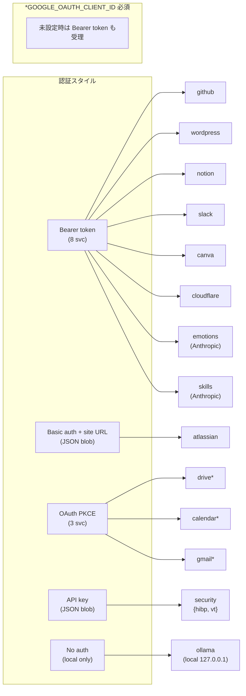
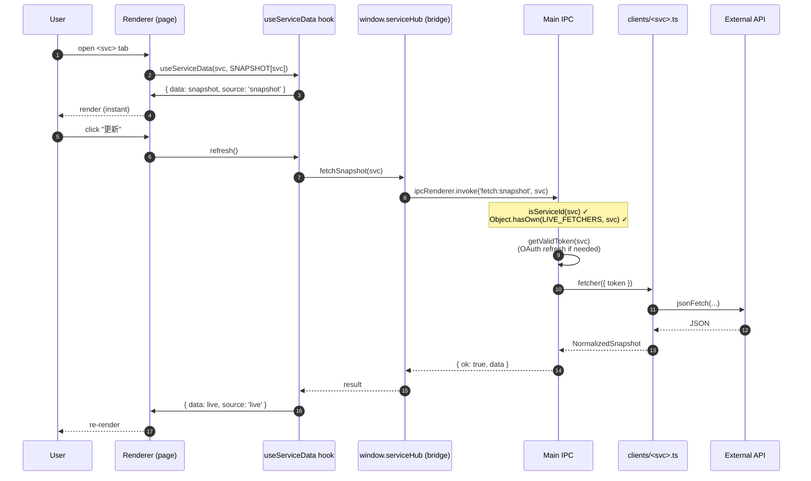
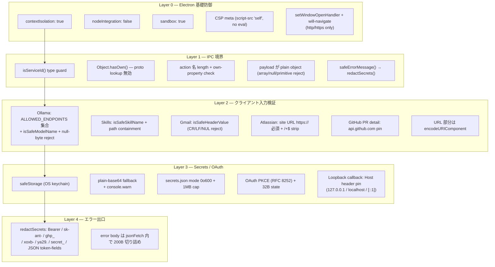
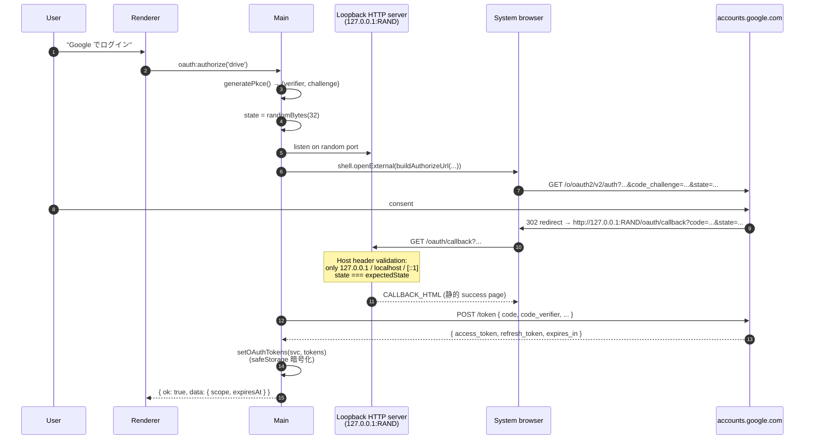
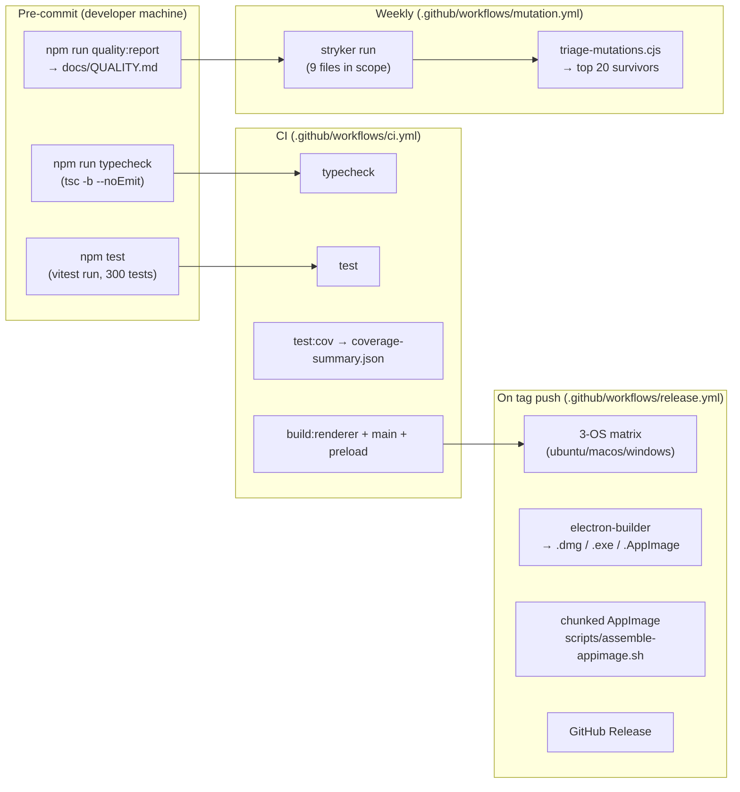
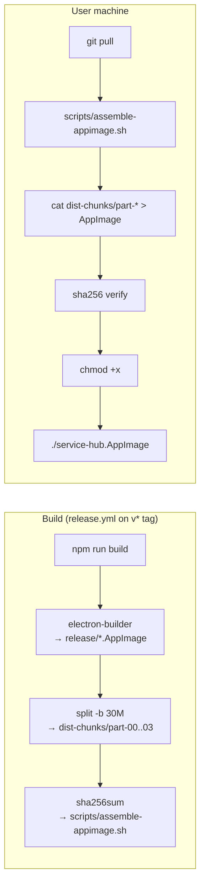
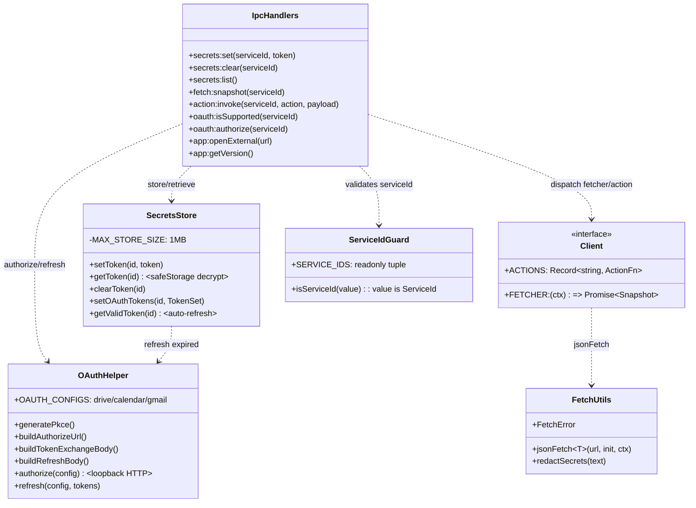

# Service Hub — システム設計図

最終更新: 2026-05-12 (commit `7684c12`)

Service Hub は **Electron + React + TypeScript** のデスクトップダッシュボードで、
14 のサービス (GitHub / WordPress.com / Atlassian / Notion / Google Drive・Calendar・Gmail /
Slack / Canva / Skills / Security / Cloudflare / Emotions / Ollama) をひとつのサイドバー
UI から横断操作できる。本書は実装の **全体図 / プロセス間境界 / セキュリティ境界 /
品質パイプライン / 配布パイプライン** を一望できるリファレンス。

---

## 1. 三プロセス構成 (High-level)

Electron は OS プロセスとして 3 種類のサブプロセスを生む。Service Hub では
**信頼境界 = この 3 プロセスの間** に置く。Renderer はサンドボックス内で動作し、
特権 API は Preload 経由でしか触れない。

```mermaid
graph TB
  subgraph "OS"
    A[End user]
    OS["OS keychain<br/>(safeStorage 暗号化先)"]
    FS["~/userData/<br/>service-hub-secrets.json"]
  end

  subgraph "Electron app process"
    subgraph "Renderer (React + Vite)"
      R1["sidebar<br/>services.ts (SSOT)"]
      R2["pages/*.tsx<br/>14 services"]
      R3["useServiceData hook<br/>snapshot ↔ live"]
      R4["window.serviceHub<br/>(typed bridge)"]
    end

    subgraph "Preload (contextBridge)"
      P1["exposeInMainWorld<br/>'serviceHub'"]
    end

    subgraph "Main process (Node)"
      M1["IPC handlers<br/>app:* secrets:* fetch:* action:* oauth:*"]
      M2["clients/<br/>(14 fetchers + actions)"]
      M3["secrets.ts<br/>(safeStorage + 1MB cap)"]
      M4["oauth.ts<br/>(PKCE loopback)"]
    end
  end

  subgraph "External"
    EX1["api.github.com<br/>api.notion.com<br/>... (14 hosts)"]
    EX2["accounts.google.com<br/>(OAuth PKCE)"]
    EX3["127.0.0.1:11434<br/>(Ollama, local only)"]
  end

  A -->|click / type| R2
  R2 --> R3
  R3 -->|fetch:snapshot<br/>action:invoke| R4
  R4 -->|IPC| P1
  P1 -->|invoke| M1
  M1 -->|dispatch| M2
  M1 -->|store / read| M3
  M3 -->|encryptString| OS
  M3 -->|fs.readFile/writeFile<br/>mode 0o600| FS
  M2 -->|HTTPS| EX1
  M4 -->|HTTPS + redirect| EX2
  M2 -->|HTTP local-only| EX3

  classDef renderer fill:#1e3a8a,color:#fff,stroke:#3b82f6
  classDef preload fill:#7c2d12,color:#fff,stroke:#ea580c
  classDef main fill:#14532d,color:#fff,stroke:#22c55e
  classDef ext fill:#581c87,color:#fff,stroke:#a855f7
  class R1,R2,R3,R4 renderer
  class P1 preload
  class M1,M2,M3,M4 main
  class EX1,EX2,EX3 ext
```

| プロセス | 権限 | 主責任 |
|---|---|---|
| **Renderer** | `nodeIntegration: false` + `sandbox: true` + `contextIsolation: true` + CSP | 表示・ユーザ入力。Node API 不可。外部 HTTP も `connect-src` で制限。 |
| **Preload** | contextIsolated bridge | `window.serviceHub` を最小 API で expose。型は `src/shared/bridge.d.ts`。 |
| **Main** | フル Node | IPC dispatch + `safeStorage` + 全 fetcher / action + OAuth loopback server + `shell.openExternal` (http/https only) |

---

## 2. ディレクトリ構成

```
service-hub-desktop/
├── src/
│   ├── main/                         # Electron main プロセス
│   │   ├── main.ts                   # ipcMain 登録 + BrowserWindow
│   │   ├── secrets.ts                # safeStorage + plain-base64 fallback + 1MB cap
│   │   ├── oauth.ts                  # PKCE + loopback HTTP server + Host header pin
│   │   └── clients/
│   │       ├── index.ts              # LIVE_FETCHERS / LIVE_ACTIONS / LOCAL_SERVICES
│   │       ├── types.ts              # jsonFetch + FetchError + redactSecrets
│   │       ├── github.ts             # PR 詳細取得時 api.github.com pin
│   │       ├── wordpress.ts
│   │       ├── atlassian.ts          # site URL は https:// 必須
│   │       ├── notion.ts
│   │       ├── drive.ts / calendar.ts / gmail.ts
│   │       ├── slack.ts
│   │       ├── canva.ts
│   │       ├── skills.ts             # ~/.claude/skills 配下 read-only + 名前 allowlist
│   │       ├── security.ts           # HIBP + VirusTotal + Norton detection
│   │       ├── cloudflare.ts
│   │       ├── emotions.ts           # mood journal + Anthropic API
│   │       └── ollama.ts             # 127.0.0.1:11434 hardcoded + endpoint allowlist
│   ├── preload/
│   │   └── preload.ts                # contextBridge.exposeInMainWorld
│   ├── renderer/
│   │   ├── App.tsx                   # sidebar router
│   │   ├── services.ts               # SSOT for ServiceId, label, icon
│   │   ├── pages/                    # 14 service pages
│   │   ├── components/               # DataList, StatusBar, ...
│   │   ├── hooks/useServiceData.ts   # snapshot ↔ live 切替
│   │   └── data/snapshot.ts          # 起動初期データ
│   └── shared/
│       ├── serviceId.ts              # ServiceId union + isServiceId() guard
│       ├── bridge.d.ts               # window.serviceHub の型
│       └── api/                      # 旧スタブ
├── docs/                             # 設計 / 監査 / 運用ドキュメント
├── scripts/                          # quality:report, triage, scaffold, ...
├── stryker.config.json               # 9-file mutation scope
├── vitest.config.ts                  # 300 tests
└── electron-builder.json             # mac/win/linux パッケージ
```

---

## 3. サービスレジストリ (14 services)



**LIVE_FETCHERS** / **LIVE_ACTIONS** マップ (`src/main/clients/index.ts`) は `ServiceId` を key にして fetcher / actions を解決する。IPC ハンドラは `isServiceId()` で値を検証 → `Object.hasOwn()` で prototype lookup も無効化 → map 索引、の三段階。

```typescript
// src/main/clients/index.ts (concept)
export const LIVE_FETCHERS: Record<ServiceId, FetcherFn> = { github: fetchGithubSnapshot, ... };
export const LIVE_ACTIONS:  Record<ServiceId, ActionMap | undefined> = { gmail: GMAIL_ACTIONS, ... };
export const LOCAL_SERVICES: Set<ServiceId> = new Set(['skills', 'security']);
```

---

## 4. データフロー (snapshot ↔ live)

各ページは **静的スナップショット** (`src/renderer/data/snapshot.ts`) で即時描画し、
ユーザがトークンを保存すると `fetch:snapshot` IPC で **ライブ取得** に切り替わる。



エラー時は `safeErrorMessage(err)` 経由で `redactSecrets()` を通過した文字列のみが
Renderer に返る (Bearer token / api_key / ya29 / sk-ant- 等が正規表現で `[REDACTED]` 化)。

---

## 5. セキュリティ境界と防御層



### 攻撃面マトリクス

| 攻撃面 | 例 | 防御 |
|---|---|---|
| **プロトタイプ汚染** | `serviceId="__proto__"` | `isServiceId()` allowlist + `Object.hasOwn()` |
| **任意 URL の Ollama 接続** | renderer が他ホスト指定 | URL ハードコード `127.0.0.1:11434` + ALLOWED_ENDPOINTS |
| **モデル file OOB read (未パッチ)** | 悪意 GGUF ロード | `/api/pull|create|push|copy|delete|blobs|upload` 一切呼ばない設計 |
| **Skill name 経由パストラバーサル** | `name="../../etc/passwd"` | `isSafeSkillName()` + `path.resolve().startsWith()` containment |
| **RFC 2822 ヘッダ injection** | `to="x@y\r\nBcc: z"` | `isSafeHeaderValue()` で CR/LF/NUL reject |
| **token 漏洩 (error body echo)** | API が Authorization 反射 | `redactSecrets()` を全 catch で経由 |
| **Renderer XSS** | (理論) | CSP + React auto-escape + `dangerouslySetInnerHTML` 0 件 |
| **External URL 開封** | `javascript:` / `file:` | `app:openExternal` で `http/https` 限定 |
| **secrets.json 改竄/巨大化** | ディスク満杯 / 攻撃者 | 1MB cap + shape 検証 + plain-base64 警告 |

---

## 6. OAuth フロー (PKCE + Loopback)



トークン refresh は `getValidToken()` 内で expires < 60s で自動実行。失敗時は stale
access token を返し、API 401 → UI が再ログインを促す動線へ。

---

## 7. 品質パイプライン



### メトリクス現状 (commit `7684c12`)

| 指標 | 値 |
|---|---|
| TypeScript 型チェック | ✅ pass |
| ユニットテスト | **300 passing** (19 files) |
| Line coverage | ~72% (clients/oauth) |
| Mutation score (total) | **72.94%** |
| Mutation score (covered) | **82.81%** |
| Mutants killed | 770 |
| Mutants survived | 160 |
| `npm audit` (prod) | 0 vulnerabilities |

### 精度向上の方針

1. **Stryker 走らせる** → `npm run mutate` (~2 min)
2. **生存 mutant を triage** → `npm run mutate:triage` で top 20 をインパクト降順表示
3. **kill test を書く** → ConditionalExpression / ObjectLiteral / MethodExpression を優先
4. **`npm run quality:report`** → `docs/QUALITY.md` を更新
5. equivalent mutant (例: base64 `/=+$/` regex) は skip 判断する

---

## 8. 配布パイプライン (chunked AppImage)

サンドボックス VM ではユーザのデスクトップに大容量バイナリを直接配置できないため、
**AppImage を 30MB チャンクに分割して git に commit** する独自手順を採用。



---

## 9. レイヤ別の主要モジュール



---

## 10. 設計の不変条件 (invariants)

新しい機能を追加する PR でこれらを破ってはいけない:

1. **Renderer は Node API を直接呼ばない** — 必ず `window.serviceHub` 経由。
2. **Renderer に raw token は届かない** — `secrets:list` は ID のみ返す。
3. **IPC で受けた serviceId は indexing 前に `isServiceId()` 検証** — `Object.hasOwn()` も併用。
4. **Error message は `safeErrorMessage()` / `redactSecrets()` を必ず通る**。
5. **外部 URL は `app:openExternal` 経由のみ** — http(s) 限定。
6. **fetcher / action の URL path 中の動的部分は `encodeURIComponent`** — 例外: Ollama の `model` (regex sanitize 済) と Atlassian `site` (https:// validated, host only)。
7. **Ollama は `127.0.0.1:11434` 以外には接続しない** — `ALLOWED_ENDPOINTS` で enforce。
8. **dangerouslySetInnerHTML / eval / new Function 禁止**。
9. **新規 client は CLAUDE.md の "ServiceClient contract" を満たす + `LIVE_FETCHERS` / `SERVICES` 両方に登録**。
10. **追加した PR で `npm run typecheck && npm test` が green**。理想的には `npm run quality:report` で mutation 数値も維持・改善。

---

## 11. 関連ドキュメント

| ドキュメント | 目的 |
|---|---|
| `docs/SECURITY.md` | 脅威モデル A1-A7 |
| `docs/SECURITY_AUDIT.md` | 監査ログ (P0-P3 findings + defense-in-depth 追加) |
| `docs/OLLAMA_SECURITY.md` | Ollama CVE + 未パッチ OOB read 対策 |
| `docs/OAUTH_SETUP.md` | GOOGLE_OAUTH_CLIENT_ID 設定手順 |
| `docs/EMOTIONS_SETUP.md` | Anthropic API key 設定 |
| `docs/SECURITY_SETUP.md` | HIBP / VirusTotal キー設定 |
| `docs/CLOUDFLARE_SETUP.md` | Cloudflare API key 設定 |
| `docs/QUALITY.md` | (自動生成) coverage / mutation dashboard |
| `docs/QUALITY_WORKFLOW.md` | 品質運用 playbook |
| `docs/ADDING_A_SERVICE.md` | 新サービス追加チェックリスト |
| `docs/REMAINING_WORK.md` | Phase 4-7 ロードマップ |
