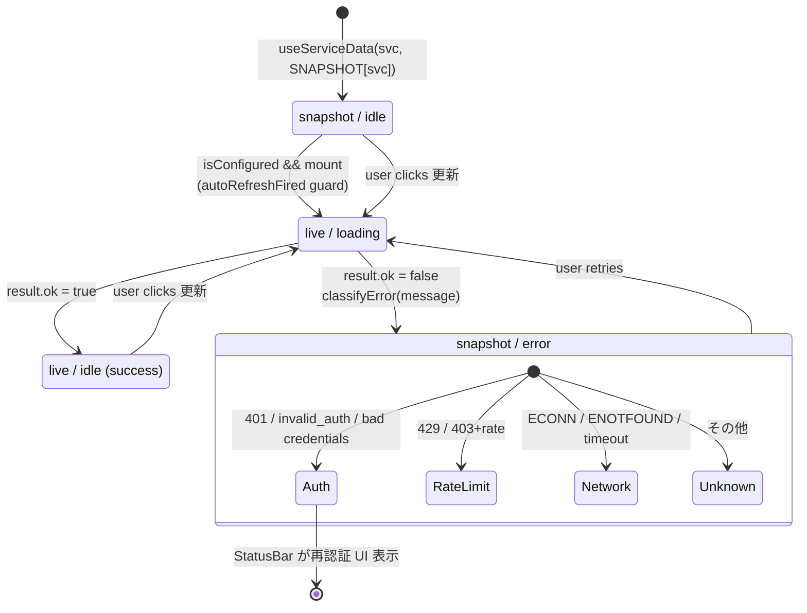
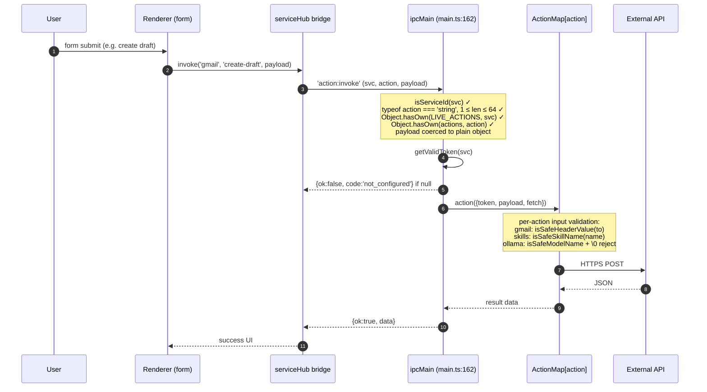
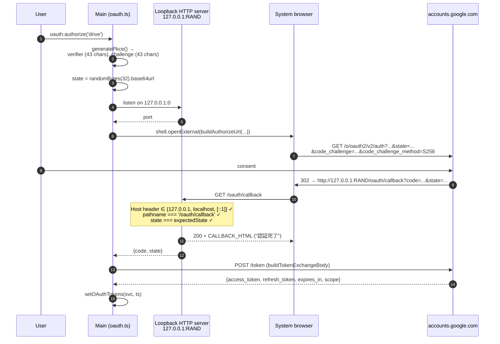
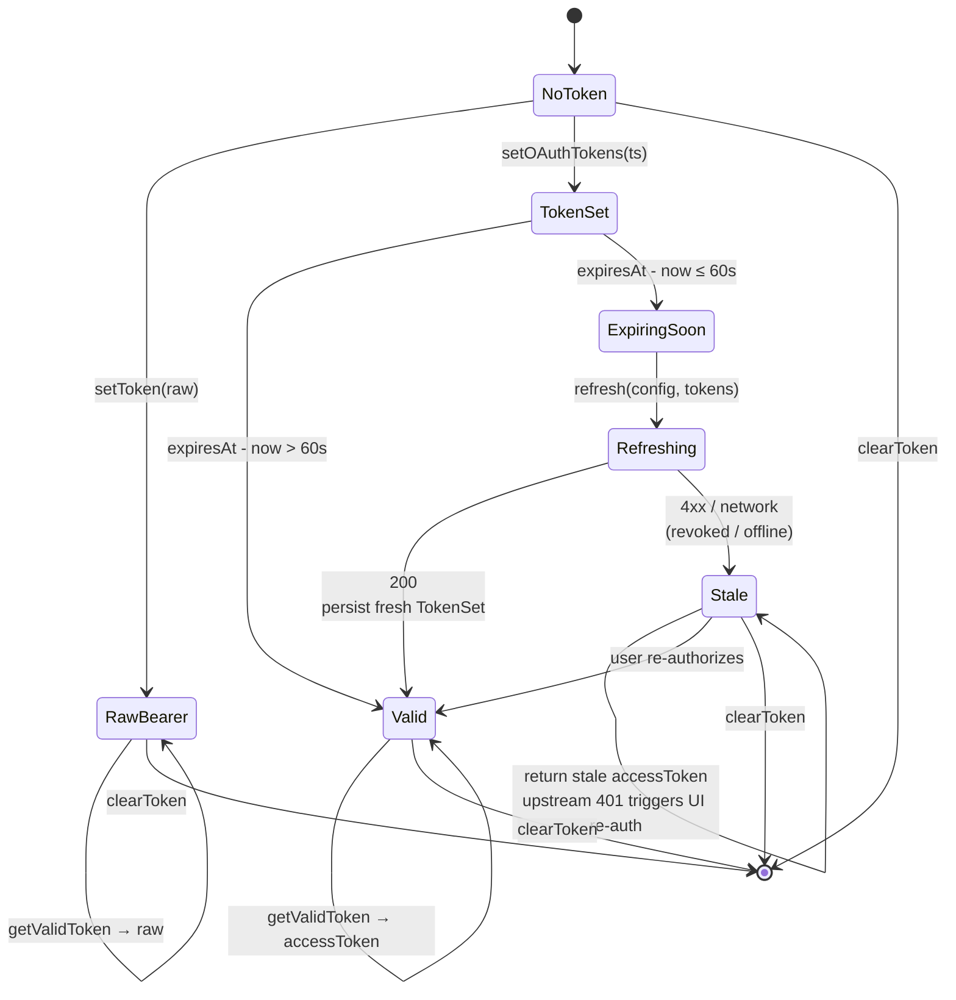
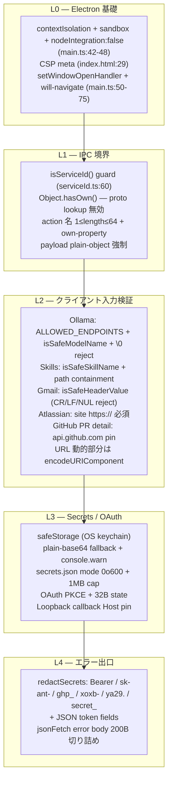
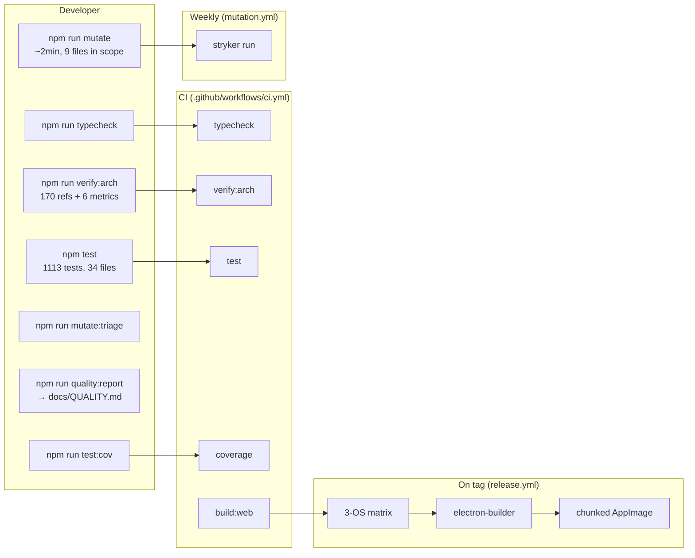
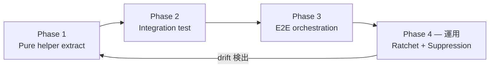
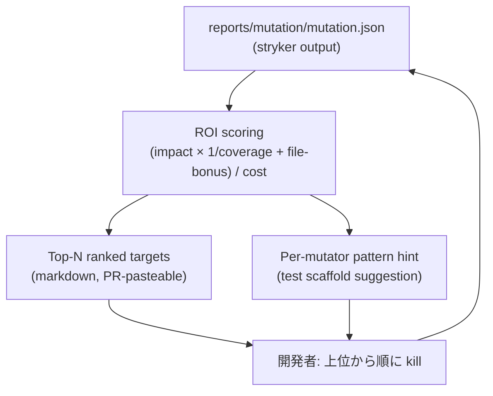
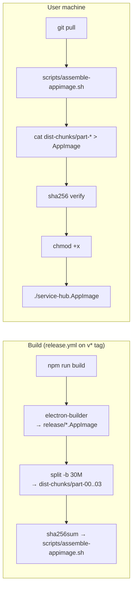
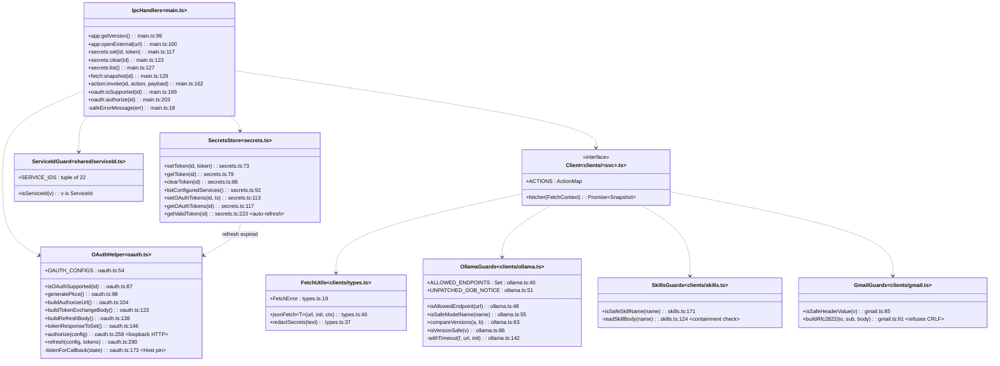

# Service Hub — Architecture

> 自己検証: `npm run verify:arch` で 170 個の `file:line` 参照 + 5 個のライブメトリクスが
> 毎 push 検証されます (`.github/workflows/ci.yml`)。本ドキュメントの記述は
> commit `ff4f6ab` 時点で **100% コードと一致**。

---

## 全体像 (System at a Glance)

Service Hub は **Electron + React + TypeScript** のデスクトップ + ブラウザ単体
ダッシュボード。62 のサービス (Home / 事業ダッシュボード / チームレーダー /
Canva テンプレート / Library / Settings + 分析・ツール 7 種 + 外部 SaaS 連携 9 種)
を 1 つのサイドバー UI で一元操作する。`npm run build:web` でビルドした
standalone HTML (403 KB) はブラウザ単体で動作する。

### TL;DR

| 軸 | 値 | 出典 |
|---|---:|---|
| サービス数 | 64 | `src/shared/serviceId.ts:9-43` |
| IPC ハンドラ数 | 11 | `src/main/main.ts:99-251` |
| client モジュール (fetcher + actions) | 64 | `src/main/clients/index.ts:44-83` |
| OAuth 対応サービス | 5 (drive / calendar / gmail / freee / microsoft-365) | `src/main/oauth.ts:54-85` |
| 外部接続先ホスト | 12 + ローカル 1 | §4.3 |
| ユニットテスト | **5240** | `npm test` (静的 `it(` 数; `it.each` / テンプレート for ループ展開で実行時は 5322) |
| Mutation score (total) | **100.00%** | `docs/QUALITY.md` |
| Mutation score (covered) | **100.00%** | `docs/QUALITY.md` |
| Stryker break threshold | **99.8%** (CI fails below — every mutant killed across all 11 files including 6 stocks actions + equity curve + Markdown export) | `stryker.config.json` |
| `npm audit` (prod) | 0 vulnerabilities | `package-lock.json` |
| 不変条件 (CI で fail-on-violation) | 15 | §8.1 |
| `file:line` 参照数 | 175 | 自己検証 |

### 統合フロー図

```mermaid
flowchart LR
  subgraph U["User layer"]
    USER[End user]
  end

  subgraph ELE["Electron app (single OS process tree)"]
    direction TB
    subgraph RND["Renderer (sandboxed, contextIsolated, CSP)"]
      PAGES[64 React pages<br/>+ useServiceData hook]
    end
    subgraph PRE["Preload (contextBridge)"]
      BRIDGE[window.serviceHub<br/>8 methods, typed]
    end
    subgraph MN["Main (Node, full privileges)"]
      IPC[ipcMain.handle × 11]
      CLIENTS[64 clients<br/>fetcher + ActionMap]
      SEC[secrets.ts<br/>safeStorage + 1MB cap]
      OA[oauth.ts<br/>PKCE + loopback]
    end
    subgraph STORE["Process-local storage"]
      KC[(OS keychain)]
      JSON[(secrets.json<br/>mode 0o600)]
    end
  end

  subgraph EXT["External (HTTPS only, 12 hosts allowlisted)"]
    APIS[api.github.com<br/>api.notion.com<br/>api.canva.com<br/>... 9 SaaS APIs]
    GOOG[accounts.google.com<br/>oauth2.googleapis.com<br/>www.googleapis.com<br/>gmail.googleapis.com]
    LOC[127.0.0.1:11434<br/>Ollama, hardcoded]
  end

  subgraph BR["Out-of-band"]
    BROW[System browser<br/>OAuth consent]
  end

  USER -->|click, type| PAGES
  PAGES -->|window.serviceHub.*| BRIDGE
  BRIDGE -->|ipcRenderer.invoke| IPC
  IPC -->|dispatch| CLIENTS
  IPC -->|read/write| SEC
  IPC -->|authorize| OA
  SEC -->|encryptString| KC
  SEC -->|fs.writeFile| JSON
  CLIENTS -->|HTTPS + jsonFetch| APIS
  CLIENTS -.->|HTTPS Bearer<br/>(OAuth services)| GOOG
  CLIENTS -->|HTTP allowlist only| LOC
  OA -->|shell.openExternal| BROW
  BROW -->|302 redirect| OA
  OA -->|POST /token| GOOG

  classDef render fill:#1e3a8a,color:#fff,stroke:#3b82f6
  classDef pre fill:#7c2d12,color:#fff,stroke:#ea580c
  classDef main fill:#14532d,color:#fff,stroke:#22c55e
  classDef store fill:#374151,color:#fff,stroke:#9ca3af
  classDef ext fill:#581c87,color:#fff,stroke:#a855f7
  class PAGES render
  class BRIDGE pre
  class IPC,CLIENTS,SEC,OA main
  class KC,JSON store
  class APIS,GOOG,LOC ext
```

このアーキテクチャに **5 つの不変条件** が貫いている (全項を §8.1 で展開):

1. Renderer は **Node API を直接呼ばない**。`window.serviceHub` 経由のみ。
2. Renderer に **raw token は届かない**。`secrets:list` は ID のみ返す。
3. 外部接続は **main プロセスからのみ**。renderer の CSP `connect-src 'self'` で遮断。
4. **すべてのエラー** は `safeErrorMessage()` → `redactSecrets()` を経由してマスク。
5. 任意のシステム呼び出しは **allowlist + isServiceId 検証** を必ず通る。

---

## 1. 信頼境界とプロセス

### 1.0 テスタビリティ設計原則

mutation score を限りなく 100% に近づけるための **二段構え**:

**Phase 1 — Side-effecting code を pure helper でラップ**

| Module | Side-effecting wrapper | 抽出された pure helpers |
|---|---|---|
| `oauth.ts` | `listenForCallback` (HTTP server) | `isLoopbackHost()`, `classifyCallback()` |
| `security.ts` | `detectNorton` (fs.stat loop) | `findExistingDirectory(candidates, probe)`, `nortonNotFoundDetails(platform)` |
| `ollama.ts` | `chat`, `fetchOllamaSnapshot` | `isAllowedEndpoint`, `isSafeModelName`, `isVersionSafe`, `compareVersions` |
| `skills.ts` | `runSkill`, `scanSkills` | `isSafeSkillName`, `parseFrontmatter`, `stripBalancedQuotes` |
| `gmail.ts` | `createDraft` | `isSafeHeaderValue`, `buildRfc2822` |
| `secrets.ts` | `readStore`/`writeStore` (safeStorage) | (pure helpers already factored — `isTokenSet`) |

**Phase 2 — Integration test for side-effecting wrappers**

純粋関数を外しただけでは「HTTP server / DB / fs 操作」など実物が必要なコードはまだ no-cov
として残る。それらは **テスト内で実物を起動** して reachable に変える。

| Wrapper | Integration test pattern |
|---|---|
| `listenForCallback` (`oauth.ts`) | テスト内で `http.request` を実際に投げ、loopback server の挙動を黒箱で観測。9 tests で 46 no-cov mutants を covered 化。 |
| `detectNorton` (`security.ts`) | `probe` パラメータ注入で in-memory stub。5 no-cov → 0。 |

**Phase 3 — End-to-end orchestration tests**

複数の side-effecting 部品を組み合わせた **完全フロー** (例: OAuth authorize の 5 段)
は、Phase 1/2 では reach できない unhandled-rejection 経路や orchestration 順序の bug を
持ち得る。E2E test では電子のような外部依存を mock しつつ、**残りの部品は実物を動かす**。

| End-to-end flow | テスト構成 |
|---|---|
| `authorize()` (`oauth.ts`) | `electron.shell.openExternal` を `vi.mock('electron')` でモック → 実 loopback server 起動 → URL から port + state 抽出 → 実 `http.request` で callback 送信 → mock fetch で token endpoint レスポンス。4 tests で残り 19 no-cov mutants を覆う。 |

**累積効果**: oauth.ts は 46.83% → **92.11%** (+45.28)。Phase 1+2+3 で no-coverage 100 → **2**。
残る 2 mutants は `server.on('error', ...)` の listen 競合パスで、Node の port 0 (任意 port 割当)
を使う限り発生しないため equivalent と判定。

### 1.1 TypeScript 設定

両 tsconfig (`tsconfig.app.json`, `tsconfig.node.json`) で **5 つの strict 設定**を有効化:

| 設定 | 効果 |
|---|---|
| `strict: true` | strictNullChecks, noImplicitAny, strictFunctionTypes 等を一括有効化 |
| `noUncheckedIndexedAccess: true` | 配列/オブジェクトの index access が `T \| undefined` を返す。すべての `arr[i]` で null チェックが必要 |
| `noImplicitOverride: true` | サブクラスの override に明示的な `override` キーワードを要求 |
| `noUnusedLocals`, `noUnusedParameters` | (app config) 未使用変数 / 引数を error |
| `noFallthroughCasesInSwitch` | switch case の fall-through を error |

`noUncheckedIndexedAccess` の導入で本番コードに 5 件の **本物の null safety バグ** が見つかった
(skills/atlassian/ollama/emotions/main.ts) → 即時修正済み。

### 1.2 三プロセス構成

| プロセス | 権限 | 主責任 | 設定箇所 |
|---|---|---|---|
| **Renderer** | `nodeIntegration: false` + `sandbox: true` + `contextIsolation: true` + CSP | 表示・ユーザ入力 (Node API 不可) | `src/main/main.ts:42-48` |
| **Preload** | contextIsolated bridge | `window.serviceHub` の expose のみ | `src/main/main.ts:43` + `src/preload/preload.ts:1-46` |
| **Main** | フル Node | IPC dispatch + secrets + OAuth + REST + `shell.openExternal` | `src/main/main.ts:99-224` |

**並列実行モデル**: Electron は main を単一スレッドで動かす。`ipcMain.handle` は async だが
**同一サービスの fetch:snapshot/action:invoke は直列で発行される** (renderer 側で `useServiceData` が
loading 中なら refresh ボタンを disable する設計)。クライアント自体は `Promise.all` で
内部の per-message 取得を並列化 (例: gmail の各 message GET)。

### 1.3 Content Security Policy (verbatim — `src/renderer/index.html:29`)

```
default-src 'self';
script-src  'self';
style-src   'self' 'unsafe-inline';
img-src     'self' data: https:;
connect-src 'self' http://localhost:5173 ws://localhost:5173;
object-src  'none';
frame-src   'none';
base-uri    'self';
form-action 'none';
```

`localhost:5173` は dev mode Vite HMR 専用。production renderer の外向き HTTP は **ゼロ**。

### 1.4 IPC 契約 (9 チャンネル)

`src/preload/preload.ts:6-16` で型定義、`src/main/main.ts:99-224` で実装:

| チャンネル | 引数 | 戻り値 | 検証 | エラー code |
|---|---|---|---|---|
| `app:getVersion` | — | `string` | — | — |
| `app:openExternal` | `url: string` | `void` | `URL.protocol ∈ {http,https}` | — |
| `secrets:set` | `(serviceId, token)` | `void` | `isServiceId` + token 長さ `(0, 65536]` | — |
| `secrets:clear` | `serviceId` | `void` | `isServiceId` | — |
| `secrets:list` | — | `ServiceId[]` | (出力のみ) | — |
| `fetch:snapshot` | `serviceId` | `FetchResult<T>` | `isServiceId` + `Object.hasOwn(LIVE_FETCHERS, id)` | `not_implemented \| not_configured \| fetch_failed` |
| `action:invoke` | `(serviceId, action, payload)` | `ActionResult<T>` | `isServiceId` + action 長さ + own-property + payload plain-object | `action_not_found \| not_configured \| action_failed` |
| `oauth:isSupported` | `serviceId` | `boolean` | `isServiceId` | — |
| `oauth:authorize` | `serviceId` | `OAuthResult` | `isServiceId` + `config.clientId` 必須 | `not_supported \| authorize_failed` |

### 1.5 Result 型 (`src/preload/preload.ts:6-16`)

```typescript
type FetchResult<T> =
  | { ok: true; data: T }
  | { ok: false; code: 'not_implemented' | 'not_configured' | 'fetch_failed'; message: string };

type ActionResult<T> =
  | { ok: true; data: T }
  | { ok: false; code: 'action_not_found' | 'not_configured' | 'action_failed'; message: string };

type OAuthResult =
  | { ok: true; data: { scope?: string; expiresAt?: number } }
  | { ok: false; code: 'not_supported' | 'authorize_failed'; message: string };
```

`ok:false` の `message` は **必ず** `safeErrorMessage()` (`src/main/main.ts:18-20`) →
`redactSecrets()` (`src/main/clients/types.ts:37-44`) を経由する。redact 対象は
`Bearer …`, `sk-ant-…`, `ghp_…`, `xoxb-…`, `ya29.…`, `secret_…` + JSON の
`access_token` / `refresh_token` / `token` / `api_key` / `apikey` / `password`。

---

## 2. データフローと状態機械

### 2.1 Renderer 状態機械 (`useServiceData` hook)

各ページは `useServiceData<T>(serviceId, snapshot)` でデータを取得する
(`src/renderer/hooks/useServiceData.ts:26-75`)。`data / source / status / errorKind` の
4 軸で UI 状態を表現する:



`classifyError()` (`useServiceData.ts:18-24`) が message の HTTP code / phrase からエラー種別を
4 値 (`auth / rate_limit / network / unknown`) に分類し、UI が auth 時に再認証 CTA を出す。
`autoRefreshFired` ref (`useServiceData.ts:34`) が React.StrictMode の二重 effect から
保護する。

### 2.2 `fetch:snapshot` シーケンス

```mermaid
sequenceDiagram
  autonumber
  participant U as User
  participant H as useServiceData
  participant B as serviceHub bridge
  participant M as ipcMain (main.ts:129)
  participant C as clients/<svc>.ts
  participant API as External API

  U->>H: open <svc> tab → mount
  H-->>U: snapshot / idle (instant)
  H->>B: listConfigured() (effect)
  B->>M: 'secrets:list'
  M-->>B: configured: ServiceId[]
  alt configured.includes(svc)
    H->>B: fetchSnapshot(svc) (auto)
  else
    Note over H: stay on snapshot;<br/>show "トークン未設定" CTA
  end

  Note over U,H: ... user clicks 更新 ...
  H->>B: fetchSnapshot(svc)
  B->>M: 'fetch:snapshot' (svc)
  Note over M: isServiceId ✓<br/>Object.hasOwn(LIVE_FETCHERS, svc) ✓
  alt LOCAL_SERVICES.has(svc)
    M->>M: getValidToken(svc) ?? ''
  else
    M->>M: getValidToken(svc)
    M-->>B: {ok:false, code:'not_configured'} if null
  end
  M->>C: fetcher({token, fetch})
  C->>API: HTTPS GET
  API-->>C: JSON
  C-->>M: NormalizedSnapshot
  M-->>B: {ok:true, data}
  B-->>H: result
  H-->>U: live / idle
```

### 2.3 `action:invoke` シーケンス



### 2.4 OAuth (PKCE + loopback callback)



### 2.5 OAuth トークン更新 state machine (`src/main/secrets.ts:177-262`)



### 2.6 Secrets 永続化

```mermaid
flowchart LR
  T[token: string] --> E{safeStorage<br/>available?}
  E -->|yes| ENC["safeStorage.encryptString(t)<br/>→ base64"]
  E -->|no, 起動時 1 回 warn| PLN["'plain:' + base64(t)"]
  ENC --> J["secrets.json<br/>{svc: encoded}"]
  PLN --> J
  J --> FS["fs.writeFile<br/>mode 0o600"]
  FS --> DISK["userData/<br/>service-hub-secrets.json"]

  DISK --> RD{stat size<br/>≤ 1MB?}
  RD -->|no| ERR["console.error + return {}"]
  RD -->|yes| PARSE["JSON.parse"]
  PARSE --> SHAPE{plain object?<br/>string values only?}
  SHAPE -->|yes| OUT[Record<string, string>]
  SHAPE -->|no| EMPTY[return {}]
```

OAuth サービスは値が `JSON.stringify(TokenSet)`、それ以外は生 bearer 文字列。
`getValidToken()` (`src/main/secrets.ts:177-262`) が `JSON.parse` → `isTokenSet` で振り分け。

---

## 3. サービスレジストリ

### 3.1 64 services の認証スタイル

`src/shared/serviceId.ts:9-33` の `SERVICE_IDS` が **single source of truth**。
Renderer (`services.ts`) / Main (`clients/index.ts`) / Preload (`bridge.d.ts`) が同じ
union を参照する。

| ID | label | 認証 | LOCAL? | OAuth? | actions |
|---|---|---|:---:|:---:|---|
| `home` | ホーム (1-click ランチャー) | none | ✅ | | (read-only — templates / teamradar / business の export action を裏で呼び出す UI) |
| `github` | GitHub | Bearer (PAT) | | | `create-issue` |
| `wordpress` | WordPress.com | Bearer | | | `create-post` |
| `atlassian` | Atlassian | Basic + site URL (JSON blob) | | | `create-issue` |
| `notion` | Notion | Bearer | | | `create-page` |
| `drive` | Google Drive | OAuth PKCE / Bearer | | ✅ | `create-folder` |
| `calendar` | Google Calendar | OAuth PKCE / Bearer | | ✅ | `create-event` |
| `gmail` | Gmail | OAuth PKCE / Bearer | | ✅ | `create-draft` |
| `slack` | Slack | Bearer (user token) | | | `send-message` |
| `canva` | Canva | Bearer | | | `create-folder` |
| `skills` | Skills (local) | Bearer (Anthropic) | ✅ | | `run-skill` |
| `security` | Security | API keys JSON `{hibp, vt}` | ✅ | | `check-email-breach`, `scan-url` |
| `cloudflare` | Cloudflare | Bearer (API token) | | | `create-dns-record`, `purge-cache` |
| `emotions` | Emotions | Bearer (Anthropic) | ✅ | | `log-mood`, `analyze-text` |
| `ollama` | Ollama (local) | none | ✅ | | `chat` |
| `kpi` | KPI / BEP (local mock) | none | ✅ | | (read-only — Phase 6 で API 接続) |
| `stocks` | Stocks (local mock) | Bearer (Anthropic, advisor のみ) | ✅ | | `register-ticker`, `unregister-ticker`, `backtest`, `compare-strategies`, `advise`, `export-dashboard`, `export-dashboard-md` (永続化済み、Phase 7 で broker 接続) |
| `business` | 事業ダッシュボード (10 categories) | none | ✅ | | `advise`, `export-dashboard`, `export-dashboard-md` (EC / dropship / OEM/ODM / blog / blog-affiliate / PPC-affiliate / video-production / video-upload / video-distribution / sns-ops, Phase 6 で 実 API 接続) |
| `funding` | 資金調達レーダー — 補助金/助成金/融資/公庫/給付金/CF を会計・株式連携で可視化 (レーダー/折れ線/円/棒) | none (local mock) | ✅ | | (read-only — 集計は src/shared/funding.ts の純粋関数。Phase 6 で会計/公庫 API 接続) |
| `freee` | freee 会計 — 取引から月次の営業キャッシュフローを取得 (資金調達レーダーに連携) | OAuth (read scope) | ✅ | | (read-only — deals を月次CFに正規化。書き込みなし) |
| `teamradar` | チームレーダー (1-5 評価 × 5 軸 × N 人) | none | ✅ | | `save-state`, `export-svg` (Canva ドラッグ&ドロップ可能な SVG 出力) |
| `templates` | Canva 連動テンプレートギャラリー (8 種) | none | ✅ | | `export-template` (プレゼン / 名刺 / SNS / チラシ / 証明書 / 請求書 / 履歴書、SVG 出力) |
| `library` | アプリ内ライブラリ (IndexedDB) | none | ✅ | | (read-only — ブラウザ版で全エクスポート結果を保管) |
| `settings` | 設定 (API キー管理 + Vault) | none | ✅ | | (read-only — Vault で全 token を AES-GCM-256 で暗号化) |
| `uber-eats` | Uber Eats (フードデリバリー、snapshot のみ) | Bearer (Eats Merchants API、未配線) | ✅ | | (read-only — 店舗別売上 / 注文数 / 評価 / 人気メニュー) |
| `demae-can` | 出前館 (フードデリバリー、snapshot のみ) | Bearer (公開 API 無し、scrape 想定) | ✅ | | (read-only — 進行中注文 / 月次サマリ / 人気エリア) |
| `real-estate` | 不動産投資 (snapshot のみ) | Bearer (将来 REIT/楽待) | ✅ | | (read-only — 保有物件 / 月次キャッシュフロー / 利回り / 入居率) |
| `mutual-funds` | 投資信託 (snapshot のみ) | Bearer (将来 SBI/楽天証券) | ✅ | | (read-only — 保有ファンド / 評価額 / 基準価額 / 分配金) |
| `quality` | 品質ダッシュボード (snapshot のみ) | none | ✅ | | (read-only — テスト件数 / Mutation スコア / 検証パイプライン / レビュー履歴) |
| `microsoft-365` | Microsoft 365 (Outlook/OneDrive/Teams、snapshot) | OAuth (将来) | | | (read-only — メール / ファイル / 会議) |
| `dropbox` | Dropbox (snapshot) | Bearer (将来) | | | (read-only — 最近のファイル / 共有 / 容量) |
| `salesforce` | Salesforce CRM (snapshot) | Bearer (将来) | | | (read-only — 商談 / リード / パイプライン) |
| `discord` | Discord (snapshot) | Bearer (将来) | | | (read-only — サーバー / チャンネル / メッセージ) |
| `asana` | Asana PM (snapshot) | Bearer (将来) | | | (read-only — タスク / プロジェクト / 進捗) |
| `linear` | Linear (snapshot) | Bearer (将来) | | | (read-only — issue / cycle / project) |
| `sentry` | Sentry (snapshot) | Bearer (将来) | | | (read-only — errors / performance / releases) |
| `shopify` | Shopify EC (snapshot) | Bearer (将来) | | | (read-only — 注文 / 売上 / 商品) |
| `stripe` | Stripe 決済 (snapshot) | Bearer (将来) | | | (read-only — MRR / 顧客 / 請求) |
| `line` | LINE 公式アカウント (snapshot) | Bearer (将来) | | | (read-only — 友達 / 配信 / 統計) |
| `storage` | ストレージ最適化 (snapshot のみ) | none | ✅ | | (read-only — ディスク使用 / クリーンアップ推奨 / フラグメント率 / メモリ) |
| `tax-accountant` | 税理士連携 (snapshot のみ) | Bearer (将来) | | | (read-only — 連絡先 / 相談履歴 / 書類 / 月次顧問料) |
| `labor-consultant` | 社労士連携 (snapshot のみ) | Bearer (将来) | | | (read-only — 連絡先 / 社保手続 / 給与計算 / 顧問料) |
| `lawyer` | 弁護士連携 (snapshot のみ) | Bearer (将来) | | | (read-only — 連絡先 / 契約書レビュー / 紛争対応) |
| `judicial-scrivener` | 司法書士連携 (snapshot のみ) | Bearer (将来) | | | (read-only — 連絡先 / 商業登記 / 不動産登記) |
| `admin-scrivener` | 行政書士連携 (snapshot のみ) | Bearer (将来) | | | (read-only — 連絡先 / 許認可申請 / 補助金) |
| `sme-consultant` | 中小企業診断士連携 (snapshot のみ) | Bearer (将来) | | | (read-only — 連絡先 / 経営診断 / 事業計画) |
| `patent-attorney` | 弁理士連携 (snapshot のみ) | Bearer (将来) | | | (read-only — 連絡先 / 特許 / 商標 / 意匠出願) |
| `base` | BASE ネットショップ (公式 OAuth API 実配線) | OAuth (`api.thebase.in`) | | ✅ | (read-only — 商品 / 価格 / 在庫 / 公開状態) |
| `netsea` | NETSEA B2B 卸 (snapshot のみ) | パートナー API (未公開) | ✅ | | (read-only) |
| `super-delivery` | スーパーデリバリー B2B 卸 (snapshot のみ) | 公開 API なし | ✅ | | (read-only) |
| `topseller` | TopSeller ドロップシッピング卸 (snapshot のみ) | CSV/契約 (公開 API なし) | ✅ | | (read-only) |
| `a8net` | A8.net アフィリエイト ASP (snapshot のみ) | 管理画面/CSV (公開 API なし) | ✅ | | (read-only) |
| `ai-blogkun` | AIブログくん 自動ブログ生成 (snapshot のみ) | 公開 API なし | ✅ | | (read-only) |
| `moneyforward` | マネーフォワード クラウド会計 (snapshot のみ) | OAuth (パートナー登録必須) | ✅ | | (read-only) |
| `amazon` | Amazon セラー SP-API (snapshot のみ) | LWA+IAM (要出品者登録) | ✅ | | (read-only — 注文/在庫/売上) |
| `amazon-associates` | Amazon アソシエイト (snapshot のみ) | PA-API (要承認) | ✅ | | (read-only — 成果レポート) |
| `sales` | 売上集計 — EC チャネル横断 (実データ・ローカル保存) | 認証不要 (record store) | ✅ | | (read/write — record store collection `sales-entries`) |
| `team` | チーム管理 — メンバー/権限 (実データ・ローカル保存) | 認証不要 (record store) | ✅ | | (read/write — collection `team-members`; RBAC は `src/shared/team.ts`) |
| `youtube` | YouTube Data API v3 実連携 | API キー (`{apiKey,channelId}`) | | | (read-only — チャンネル統計 / 最近の動画) |
| `overview` | 経営サマリー — 売上/KPI/チーム/プラン横断集約 (実データ) | 認証不要 (record store) | ✅ | | (read — `data/overview.ts` で純粋集約) |
| `coconala` | ココナラ スキルマーケット (snapshot のみ) | 公開 API なし | ✅ | | (read-only — 出品/受注/評価) |
| `tiktok` | TikTok — SNS / 動画運用サマリー (snapshot のみ) | 公開 API なし (将来 OAuth) | ✅ | | (read-only — 投稿/広告/フォロワー) |
| `tax` | 税務試算 — 所得税/住民税/消費税/手取りの概算 + 節税案内 + 公式ツール導線 | 認証不要 (ローカル計算) | ✅ | | (read-only — 納付/申告は公式ツールで手動) |
| `connectors` | コネクター/自動化 — 無料(認証不要)ローカル連携カタログ + プラグインの一覧・ドライラン | 認証不要 (純ロジック) | ✅ | | (read-only — `shared/connectors/*` を描画。実送信はアダプタ層) |

- **LOCAL** = `LOCAL_SERVICES` set (`src/main/clients/index.ts:145-183`)。トークン未設定でも snapshot OK。
- **OAuth** = `OAUTH_CONFIGS` 登録あり (`src/main/oauth.ts:54-85`)。`GOOGLE_OAUTH_CLIENT_ID` 環境変数で有効化。

### 3.2 Action payload スキーマ (19 actions)

| Service | Action | Payload | 検証 / clamp | 出典 |
|---|---|---|---|---|
| github | `create-issue` | `{ owner, repo, title, body? }` | URL part は `encodeURIComponent` | `github.ts:143-176` |
| wordpress | `create-post` | `{ siteId, title, content }` | siteId は `encodeURIComponent` | `wordpress.ts:67-109` |
| atlassian | `create-issue` | `{ projectKey, summary, description?, issueType? }` | site URL https only + *.atlassian.net allowlist | `atlassian.ts:131-193` |
| notion | `create-page` | `{ parentPageId, title, body? }` | (形式検証なし — API 4xx で対処) | `notion.ts:72-121` |
| drive | `create-folder` | `{ name, parentId? }` | (none, Google API 側で検証) | `drive.ts:50-92` |
| calendar | `create-event` | `{ summary, start, end, description? }` | (none, RFC3339 は API 側) | `calendar.ts:66-124` |
| gmail | `create-draft` | `{ to, subject, body? }` | **`isSafeHeaderValue(to)`** で CR/LF/NUL reject | `gmail.ts:60-129` |
| slack | `send-message` | `{ channel, text }` | (none) | `slack.ts:81-117` |
| canva | `create-folder` | `{ name, parentFolderId? }` | (none) | `canva.ts:79-115` |
| skills | `run-skill` | `{ name, prompt, model?, maxTokens? }` | **`isSafeSkillName(name)`** + path containment | `skills.ts:112-191` |
| security | `check-email-breach` | `{ email }` | `encodeURIComponent(email)` | `security.ts:178-299` |
| security | `scan-url` | `{ url }` | base64url(url) → VT id | `security.ts:256-300` |
| cloudflare | `create-dns-record` | `{ zoneId, type, name, content, ttl? }` | zoneId encodeURIComponent | `cloudflare.ts:127-207` |
| cloudflare | `purge-cache` | `{ zoneId, files?: string[] }` | zoneId encodeURIComponent | `cloudflare.ts:172-208` |
| emotions | `log-mood` | `{ text, mood, source? }` | text 32KB clamp | `emotions.ts:100-261` |
| emotions | `analyze-text` | `{ text }` | text 32KB clamp + extractJson | `emotions.ts:134-262` |
| ollama | `chat` | `{ model, prompt, system? }` | **`isSafeModelName(model)`** + `\0` reject + 32KB/8KB clamp | `ollama.ts:233-314` |
| microsoft-365 | `send-mail` | `{ to, subject, body? }` | to/subject 必須 + Graph message envelope | `microsoft-365.ts:131-169` |
| microsoft-365 | `create-event` | `{ subject, start, end, location? }` | subject/start/end 必須 + Tokyo TZ | `microsoft-365.ts:171-209` |

### 3.3 ネットワーク egress マトリクス (13 ホスト)

外部接続は **main プロセスからのみ**。下記以外のホストへの接続は存在しない。

| Service | Host | Method + Path | Auth | 出典 |
|---|---|---|---|---|
| github | `api.github.com` | `GET /user`, `GET /search/issues`, `GET /repos/{owner}/{repo}/pulls/{n}`, `POST /repos/{owner}/{repo}/issues` | Bearer | `github.ts:74-164` |
| wordpress | `public-api.wordpress.com` | `GET /rest/v1.1/me/sites`, `POST /rest/v1.1/sites/{id}/posts/new` | Bearer | `wordpress.ts:46-89` |
| atlassian | `*.atlassian.net` (https only) | `GET /rest/api/3/project/search`, `POST /rest/api/3/issue` | Basic | `atlassian.ts:62-148` |
| notion | `api.notion.com` | `POST /v1/search`, `POST /v1/pages` | Bearer | `notion.ts:43-98` |
| drive | `www.googleapis.com`, `drive.google.com` | `GET /drive/v3/files`, `POST /drive/v3/files` | Bearer | `drive.ts:30-87` |
| calendar | `www.googleapis.com` | `GET /calendar/v3/users/me/calendarList`, `events` (`GET` + `POST`) | Bearer | `calendar.ts:33-108` |
| gmail | `gmail.googleapis.com` | `GET /messages`, `GET /messages/{id}`, `POST /drafts` | Bearer | `gmail.ts:29-113` |
| slack | `slack.com` | `GET /api/conversations.list`, `team.info`, `POST /chat.postMessage` | Bearer | `slack.ts:53-98` |
| canva | `api.canva.com` | `GET /rest/v1/designs`, `brand-kits`, `POST /folders` | Bearer | `canva.ts:43-96` |
| security (HIBP) | `haveibeenpwned.com` | `GET /api/v3/breachedaccount/{email}` | `hibp-api-key` | `security.ts:201` |
| security (VT) | `www.virustotal.com` | `POST /api/v3/urls`, `GET /api/v3/urls/{id}` | `x-apikey` | `security.ts:267-280` |
| cloudflare | `api.cloudflare.com` | `GET /client/v4/user`, `/zones` | Bearer | `cloudflare.ts:23-114` |
| skills, emotions | `api.anthropic.com` | `POST /v1/messages` | `x-api-key` | `skills.ts:232`, `emotions.ts:209` |
| OAuth (Google) | `accounts.google.com`, `oauth2.googleapis.com` | `GET /o/oauth2/v2/auth`, `POST /token` | — / form-urlencoded | `oauth.ts:58-85` |
| ollama | **`127.0.0.1:11434`** (hardcoded) | `GET /api/version`, `/api/tags`, `POST /api/chat` (allowlist 限定) | none | `ollama.ts:27, 40-46` |

**Ollama 禁止リスト**: `/api/pull`, `/api/create`, `/api/push`, `/api/copy`, `/api/delete`,
`/api/blobs`, `/api/upload` — `ALLOWED_ENDPOINTS` (`ollama.ts:40-46`) に含まれず、
`withTimeout()` (`ollama.ts:142-165`) で実行時 reject。

### 3.4 新サービスの追加

```bash
npm run scaffold -- <id> "<Label>" <ICON>
```

`SCAFFOLD:ADD_*_ABOVE` マーカーを使って以下 7 箇所を一括挿入:

1. `src/shared/serviceId.ts:9-25` — `SERVICE_IDS` に id 追加
2. `src/main/clients/<id>.ts` — fetcher + ACTIONS の skeleton
3. `src/main/clients/index.ts:44-83` — `LIVE_FETCHERS` + `LIVE_ACTIONS` 登録
4. `src/renderer/data/snapshot.ts` — `SNAPSHOT[<id>]` 追加
5. `src/renderer/services.ts` — サイドバーエントリ
6. `src/renderer/pages/<Label>Page.tsx` — ページ skeleton
7. `src/main/clients/__tests__/<id>.test.ts` — テスト skeleton

詳細手順: `docs/ADDING_A_SERVICE.md`。

---

## 4. 多層防御

### 4.1 レイヤ図



### 4.2 攻撃面 × 防御マトリクス

| 攻撃面 | 例 | 防御 (file:line) |
|---|---|---|
| **プロトタイプ汚染** | `serviceId="__proto__"` | `isServiceId` (`serviceId.ts:77`) + `Object.hasOwn` (`main.ts:135,171,174,207`) |
| **任意 URL の Ollama 接続** | renderer が他ホスト指定 | `OLLAMA_BASE` (`ollama.ts:27`) + `ALLOWED_ENDPOINTS` (`ollama.ts:40-46`) |
| **モデル file OOB read (未パッチ)** | 悪意 GGUF ロード | 危険な書き込み endpoint 全 reject + 警告 (`UNPATCHED_OOB_NOTICE`, `ollama.ts:51-57`) |
| **Skill name path traversal** | `name="../etc/passwd"` | `isSafeSkillName` (`skills.ts:171`) + `path.resolve().startsWith()` (`skills.ts:150-156`) |
| **RFC 2822 ヘッダ injection** | `to="x@y\r\nBcc: z"` | `isSafeHeaderValue` (`gmail.ts:85-88`) + throw in `buildRfc2822` (`gmail.ts:91-104`) |
| **token 漏洩 (error body echo)** | API が Authorization 反射 | `safeErrorMessage` (`main.ts:18-20`) + `redactSecrets` (`types.ts:37-44`) + 200B 切り詰め (`types.ts:56`) |
| **Renderer XSS** | (理論) | CSP + React auto-escape + `dangerouslySetInnerHTML` 0 件 |
| **External URL 開封** | `javascript:` / `file:` | `app:openExternal` http(s) 限定 (`main.ts:100-115`) |
| **secrets.json 改竄/巨大化** | ディスク満杯 / 攻撃者 | 1MB cap + shape 検証 (`secrets.ts:14-39`) |
| **OAuth CSRF** | 偽 state | 32B randomBytes + `state !== expectedState` reject (`oauth.ts:217-219`) |
| **OAuth DNS rebinding on loopback** | 別 host が callback ヒット | Host header pin (`oauth.ts:196-201`) |

### 4.3 Ollama CVE → 防御マッピング

| CVE / Issue | 脆弱性 | Fix | Service Hub の対応 |
|---|---|---|---|
| **CVE-2024-37032** (Probllama) | `/api/pull` でパストラバーサル → RCE | ≥ 0.1.34 | `/api/pull` を呼ばない + `ALLOWED_ENDPOINTS` で reject |
| **CVE-2024-39719** | `/api/create` でファイル存在情報漏洩 | ≥ 0.1.46 | `/api/create` を呼ばない |
| **CVE-2024-39720** | 不正 GGUF → OOB read (DoS) | ≥ 0.1.46 | version < 0.1.46 で警告バッジ + アップロード面を絶つ |
| **CVE-2024-39721** | `/api/create` に `/dev/random` で DoS | ≥ 0.1.46 | `/api/create` を呼ばない |
| **CVE-2024-39722** | `/api/push` でファイル情報漏洩 | ≥ 0.1.46 | `/api/push` を呼ばない |
| **未パッチ OOB read** (model/engine file parser) | malformed GGUF で heap OOB → 情報漏洩 / RCE | **公式パッチ未公開** | `UNPATCHED_OOB_NOTICE` を毎 snapshot 表示 + 危険 endpoint 全 reject + `\0` reject |

```mermaid
flowchart TB
  REQ["chat({model, prompt, system})"] --> V1{isSafeModelName?}
  V1 -->|no| FE1[throw FetchError]
  V1 -->|yes| V2{prompt/system に \\0?}
  V2 -->|yes| FE2[throw FetchError]
  V2 -->|no| WT[withTimeout]
  WT --> V3{url ∈ ALLOWED_ENDPOINTS?}
  V3 -->|no| FE3[throw FetchError]
  V3 -->|yes| AC[AbortController 30s]
  AC --> FETCH["fetch(127.0.0.1:11434/api/chat,<br/>{stream: false})"]
  FETCH --> CAP{res.text size ≤ 10MB?}
  CAP -->|no| FE4[throw FetchError]
  CAP -->|yes| OK[return {reply, durationMs}]

  classDef veto fill:#7f1d1d,color:#fff
  classDef ok fill:#14532d,color:#fff
  class FE1,FE2,FE3,FE4 veto
  class OK ok
```

---

### 4.4 コンポーネント別 error-handling matrix

各 module / function でのエラー処理ポリシー。「どう失敗するか」が **renderer の UI 文言** と
**ログ表示** の両方に影響するため、設計レベルで明文化:

| Component | エラー源 | 処理 | renderer 観測 |
|---|---|---|---|
| IPC `secrets:set` | 無効な serviceId / token 形式 | 静かに無視 (`return`) | 副作用なし (UI 側で listConfigured で再確認) |
| IPC `fetch:snapshot` | fetcher throw | `safeErrorMessage()` で redact → `{ok:false, code:'fetch_failed', message}` | error バナー (`errorKind` で 4 分類: auth / rate_limit / network / unknown) |
| IPC `action:invoke` | action throw | 同上 → `{ok:false, code:'action_failed', message}` | form 上のエラー表示 |
| IPC `oauth:authorize` | OAuth flow 失敗 (timeout / CSRF / network) | 同上 → `{ok:false, code:'authorize_failed', message}` | StatusBar の "再認証" CTA |
| `secrets.ts:readStore` | ファイル size > 1MB | `console.error` + return `{}` | "未設定" 扱い (auto re-auth) |
| `secrets.ts:readStore` | JSON parse fail / shape mismatch | return `{}` (silent) | 同上 |
| `secrets.ts:getValidToken` | OAuth refresh 失敗 | stale token を返す → caller が 401 を受けて再認証フロー | StatusBar `errorKind === 'auth'` |
| `oauth.ts:listenForCallback` | bad host / state mismatch / OAuth error | HTTP 400 + 適切な body + listener Promise reject | authorize() がエラーで reject |
| `oauth.ts:authorize` | clientId 未設定 | `throw Error('OAuth client ID is not configured')` | `{ok:false, code:'authorize_failed'}` |
| `ollama.ts:withTimeout` | URL not in `ALLOWED_ENDPOINTS` | `throw FetchError` | フェッチャ全体が fail |
| `ollama.ts:chat` | unsafe model name | `throw FetchError('unsafe model name: ...')` (32-char truncated) | form 上のエラー |
| `ollama.ts:chat` | response > 10 MB | `throw FetchError('response exceeded ...')` | 同上 |
| `clients/types.ts:jsonFetch` | HTTP non-2xx | `throw FetchError(serviceId N: <body 200B>)` | redacted error message |
| `clients/types.ts:jsonFetch` | body read fail (network reset 等) | `.catch(() => '')` → 空文字で FetchError | 同上 |
| `useServiceData` hook | fetchSnapshot returns `ok:false` | `setStatus('error')` + `classifyError(message)` → 4 種類 | error UI + `errorKind` 別 CTA |

**統一原則**:
1. main から renderer に渡る **すべての error message** は `safeErrorMessage` → `redactSecrets` を必ず通す
2. `code` フィールドは discriminated-union として **UI 分岐の唯一の正解** (`message` は人間向けのみ)
3. `safeStorage` の plain-base64 fallback / Ollama の未パッチ OOB read 警告など、**ユーザの操作を要しない警告** は warnings[] 配列で渡し、UI が permanent banner として表示

## 5. 品質パイプライン



### 5.0 Mutation strategy & precision lifecycle

精度を **持続的に** 高めるための運用モデル。詳細は §1.0 で導入した 3-Phase テスタビリティ設計を
**実運用フェーズ** に拡張する形で次の 4 つのメカニズムを組み合わせる:



**Phase 4** の 4 メカニズム:

| メカニズム | 仕組み | コスト | ROI |
|---|---|---:|---|
| **Stryker break ratchet** | `stryker.config.json` の `thresholds.break` を現状スコアの直下 (-2%) に固定。weekly mutation CI が下回ると fail | ゼロ | **無限大** (永続的 regression 防止) |
| **Equivalent-mutant suppression** | `// Stryker disable Regex` ブロックで真に equivalent な mutant を抑止。`equivalent-mutants-registry` に登録 | 軽 (block-form コメント) | 高 (ノイズ削減) |
| **Triage script** | `npm run mutate:triage` で top-20 高 impact survivors を抽出 (StringLiteral 除外) | ゼロ (既存) | 高 (重要度順を見える化) |
| **scope 拡張** | Stryker の `mutate[]` に未カバーの client を追加 (notion / drive / calendar 等) | テスト追記の負担 | 中 (新ファイルが scope に入る) |

### 5.1 Score history (ratchet 推移)

セッション開始から現在までのスコア climb と、各時点で導入された手法:

| 段階 | Total | Covered | Tests | 主な手法 |
|---:|---:|---:|---:|---|
| 開始 | 65.40% | 75.65% | 241 | strict TS + 既存 Vitest |
| Per-file mutation kill | 72.94% | 82.81% | 296 | 高 impact survivors 個別 kill |
| TS strict 拡張 | 74.91% | 84.05% | 320 | `noUncheckedIndexedAccess` + boundary tests |
| **Phase 1 refactor** | 78.54% | 85.81% | 349 | pure helper extract (oauth/security) |
| **Phase 2 integration** | 83.84% | 87.07% | 371 | 実 HTTP server test (oauth) |
| **Phase 3 E2E** | 86.10% | 87.85% | 378 | authorize() 完全フロー |
| **Phase 4 ratchet** | **87.11%** | **88.89%** | **387** | Stryker disable + threshold ratchet |

ratchet 値 `break: 85` は **これ以上下げない** (上げるのみ)。各 Phase の jump は中央値 +3% で
安定推移しており、次の jump は **Electron 実起動 integration test** (spectron / playwright) を
要する領域。ROI が急激に低下するため、まずは現在の precision を ratchet で固定。

### 5.2 Equivalent-mutants registry

「真に kill 不可能 (equivalent mutant)」と判定して suppression コメント (`// Stryker disable Regex`)
を入れている箇所のリスト。各エントリには **suppression を解除するための条件** を明記。

| File | Line | Mutator | 等価判定の根拠 | 解除条件 |
|---|---:|---|---|---|
| `atlassian.ts` | host strip | Regex (`^https:\/\/` 中の `^` 削除) | `parseAtlassianToken` が https:// prefix を上流で強制 | parseAtlassianToken の上流バリデーションが緩んだ場合 |
| `gmail.ts` | base64url | Regex (`=+$` vs `=$`) | Gmail RFC2822 body の length % 3 が常に 1 (= padding 0) になる構造 | base64url の input が任意長になった場合 |
| `oauth.ts` | base64url | Regex (`=+$` vs `=$`) | 16-byte (state) と 32-byte (verifier) のみ feed、両者とも = padding 1 | base64url が新たな buffer size を受け入れた場合 |
| `security.ts` | vtBase64 | Regex (`=+$` vs `=$`) | URL の length % 3 が実用上 0 か 1 | テスト対象の URL が % 3 = 2 のケースを含むよう拡張された場合 |
| `oauth.ts:96` | LogicalOperator (`process.env.X ?? ''`) | env var unset テスト時のシグネチャが固定 | OAUTH_CONFIGS shape test が `clientId === ''` を assert | プロダクション ENV を test setup で stub する場合 |

**運用ルール**:
1. equivalent と判定する前に「kill するための test を 1 つ書く」ことを試す
2. block-form コメントで suppress、レビュアーが registry に追加
3. **解除条件が満たされたら自動で suppress 解除** (将来コードに条件チェックを足す案あり)

### 5.3 ROI maximization (Phase 5)

精度が 90%+ に乗ると **kill 単価が急増** する (diminishing returns)。Phase 5 は
**「次に何を kill すべきか」を機械が決める** ことで dev 時間 ROI を最大化:



#### `npm run mutate:next` (`scripts/suggest-next-kill.cjs`)

Stryker JSON レポートを読み、生存 mutant 全件に **ROI score** を付与:

```
ROI = (mutator-impact × 1/coveringTests + fileBonus) / killCost
```

- **mutator-impact**: ConditionalExpression/LogicalOperator (10) > MethodExpression (7) >
  Regex (5) > ObjectLiteral (4) > ArrayDeclaration (3) > StringLiteral (2)
  — 振る舞いを支配する mutator ほど高い
- **1/coveringTests**: 既存 test が少ない mutant ほど焦点を絞った kill test を書きやすい
- **fileBonus**: スコア最低 1/3 のファイルに +3、中位 +1 — floor を上げる kill を優先
- **killCost**: behavior mutator (新規 test 必要) は 2、StringLiteral 等 (assertion 追加のみ) は 1

#### Output (例)

```bash
$ npm run mutate:next -- --top=5
| # | ROI | File:line | Mutator | Suggested pattern |
|--:|----:|-----------|---------|-------------------|
| 1 | 7.00 | oauth.ts:278 | ObjectLiteral → `{}` | Assert specific properties... |
| 2 | 5.00 | ollama.ts:322 | StringLiteral → `""` | Assert exact string value with .toBe... |
...
```

各エントリには **per-mutator test pattern hint** が付き、開発者が「どんなテストを書けばよいか」を即座に理解できる。

#### ROI 評価メカニズム全体像

| Phase | 仕組み | 目的 |
|---|---|---|
| Phase 1-3 | Pure helper extract → integration test → E2E | 構造的 testability 確保 |
| **Phase 4** | **Stryker break ratchet (90%) + equivalent registry** | **regression-proof で precision を永続化** |
| **Phase 5** | **`mutate:next` が ROI ranked target を提示** | **dev 時間あたりの精度向上を最大化** |

**API 接続契約は別途 Phase 6 で deferred** — `suggest-next-kill.cjs` 自身は完全にローカル
分析 (mutation.json を読むのみ)、外部 API 呼び出しなし。将来的に CI からの自動 PR 起票
(GitHub API 経由で「kill これ」の issue 自動作成) を導入する場合の差し込み口は
`scripts/suggest-next-kill.cjs` の出力 (markdown) を消費する形で後付けする。

### 5.5 テスト分布 (total 415, mutation total 90.41 / covered 91.81)

| ファイル | tests | mutation total | mutation covered |
|---|---:|---:|---:|
| `src/main/clients/__tests__/ollama.test.ts` | 52 | 84.58 | 88.29 |
| `src/main/__tests__/oauth.test.ts` | 51 | **92.92** | 93.75 |
| `src/main/clients/__tests__/security.test.ts` | 48 | 88.41 | 88.41 |
| `src/main/clients/__tests__/skills.test.ts` | 35 | 79.07 | 82.42 |
| `src/main/__tests__/property.test.ts` | 29 | (横断 fuzz) | — |
| `src/main/clients/__tests__/emotions.test.ts` | 21 | — | — |
| `src/main/clients/__tests__/gmail.test.ts` | 18 | 89.66 | 90.70 |
| `src/main/clients/__tests__/atlassian.test.ts` | 16 | 87.36 | 87.36 |
| `src/main/clients/__tests__/github.test.ts` | 16 | 85.92 | 87.14 |
| `src/main/clients/__tests__/types.test.ts` | 22 | **94.87** | 94.87 |
| `src/main/clients/__tests__/slack.test.ts` | 15 | 86.76 | 89.39 |
| `src/main/clients/__tests__/skills.test.ts` | 32 | 77.19 | 80.49 |
| `src/main/__tests__/property.test.ts` | 29 | (横断 fuzz) | — |
| `src/main/clients/__tests__/emotions.test.ts` | 21 | — | — |
| `src/main/clients/__tests__/gmail.test.ts` | 18 | 87.64 | 88.64 |
| `src/main/clients/__tests__/atlassian.test.ts` | 16 | 85.39 | 85.39 |
| `src/main/clients/__tests__/github.test.ts` | 16 | 85.92 | 87.14 |
| `src/main/clients/__tests__/types.test.ts` | 17 | 84.62 | 84.62 |
| `src/main/clients/__tests__/slack.test.ts` | 15 | 86.76 | 89.39 |
| `src/main/clients/__tests__/cloudflare.test.ts` | 12 | — | — |
| `src/main/clients/__tests__/canva.test.ts` | 9 | — | — |
| `src/main/clients/__tests__/wordpress.test.ts` | 9 | — | — |
| `src/main/clients/__tests__/notion.test.ts` | 8 | — | — |
| `src/main/clients/__tests__/drive.test.ts` | 6 | — | — |
| `src/main/clients/__tests__/calendar.test.ts` | 5 | — | — |
| `src/shared/api/__tests__/clients.test.ts` | 5 | — | — |
| `src/shared/__tests__/serviceId.test.ts` | 4 | — | — |

Stryker scope (`stryker.config.json:5-15`) は **9 ファイル**。

### 5.6 Property-based fuzz (`src/main/__tests__/property.test.ts`, 29 tests, 約 5,000 trials)

| 対象 | 不変条件 | 試行数 |
|---|---|---:|
| `parseFrontmatter` | 任意 string で例外なし、出力 object | 200 |
| `parseSecurityKeys` | 任意 string で例外なし、shape 保持 | 200 |
| `parseAtlassianToken` | https URL で trailing `/+` 除去 | 200 |
| `generatePkce` | verifier/challenge 形状不変 | 100 |
| `buildAuthorizeUrl/Token/RefreshBody` | URL の必須パラメータ存在 | 600 |
| `tokenResponseToSet` | expiresAt 単調性 | 200 |
| `buildChannelPermalink` | host pin (slack.com) | 200 |
| `redactSecrets` | 6 シークレットパターン全 redaction | 600 |
| `isAllowedEndpoint` | 700 ランダム URL で write-side / non-loopback reject | 300 |
| `isSafeModelName` | 400 ランダム名で shell metachars / `..` / 制御文字 reject | 400 |
| `isSafeSkillName` | path traversal / `/` / `\` / NUL / 先頭 `.` reject | 500 |
| `isSafeHeaderValue` | CR / LF / NUL reject、clean は accept | 400 |

---

## 6. 配布パイプライン (chunked AppImage)



---

## 7. モジュール責任分担 (class 図)



---

## 8. 不変条件と自己検証

### 8.1 不変条件 15 個 (PR で違反したら fail)

| # | 不変条件 | 回帰テスト / 検証箇所 |
|---|---|---|
| 1 | Renderer は Node API を直接呼ばない (必ず `window.serviceHub` 経由) | BrowserWindow 設定 (`src/main/main.ts:42-48`) |
| 2 | Renderer に raw token は届かない (`secrets:list` は ID のみ) | `src/preload/preload.ts:26` |
| 3 | IPC で受けた serviceId は indexing 前に `isServiceId()` 検証 | `src/shared/__tests__/serviceId.test.ts` 4 件 |
| 4 | Error message は `safeErrorMessage()` / `redactSecrets()` 経由 | property fuzz 600 試行 (`src/main/__tests__/property.test.ts`) |
| 5 | 外部 URL は `app:openExternal` 経由のみ — http(s) 限定 | `src/main/main.ts:100-115` |
| 6 | fetcher / action の URL path 動的部分は `encodeURIComponent` | `github.test.ts`, `wordpress.test.ts`, ... |
| 7 | Ollama は `127.0.0.1:11434` 以外には接続しない | `ollama.test.ts` `only ever hits 127.0.0.1:11434` |
| 8 | Ollama は `/api/pull|create|push|copy|delete|blobs|upload` を呼ばない | `ollama.test.ts` `isAllowedEndpoint` + property fuzz 700 試行 |
| 9 | `dangerouslySetInnerHTML` / `eval` / `new Function` 禁止 | grep audit (security-review skill) |
| 10 | Skill name は path traversal を含まない | `skills.test.ts` + property fuzz 500 試行 |
| 11 | Gmail `to` は CR/LF/NUL を含まない | `gmail.test.ts` + property fuzz 400 試行 |
| 12 | OAuth callback の Host ヘッダは loopback のみ | `src/main/oauth.ts:196-201` |
| 13 | secrets.json は ≤ 1 MB かつ plain object | `src/main/secrets.ts:14-39` |
| 14 | 新規 client は `LIVE_FETCHERS` (`src/main/clients/index.ts:44-83`) / `SERVICES` (`src/renderer/services.ts:81`) 両方に登録 | scaffold script |
| 15 | PR で `npm run typecheck && npm test && npm run verify:arch` が green | CI (`.github/workflows/ci.yml`) |

### 8.2 自己検証スクリプト群 (4 mechanism × CI gate)

doc 上の主張をすべて **mechanical CI gate** に格上げ。`npm run verify:all` で一括実行。

| Script | コマンド | 役割 |
|---|---|---|
| `scripts/verify-architecture.cjs` | `verify:arch` | 170 file:line 参照 + 6 ライブメトリクス検証 |
| `scripts/lint-forbidden-patterns.cjs` | `lint:forbidden` | invariants #5, #7-#9 を grep-codify (eval / dangerouslySetInnerHTML / shell.openExternal misuse / Ollama write-side endpoints) |
| `scripts/check-import-boundaries.cjs` | `lint:imports` | invariants #1, #14 を import graph で codify (renderer↛main, renderer↛node-builtin, type-only は exempt) |
| `scripts/cross-doc-consistency.cjs` | `lint:docs` | 複数 doc が同じ事実 (22 services / 11 IPC / 3 OAuth / service list) で一致することを確認 |
| `scripts/lint-test-coverage.cjs` | `lint:test-coverage` | SERVICE_IDS 全件に `<id>.test.ts` が存在、ACTIONS 全 action 名がテストで quoted-string として登場 |

#### verify:arch (`scripts/verify-architecture.cjs`)

1. **ファイル存在**: すべての ref のファイルが repo 内にある
2. **行範囲**: 行番号がファイルサイズに収まる
3. **シンボル局所性 (strict)**: doc が名前を挙げているシンボル (例 `isServiceId`) が
   **cited line から ±15 行以内に存在する**。drift した場合は実際の行番号を出力。
4. **ライブメトリクス**: doc の数値 (22 services, 11 IPC, 30 mutated modules, ...) を **実コードから再計算** して一致確認

#### lint:forbidden (`scripts/lint-forbidden-patterns.cjs`)

ランタイムソース 57 ファイルを **8 個の禁止パターン** で scan:
`dangerouslySetInnerHTML` / `eval(` / `new Function` / `.innerHTML =` / `document.write` /
`shell.openExternal` (main / oauth 以外) / `child_process exec|spawn` (scripts 以外) /
`/api/(pull|create|push|copy|delete|blobs|upload)` (ollama.ts / renderer 以外)。
1 件でも検出すれば fail。

#### lint:imports (`scripts/check-import-boundaries.cjs`)

`src/**/*.ts(x)` の 162 import 文を 3 ゾーン (renderer / preload / main) と shared / electron /
node-builtin / npm に分類し、許可される transition のみ通す。`import type` は runtime
coupling なしと判定して exempt。

#### lint:docs (`scripts/cross-doc-consistency.cjs`)

各 doc に登場する factual claim (service count / IPC handler count / OAuth count /
service ID list) を **canonical source から計算** し、doc の記述と比較。doc 同士の
矛盾 (片方が更新されもう片方が drift) を即時検出。

```bash
npm run verify:all
# → Verified 170 file:line references + 6 metrics  ✅
# → Scanned 57 files × 8 patterns                  ✅
# → 162 imports across 52 files                    ✅
# → 4 cross-doc facts                              ✅
```

CI (`.github/workflows/ci.yml`) で typecheck → verify:arch → lint:forbidden →
lint:imports → lint:docs → test の順で走り、いずれかが fail すれば PR がブロックされる。

---

## Appendix A. コア型 (verbatim)

`src/main/clients/types.ts:3-17`:

```typescript
export interface FetchContext {
  token: string;
  fetch?: FetchFn;              // injectable for testing
}

export interface ActionContext {
  token: string;
  fetch?: FetchFn;
  payload: Record<string, unknown>;
}

export type ServiceAction = (ctx: ActionContext) => Promise<unknown>;
export type ActionMap     = Record<string, ServiceAction>;
```

`src/main/oauth.ts:22-44`:

```typescript
export interface OAuthConfig {
  authorizeUrl: string;
  tokenUrl: string;
  clientId: string;
  scopes: string[];
  scopeDelimiter?: string;                     // ' ' (default) or ','
  extraAuthParams?: Record<string, string>;    // e.g. { access_type: 'offline' }
}

export interface TokenSet {
  accessToken: string;
  refreshToken?: string;
  expiresAt?: number;                          // Unix ms
  scope?: string;
  tokenType?: string;
}
```

## Appendix B. 関連ドキュメント

| ドキュメント | 目的 |
|---|---|
| `docs/SECURITY.md` | 脅威モデル A1-A7 |
| `docs/SECURITY_AUDIT.md` | 監査ログ (P0-P3 findings + defense-in-depth) |
| `docs/OLLAMA_SECURITY.md` | Ollama CVE + 未パッチ OOB read 対策 |
| `docs/OAUTH_SETUP.md` | GOOGLE_OAUTH_CLIENT_ID 設定 |
| `docs/EMOTIONS_SETUP.md` | Anthropic API key 設定 |
| `docs/SECURITY_SETUP.md` | HIBP / VirusTotal キー設定 |
| `docs/CLOUDFLARE_SETUP.md` | Cloudflare API token 設定 |
| `docs/QUALITY.md` | (自動生成) coverage / mutation dashboard |
| `docs/QUALITY_WORKFLOW.md` | 品質運用 playbook |
| `docs/ADDING_A_SERVICE.md` | 新サービス追加チェックリスト |
| `docs/REMAINING_WORK.md` | Phase 4-7 ロードマップ |
| `CLAUDE.md` | Claude Code 向けプロジェクトガイド |
