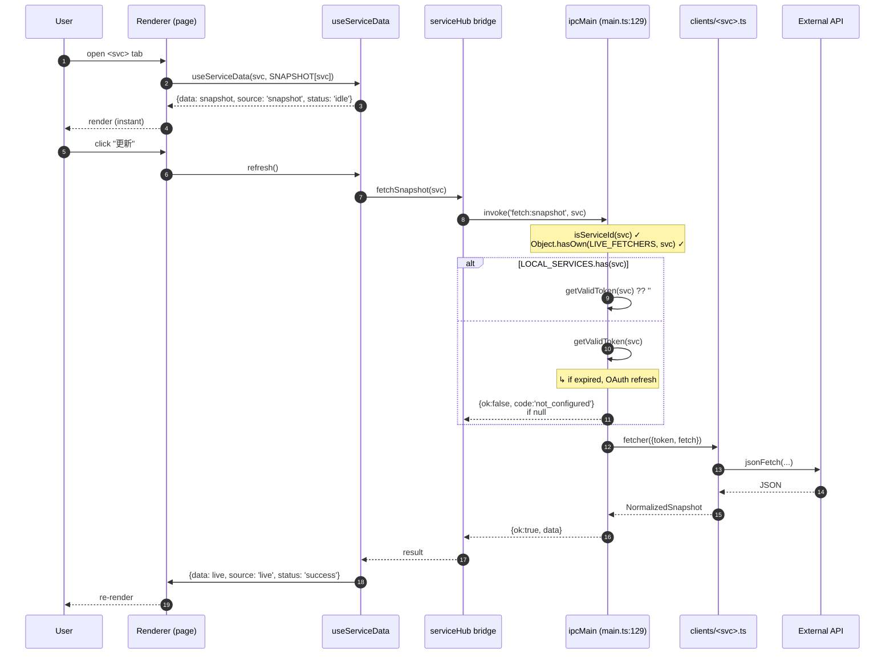
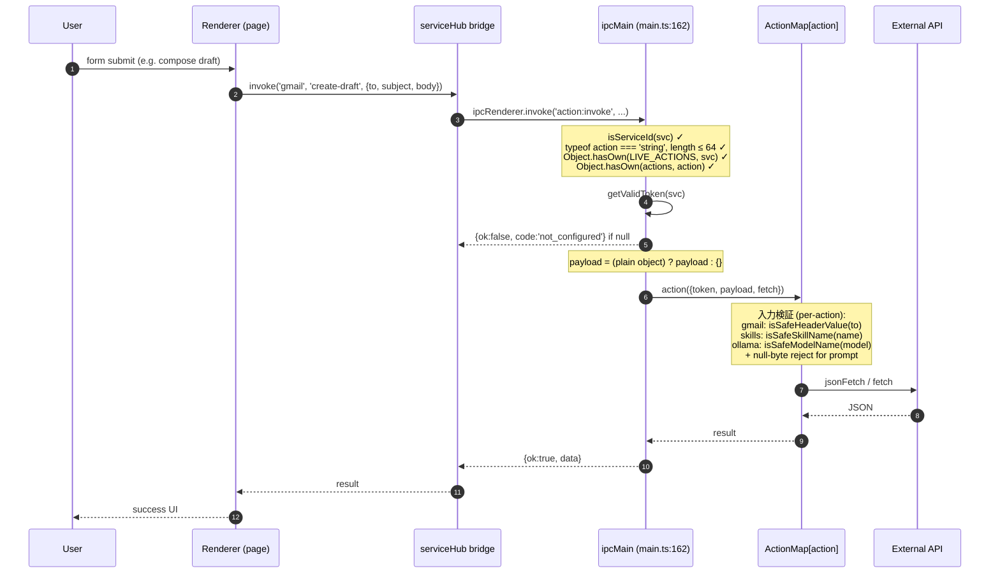
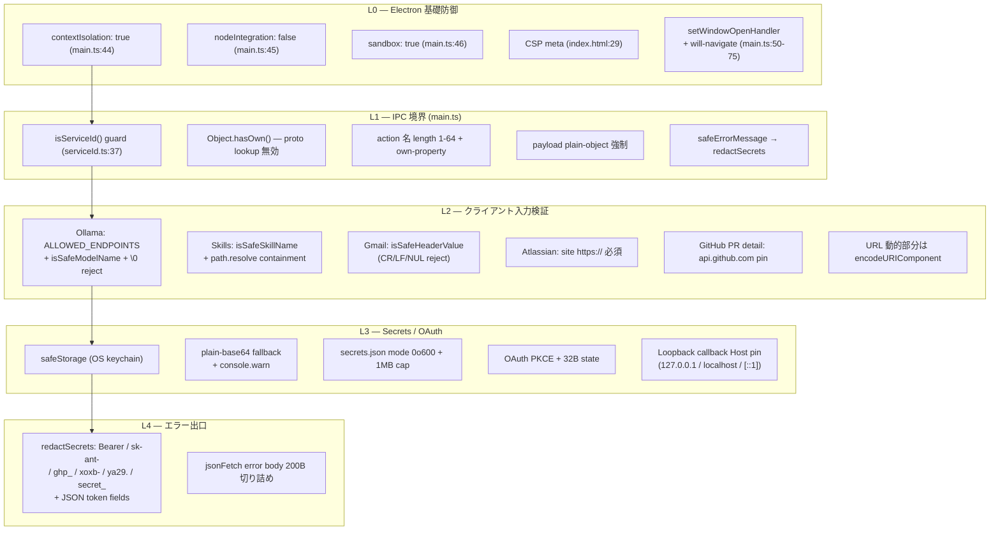
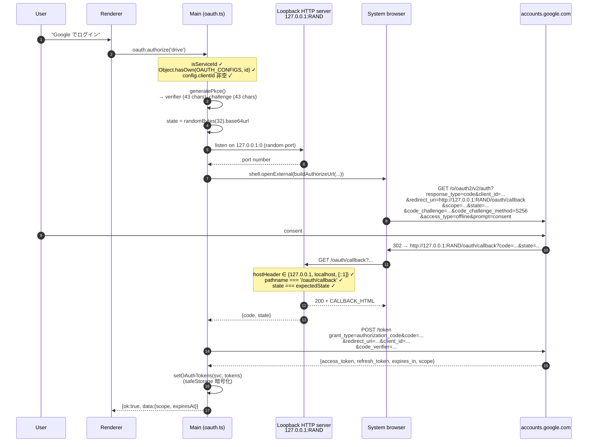
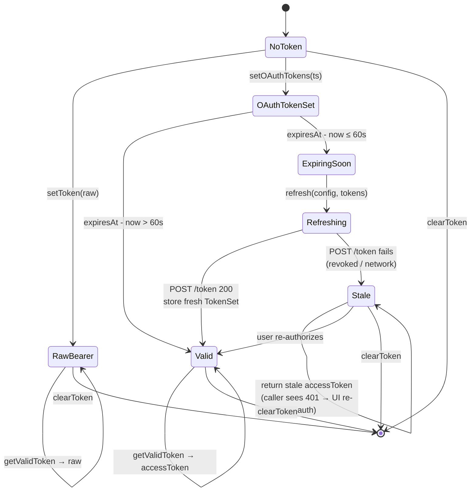
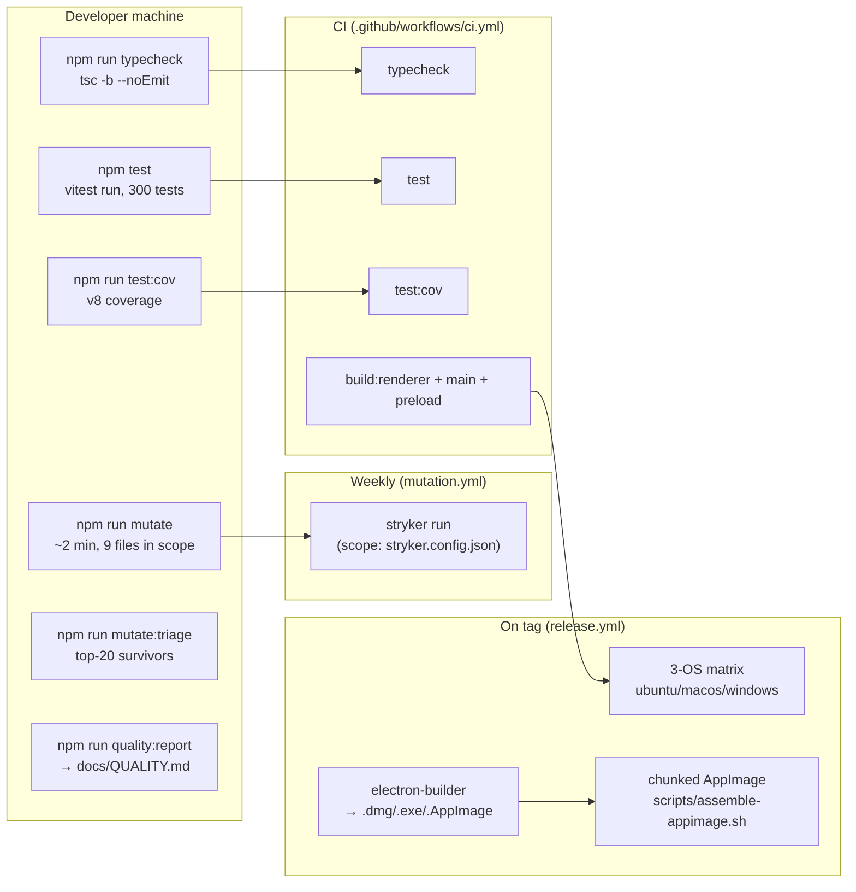
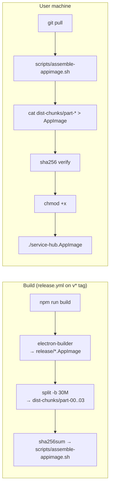
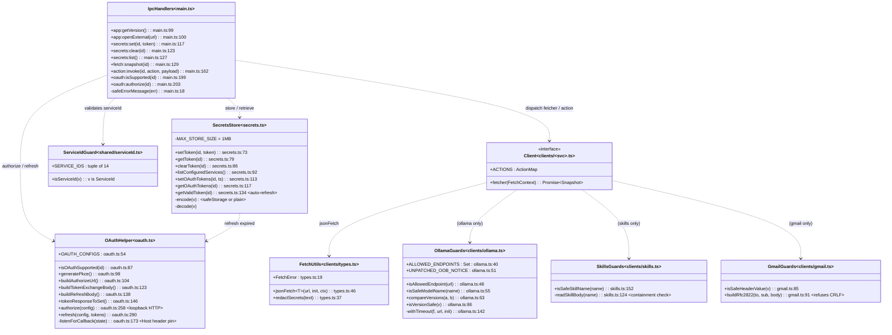

# Service Hub — システム設計図

最終更新: 2026-05-12 (commit `7684c12`)

Service Hub は **Electron + React + TypeScript** のデスクトップダッシュボードで、
14 のサービス (GitHub / WordPress.com / Atlassian / Notion / Google Drive・Calendar・Gmail /
Slack / Canva / Skills / Security / Cloudflare / Emotions / Ollama) をひとつのサイドバー
UI から横断操作できる。本書は実装の **全体図 / プロセス間境界 / セキュリティ境界 /
品質パイプライン / 配布パイプライン** を、可能な限り `file:line` 単位で検証可能な形で
網羅する。

---

## 0. TL;DR — 現在の状態

| 指標 | 値 | 出典 |
|---|---:|---|
| サービス数 | 14 | `src/shared/serviceId.ts:9-25` |
| IPC ハンドラ数 | 9 | `src/main/main.ts:99-224` |
| client モジュール (fetcher + actions) | 14 | `src/main/clients/index.ts:21-69` |
| ユニットテスト総数 | **300** | `npm test` |
| テストファイル数 | 19 | `**/__tests__/*.test.ts` |
| Mutation score (total) | **72.94%** | `docs/QUALITY.md` |
| Mutation score (covered) | **82.81%** | `docs/QUALITY.md` |
| 外部接続先ホスト | 12 + ローカル 1 | §5 で網羅 |
| OAuth 対応サービス | 3 (drive / calendar / gmail) | `src/main/oauth.ts:54-85` |
| `npm audit` (prod) | 0 vulnerabilities | `package-lock.json` |
| Linux without keychain で plain-base64 fallback | あり (起動時 1 回 console.warn) | `src/main/secrets.ts:48-63` |

---

## 1. 三プロセス構成 (High-level)

Electron は OS プロセスとして 3 種類のサブプロセスを生む。Service Hub では
**信頼境界 = この 3 プロセスの間** に置く。Renderer は sandbox 内で動作し、特権 API は
Preload bridge 経由でしか触れない。

```mermaid
graph TB
  subgraph "OS"
    A[End user]
    OS["OS keychain<br/>(safeStorage 暗号化先)"]
    FS["userData/<br/>service-hub-secrets.json<br/>mode 0o600, ≤1 MB"]
  end

  subgraph "Electron app process"
    subgraph "Renderer (React + Vite)"
      R1["sidebar<br/>services.ts (SSOT)"]
      R2["pages/*.tsx<br/>14 services"]
      R3["useServiceData hook<br/>snapshot ↔ live"]
      R4["window.serviceHub<br/>(typed bridge)"]
    end

    subgraph "Preload (contextBridge)"
      P1["exposeInMainWorld<br/>'serviceHub'<br/>preload.ts:43"]
    end

    subgraph "Main process (Node)"
      M1["ipcMain.handle × 8<br/>main.ts:99-224"]
      M2["clients/<br/>(14 fetcher + 14 ActionMap)"]
      M3["secrets.ts<br/>(safeStorage + 1MB cap)"]
      M4["oauth.ts<br/>(PKCE loopback)"]
    end
  end

  subgraph "External"
    EX1["api.github.com<br/>api.notion.com<br/>... (12 hosts)"]
    EX2["accounts.google.com<br/>(OAuth PKCE only)"]
    EX3["127.0.0.1:11434<br/>(Ollama, hardcoded)"]
  end

  A -->|click / type| R2
  R2 --> R3
  R3 -->|fetchSnapshot<br/>invoke| R4
  R4 -->|IPC| P1
  P1 -->|ipcRenderer.invoke| M1
  M1 -->|dispatch| M2
  M1 -->|store / read| M3
  M3 -->|encryptString| OS
  M3 -->|fs.readFile/writeFile| FS
  M2 -->|HTTPS| EX1
  M4 -->|HTTPS + redirect| EX2
  M2 -->|HTTP local-only| EX3

  classDef renderer fill:#1e3a8a,color:#fff,stroke:#3b82f6
  classDef preload fill:#7c2d12,color:#fff,stroke:#ea580c
  classDef main fill:#14532d,color:#fff,stroke:#22c55e
  classDef ext fill:#581c87,color:#fff,stroke:#a855f7
  class R1,R2,R3,R4 renderer
  class P1 preload
  class M1,M2,M3,M4 main
  class EX1,EX2,EX3 ext
```

| プロセス | 権限 | 主責任 | 設定箇所 |
|---|---|---|---|
| **Renderer** | `nodeIntegration: false` + `sandbox: true` + `contextIsolation: true` + CSP | 表示・ユーザ入力。Node API 不可。 | `main.ts:42-48` |
| **Preload** | contextIsolated bridge | `window.serviceHub` の expose | `main.ts:43` + `preload.ts:1-46` |
| **Main** | フル Node | IPC dispatch + secrets + OAuth + REST clients + `shell.openExternal` | `main.ts:99-224` |

### 1.1. CSP (verbatim — `src/renderer/index.html:29`)

```
default-src 'self';
script-src  'self';
style-src   'self' 'unsafe-inline';
img-src     'self' data: https:;
connect-src 'self' http://localhost:5173 ws://localhost:5173;
object-src  'none';
frame-src   'none';
base-uri    'self';
form-action 'none';
```

`connect-src` の `localhost:5173` は dev mode の Vite HMR 専用。production renderer
からの外部 HTTP は **ゼロ** (すべて main 経由)。

---

## 1.2. 自己検証スクリプト

本ドキュメントの `file:line` 参照は 145 箇所あり、コードの変更に伴って rot しがち。
`npm run verify:arch` (`scripts/verify-architecture.cjs`) が以下を自動チェックする:

1. すべての `file:line` の **ファイルが存在する**
2. **行番号がファイルサイズ範囲内**
3. doc で名前を挙げているシンボル (例 `isServiceId`) が **参照先ファイルに実在する**

CI (`.github/workflows/ci.yml`) で毎 push 走るため、コード移動で参照が壊れると即時 fail。

```bash
npm run verify:arch
# → Verified 123 file:line references in docs/ARCHITECTURE.md
# → ✅ all references resolve
```

---

## 2. IPC 契約 (8 チャンネル)

`src/preload/preload.ts:6-16` で型定義、`src/main/main.ts:99-224` で実装。

| チャンネル | Renderer → Main 引数 | Main → Renderer | 検証 | エラー code |
|---|---|---|---|---|
| `app:getVersion` | — | `string` | — | — |
| `app:openExternal` | `url: string` | `void` | `URL.protocol ∈ {http,https}` | — |
| `secrets:set` | `(serviceId, token)` | `void` | `isServiceId` + `length ∈ (0, 65536]` | — |
| `secrets:clear` | `serviceId` | `void` | `isServiceId` | — |
| `secrets:list` | — | `ServiceId[]` | (出力のみ) | — |
| `fetch:snapshot` | `serviceId` | `FetchResult<T>` | `isServiceId` + `Object.hasOwn(LIVE_FETCHERS, id)` | `not_implemented` \| `not_configured` \| `fetch_failed` |
| `action:invoke` | `(serviceId, action, payload)` | `ActionResult<T>` | `isServiceId` + action 長さ + `Object.hasOwn` + payload plain-object | `action_not_found` \| `not_configured` \| `action_failed` |
| `oauth:isSupported` | `serviceId` | `boolean` | `isServiceId` | — |
| `oauth:authorize` | `serviceId` | `OAuthResult` | `isServiceId` + `Object.hasOwn(OAUTH_CONFIGS, id)` + `config.clientId` 必須 | `not_supported` \| `authorize_failed` |

### 2.1. Result discriminated unions (`src/preload/preload.ts:6-16`)

```typescript
type FetchResult<T = unknown> =
  | { ok: true; data: T }
  | { ok: false; code: 'not_implemented' | 'not_configured' | 'fetch_failed'; message: string };

type ActionResult<T = unknown> =
  | { ok: true; data: T }
  | { ok: false; code: 'action_not_found' | 'not_configured' | 'action_failed'; message: string };

type OAuthResult =
  | { ok: true; data: { scope?: string; expiresAt?: number } }
  | { ok: false; code: 'not_supported' | 'authorize_failed'; message: string };
```

`ok: false` の `message` は `safeErrorMessage()` (`main.ts:18-20`) を必ず経由する。
これは `redactSecrets()` (`clients/types.ts:37-44`) で `Authorization: Bearer …`,
`sk-ant-…`, `ghp_…`, `xoxb-…`, `ya29.…`, `secret_…`, および JSON の
`access_token` / `refresh_token` / `token` / `api_key` / `apikey` / `password` フィールド
を `[REDACTED]` にマスクする。

### 2.2. コア型 (verbatim)

`src/main/clients/types.ts:3-17`:

```typescript
export interface FetchContext {
  token: string;
  fetch?: FetchFn;        // injectable for testing
}

export interface ActionContext {
  token: string;
  fetch?: FetchFn;
  payload: Record<string, unknown>;
}

export type ServiceAction = (ctx: ActionContext) => Promise<unknown>;
export type ActionMap     = Record<string, ServiceAction>;
```

`src/main/oauth.ts:22-44`:

```typescript
export interface OAuthConfig {
  authorizeUrl: string;
  tokenUrl: string;
  clientId: string;
  scopes: string[];
  scopeDelimiter?: string;            // ' ' (default) or ','
  extraAuthParams?: Record<string, string>;  // e.g. { access_type: 'offline' }
}

export interface TokenSet {
  accessToken: string;
  refreshToken?: string;
  expiresAt?: number;                 // Unix ms
  scope?: string;
  tokenType?: string;
}
```

---

## 3. サービスレジストリ (14 services × 認証スタイル)

`src/shared/serviceId.ts:9-25` の `SERVICE_IDS` が SSOT。型は
`type ServiceId = (typeof SERVICE_IDS)[number]`。Renderer (`services.ts`)・Main
(`clients/index.ts`)・Preload (`bridge.d.ts`) が同じ union を参照。

| ID | label | 認証 | client | LOCAL? | OAuth? | actions 数 |
|---|---|---|---|---|---|---|
| `github` | GitHub | Bearer (PAT) | `clients/github.ts` | | | 1 (`create-issue`) |
| `wordpress` | WordPress.com | Bearer | `clients/wordpress.ts` | | | 1 (`create-post`) |
| `atlassian` | Atlassian | Basic + site URL (JSON blob) | `clients/atlassian.ts` | | | 1 (`create-issue`) |
| `notion` | Notion | Bearer | `clients/notion.ts` | | | 1 (`create-page`) |
| `drive` | Google Drive | OAuth PKCE / Bearer | `clients/drive.ts` | | ✅ | 1 (`create-folder`) |
| `calendar` | Google Calendar | OAuth PKCE / Bearer | `clients/calendar.ts` | | ✅ | 1 (`create-event`) |
| `gmail` | Gmail | OAuth PKCE / Bearer | `clients/gmail.ts` | | ✅ | 1 (`create-draft`) |
| `slack` | Slack | Bearer (user token) | `clients/slack.ts` | | | 1 (`send-message`) |
| `canva` | Canva | Bearer | `clients/canva.ts` | | | 1 (`create-folder`) |
| `skills` | Skills | Bearer (Anthropic) | `clients/skills.ts` | ✅ | | 1 (`run-skill`) |
| `security` | Security | API keys JSON `{hibp, vt}` | `clients/security.ts` | ✅ | | 2 (`check-email-breach`, `scan-url`) |
| `cloudflare` | Cloudflare | Bearer (API token) | `clients/cloudflare.ts` | | | (read only) |
| `emotions` | Emotions | Bearer (Anthropic) | `clients/emotions.ts` | ✅ | | 2 (`log-mood`, `analyze-text`) |
| `ollama` | Ollama (local) | none | `clients/ollama.ts` | ✅ | | 1 (`chat`) |

- **LOCAL** = `LOCAL_SERVICES` set (`clients/index.ts:44-49`)。トークン未設定でも snapshot が動く。
- **OAuth** = `OAUTH_CONFIGS` にエントリあり (`oauth.ts:54-85`)。`GOOGLE_OAUTH_CLIENT_ID` 環境変数が必要。

### 3.1. Action payload スキーマ

各 action は `payload: Record<string, unknown>` を受け、内部で interface にキャスト。
入力検証はファイルごと:

| Service | Action | Payload interface | 検証 / clamp | 出典 |
|---|---|---|---|---|
| github | `create-issue` | `{ owner, repo, title, body? }` | URL part は `encodeURIComponent` | `github.ts:143-176` |
| wordpress | `create-post` | `{ siteId, title, content }` | siteId は `encodeURIComponent` | `wordpress.ts:67-109` |
| atlassian | `create-issue` | `{ projectKey, summary, description?, issueType? }` | site URL https only | `atlassian.ts:92-152` |
| notion | `create-page` | `{ parentPageId, title, body? }` | (形式検証なし — API 4xx で対処) | `notion.ts:72-121` |
| drive | `create-folder` | `{ name, parentId? }` | (none, Google API側で検証) | `drive.ts:50-92` |
| calendar | `create-event` | `{ summary, start, end, description? }` | (none, RFC3339 は API側で検証) | `calendar.ts:66-124` |
| gmail | `create-draft` | `{ to, subject, body? }` | **`isSafeHeaderValue(to)`** で CR/LF/NUL reject | `gmail.ts:60-129` |
| slack | `send-message` | `{ channel, text }` | (none) | `slack.ts:81-117` |
| canva | `create-folder` | `{ name, parentFolderId? }` | (none) | `canva.ts:79-115` |
| skills | `run-skill` | `{ name, prompt, model?, maxTokens? }` | **`isSafeSkillName(name)`** + path containment | `skills.ts:112-191` |
| security | `check-email-breach` | `{ email }` | `encodeURIComponent(email)` | `security.ts:137-264` |
| security | `scan-url` | `{ url }` | base64url(url) → VT id | `security.ts:190-265` |
| cloudflare | `create-dns-record` | `{ zoneId, type, name, content, ttl? }` | zoneId encodeURIComponent | `cloudflare.ts:127-207` |
| cloudflare | `purge-cache` | `{ zoneId, files?: string[] }` | zoneId encodeURIComponent | `cloudflare.ts:172-208` |
| emotions | `log-mood` | `{ text, mood, source? }` | text 32KB clamp | `emotions.ts:100-261` |
| emotions | `analyze-text` | `{ text }` | text 32KB clamp + extractJson | `emotions.ts:134-262` |
| ollama | `chat` | `{ model, prompt, system? }` | **`isSafeModelName(model)`** + `\0` reject + prompt 32KB / system 8KB clamp | `ollama.ts:233-314` |

---

## 4. データフロー (snapshot ↔ live)

各ページは **静的スナップショット** (`src/renderer/data/snapshot.ts`) で即時描画し、
ユーザがトークンを保存すると `fetch:snapshot` IPC で **ライブ取得** に切り替わる。
`useServiceData` hook (`src/renderer/hooks/useServiceData.ts`) が status 遷移を管理する。

### 4.1. `fetch:snapshot` の sequence



### 4.2. `action:invoke` の sequence



---

## 5. ネットワーク egress マトリクス

外部接続は **main プロセスからのみ**。renderer は CSP `connect-src 'self'` で外向き
HTTP を遮断 (HMR の localhost を除く)。下記以外のホストへの接続は存在しない。

| Service | Host | Endpoints (method + path) | Auth header | 出典 |
|---|---|---|---|---|
| github | `api.github.com` | `GET /user`, `GET /search/issues?...`, `GET /repos/{owner}/{repo}/pulls/{n}`, `POST /repos/{owner}/{repo}/issues` | `Authorization: Bearer …` | `clients/github.ts:74-164` |
| wordpress | `public-api.wordpress.com` | `GET /rest/v1.1/me/sites`, `POST /rest/v1.1/sites/{id}/posts/new` | `Authorization: Bearer …` | `clients/wordpress.ts:46-89` |
| atlassian | `*.atlassian.net` (user-supplied, https only) | `GET /rest/api/3/project/search`, `POST /rest/api/3/issue` | `Authorization: Basic <base64>` | `clients/atlassian.ts:62-148` |
| notion | `api.notion.com` | `POST /v1/search`, `POST /v1/pages` | `Authorization: Bearer …` | `clients/notion.ts:43-98` |
| drive | `www.googleapis.com`, `drive.google.com` | `GET /drive/v3/files`, `POST /drive/v3/files` | `Authorization: Bearer …` | `clients/drive.ts:30-87` |
| calendar | `www.googleapis.com` | `GET /calendar/v3/users/me/calendarList`, `GET /calendar/v3/calendars/primary/events`, `POST /calendar/v3/calendars/primary/events` | `Authorization: Bearer …` | `clients/calendar.ts:33-108` |
| gmail | `gmail.googleapis.com` | `GET /gmail/v1/users/me/messages`, `GET /gmail/v1/users/me/messages/{id}`, `POST /gmail/v1/users/me/drafts` | `Authorization: Bearer …` | `clients/gmail.ts:29-113` |
| slack | `slack.com` | `GET /api/conversations.list`, `GET /api/team.info`, `POST /api/chat.postMessage` | `Authorization: Bearer …` | `clients/slack.ts:53-98` |
| canva | `api.canva.com` | `GET /rest/v1/designs`, `GET /rest/v1/brand-kits`, `POST /rest/v1/folders` | `Authorization: Bearer …` | `clients/canva.ts:43-96` |
| security (HIBP) | `haveibeenpwned.com` | `GET /api/v3/breachedaccount/{email}` | `hibp-api-key: …` | `clients/security.ts:158` |
| security (VT) | `www.virustotal.com` | `POST /api/v3/urls`, `GET /api/v3/urls/{id}` | `x-apikey: …` | `clients/security.ts:231-247` |
| cloudflare | `api.cloudflare.com` | `GET /client/v4/user`, `GET /client/v4/zones?...` | `Authorization: Bearer …` | `clients/cloudflare.ts:23-114` |
| skills + emotions | `api.anthropic.com` | `POST /v1/messages` | `x-api-key: …` | `clients/skills.ts:169`, `clients/emotions.ts:209` |
| **OAuth (Google)** | `accounts.google.com`, `oauth2.googleapis.com` | `GET /o/oauth2/v2/auth?...`, `POST /token` | — / `Content-Type: x-www-form-urlencoded` | `oauth.ts:58-85` |
| ollama | **`127.0.0.1:11434`** (hardcoded) | `GET /api/version`, `GET /api/tags`, `POST /api/chat` (allowlist 限定) | none | `clients/ollama.ts:27, 40-46` |

**禁止リスト (Ollama)**: `/api/pull`, `/api/create`, `/api/push`, `/api/copy`, `/api/delete`,
`/api/blobs`, `/api/upload` — `ALLOWED_ENDPOINTS` (`clients/ollama.ts:40-46`) に含まれず、
`withTimeout()` (`clients/ollama.ts:142-165`) で実行時 reject。

---

## 6. セキュリティ境界と防御層



### 6.1. 攻撃面 × 防御マトリクス

| 攻撃面 | 例 | 防御 (file:line) |
|---|---|---|
| **プロトタイプ汚染** | `serviceId="__proto__"` | `isServiceId` (`serviceId.ts:37`) + `Object.hasOwn` (`main.ts:135,171,174,207`) |
| **任意 URL の Ollama 接続** | renderer が他ホスト指定 | `OLLAMA_BASE` (`clients/ollama.ts:27`) + `ALLOWED_ENDPOINTS` (40-46) |
| **モデル file OOB read (未パッチ)** | 悪意 GGUF ロード | `/api/pull|create|push|copy|delete|blobs|upload` 呼ばない設計 + 警告 (`UNPATCHED_OOB_NOTICE`, `ollama.ts:51-57`) |
| **Skill name path traversal** | `name="../etc/passwd"` | `isSafeSkillName` (`skills.ts:152-160`) + `path.resolve().startsWith()` (`skills.ts:131-137`) |
| **RFC 2822 ヘッダ injection** | `to="x@y\r\nBcc: z"` | `isSafeHeaderValue` (`gmail.ts:85-88`) + throw in `buildRfc2822` (91-104) |
| **token 漏洩 (error body echo)** | API が Authorization 反射 | `safeErrorMessage` (`main.ts:18-20`) + `redactSecrets` (`types.ts:37-44`) + jsonFetch 200B 切り詰め (`types.ts:56`) |
| **Renderer XSS** | (理論) | CSP + React auto-escape + `dangerouslySetInnerHTML` 0 件 |
| **External URL 開封** | `javascript:` / `file:` | `app:openExternal` http(s) limit (`main.ts:100-115`) |
| **secrets.json 改竄/巨大化** | ディスク満杯 / 攻撃者 | 1MB cap + shape 検証 (`secrets.ts:14-39`) |
| **OAuth CSRF** | 偽 state | 32 byte randomBytes + `state !== expectedState` reject (`oauth.ts:217-219`) |
| **OAuth DNS rebinding on loopback** | 別 host が callback ヒット | Host header pin (`oauth.ts:196-201`) |

---

## 7. OAuth フロー (PKCE + Loopback)

### 7.1. Authorization flow



### 7.2. トークン refresh の state machine

`getValidToken()` (`src/main/secrets.ts:134-164`) が状態遷移を駆動する。



---

## 8. Secrets 永続化

```mermaid
flowchart LR
  T[token: string] --> E{safeStorage<br/>available?}
  E -->|yes| ENC["safeStorage.encryptString(t)<br/>→ base64"]
  E -->|no, 起動時 1 回 warn| PLN["'plain:' + base64(t)"]
  ENC --> JSON["secrets.json<br/>{ &lt;svc&gt;: &lt;encoded&gt; }"]
  PLN --> JSON
  JSON --> FS["fs.writeFile<br/>mode 0o600"]
  FS --> DISK["userData/<br/>service-hub-secrets.json"]

  DISK --> RD{fs.stat<br/>size ≤ 1MB?}
  RD -->|no| ERR["console.error + return {}"]
  RD -->|yes| PARSE["JSON.parse"]
  PARSE --> SHAPE{is plain object?<br/>string values only?}
  SHAPE -->|yes| OUT[Record<string,string>]
  SHAPE -->|no| EMPTY[return {}]
```

OAuth サービスは値が `JSON.stringify(TokenSet)`、raw bearer サービスは生文字列。
`getValidToken()` は最初に `JSON.parse` を試みて `isTokenSet` で振り分け。

| 経路 | 復号 | 出典 |
|---|---|---|
| `safeStorage.encryptString` 経由 | `safeStorage.decryptString(Buffer.from(v, 'base64'))` | `secrets.ts:65-71` |
| `'plain:'` プレフィックス | `Buffer.from(v.slice(6), 'base64').toString('utf8')` | `secrets.ts:66-67` |

---

## 9. Ollama (CVE 対策レイヤ)

```mermaid
flowchart TB
  REQ["chat({model, prompt, system})"] --> V1{isSafeModelName<br/>(model)?}
  V1 -->|no| FE1[throw FetchError]
  V1 -->|yes| V2{prompt/system に \\0?}
  V2 -->|yes| FE2[throw FetchError]
  V2 -->|no| WT[withTimeout]

  WT --> V3{url ∈ ALLOWED_ENDPOINTS?}
  V3 -->|no| FE3[throw FetchError<br/>'endpoint not in allowlist']
  V3 -->|yes| AC[AbortController 30s]
  AC --> FETCH["fetch(127.0.0.1:11434/api/chat,<br/>{stream: false, ...})"]
  FETCH --> CAP{res.text size<br/>≤ 10 MB?}
  CAP -->|no| FE4[throw FetchError]
  CAP -->|yes| OK[return {reply, durationMs}]

  classDef veto fill:#7f1d1d,color:#fff
  classDef ok fill:#14532d,color:#fff
  class FE1,FE2,FE3,FE4 veto
  class OK ok
```

snapshot 取得時は `/api/version` + `/api/tags` の 2 endpoints のみ、`stream: false` のみ。
**`UNPATCHED_OOB_NOTICE`** (`clients/ollama.ts:51-57`) を `snapshot.warnings[]` に毎回
追加し、ステータスバーで「検証済みソースのみからモデル取得」を継続的に喚起。

### 9.1. CVE → 防御マッピング

| CVE / Issue | 脆弱性 | Fix version | Service Hub の対応 |
|---|---|---|---|
| **CVE-2024-37032** (Probllama) | `/api/pull` でパストラバーサル → RCE | Ollama ≥ 0.1.34 | `/api/pull` を呼ばない設計 + `ALLOWED_ENDPOINTS` で実行時 reject |
| **CVE-2024-39719** | `/api/create` でファイル存在情報漏洩 | Ollama ≥ 0.1.46 | `/api/create` を呼ばない + allowlist enforce |
| **CVE-2024-39720** | 不正 GGUF → OOB read (DoS) | Ollama ≥ 0.1.46 | バージョン < 0.1.46 で警告バッジ + 攻撃面 (アップロード) を絶つ |
| **CVE-2024-39721** | `/api/create` に `/dev/random` で DoS | Ollama ≥ 0.1.46 | `/api/create` を呼ばない |
| **CVE-2024-39722** | `/api/push` でファイルシステム情報漏洩 | Ollama ≥ 0.1.46 | `/api/push` を呼ばない + allowlist enforce |
| **未パッチ OOB read** (model/engine file parser) | malformed GGUF で heap OOB read → 情報漏洩 / RCE | **公式パッチ未公開** | `UNPATCHED_OOB_NOTICE` を毎 snapshot で表示 + dangerous endpoints 全 reject + `\0` reject in chat input |

`MIN_SAFE_VERSION = '0.1.46'` (`clients/ollama.ts:28`) 未満は `versionSafe: false` で UI に
警告バッジ表示。`compareVersions` (`clients/ollama.ts:63`) は `0.1.46-rc1` や `0.1.46+sha` の
trailing tag を正しく ignore する。

---

## 10. 品質パイプライン



### 10.1. テスト分布 (commit `7684c12`, total 300)

| ファイル | tests | mutation total | mutation covered |
|---|---:|---:|---:|
| `src/main/clients/__tests__/ollama.test.ts` | 46 | 81.04 | 84.65 |
| `src/main/clients/__tests__/security.test.ts` | 33 | 69.40 | 73.23 |
| `src/main/__tests__/property.test.ts` | 29 | (横断 fuzz) | — |
| `src/main/clients/__tests__/skills.test.ts` | 27 | 78.11 | 80.98 |
| `src/main/__tests__/oauth.test.ts` | 18 | 43.09 | 91.01 |
| `src/main/clients/__tests__/gmail.test.ts` | 18 | 87.64 | 88.64 |
| `src/main/clients/__tests__/atlassian.test.ts` | 16 | 81.82 | 81.82 |
| `src/main/clients/__tests__/github.test.ts` | 16 | 85.92 | 87.14 |
| `src/main/clients/__tests__/slack.test.ts` | 14 | 79.41 | 81.82 |
| `src/main/clients/__tests__/emotions.test.ts` | 13 | — | — |
| `src/main/clients/__tests__/cloudflare.test.ts` | 12 | — | — |
| `src/main/clients/__tests__/types.test.ts` | 12 | 74.36 | 76.32 |
| `src/main/clients/__tests__/canva.test.ts` | 9 | — | — |
| `src/main/clients/__tests__/wordpress.test.ts` | 9 | — | — |
| `src/main/clients/__tests__/notion.test.ts` | 8 | — | — |
| `src/main/clients/__tests__/drive.test.ts` | 6 | — | — |
| `src/main/clients/__tests__/calendar.test.ts` | 5 | — | — |
| `src/shared/api/__tests__/clients.test.ts` | 5 | — | — |
| `src/shared/__tests__/serviceId.test.ts` | 4 | — | — |

Stryker scope (`stryker.config.json:5-15`) は **9 ファイル** (oauth + types + 7 主要 client)。
他はカバレッジ計測のみ (`vitest --coverage`)。

### 10.2. property-based fuzz の網羅

`src/main/__tests__/property.test.ts` は fast-check で以下を fuzz する:

| 対象 | 不変条件 | 試行数 |
|---|---|---:|
| `parseFrontmatter` | 任意 string で例外を投げない、出力は object | 200 |
| `parseSecurityKeys` | 任意 string で例外を投げない、shape 保持 | 200 |
| `parseAtlassianToken` | https URL 全パターンで trailing `/+` 除去 | 200 |
| `generatePkce` | verifier/challenge 形状不変 | 100 |
| `buildAuthorizeUrl/Token/RefreshBody` | URL 構築の必須パラメータ存在 | 200 ×3 |
| `tokenResponseToSet` | expiresAt 単調性 | 200 |
| `buildRfc2822` | UTF-8 subject + 5 ヘッダ存在 | — |
| `buildChannelPermalink` | host pin (slack.com) | 200 |
| `redactSecrets` | 6 シークレットパターン全 redaction | 200 ×3 |
| `isAllowedEndpoint` | 700 ランダム URL で write-side / non-loopback reject | 300 |
| `isSafeModelName` | 400 ランダム名で shell metachars / `..` / 制御文字 reject | 400 |
| `isSafeSkillName` | path traversal / `/` / `\` / NUL / 先頭 `.` reject | 500 |
| `isSafeHeaderValue` | CR / LF / NUL reject、clean は accept | 400 |

合計 **fuzz 試行 約 5,000+**。

---

## 11. 配布パイプライン (chunked AppImage)

サンドボックス VM ではユーザのデスクトップに大容量バイナリを直接置けないため、
**AppImage を 30 MB チャンクに分割して git に commit** する独自手順を採用。



---

## 12. レイヤ別の主要モジュール (class 図)



---

## 13. 設計の不変条件 (invariants)

新しい機能を追加する PR でこれらを破ってはいけない。各項目に対応する回帰テストがある。

| # | 不変条件 | 回帰テスト |
|---|---|---|
| 1 | Renderer は Node API を直接呼ばない (必ず `window.serviceHub` 経由) | `BrowserWindow` 設定 (`main.ts:42-48`) |
| 2 | Renderer に raw token は届かない (`secrets:list` は ID のみ) | `preload.ts:26` |
| 3 | IPC で受けた serviceId は indexing 前に `isServiceId()` 検証 | `serviceId.test.ts` 4 件 |
| 4 | Error message は `safeErrorMessage()` / `redactSecrets()` を経由 | `property.test.ts` redactSecrets fuzz 600 試行 |
| 5 | 外部 URL は `app:openExternal` 経由のみ — http(s) 限定 | `main.ts:100-115` |
| 6 | fetcher / action の URL path 中の動的部分は `encodeURIComponent` | `github.test.ts`, `wordpress.test.ts`, ... |
| 7 | Ollama は `127.0.0.1:11434` 以外には接続しない | `ollama.test.ts` `only ever hits 127.0.0.1:11434` |
| 8 | Ollama は `/api/pull|create|push|copy|delete|blobs|upload` を呼ばない | `ollama.test.ts` `isAllowedEndpoint` 例 + property fuzz 700 試行 |
| 9 | `dangerouslySetInnerHTML` / `eval` / `new Function` 禁止 | grep audit (security audit) |
| 10 | Skill name は path traversal を含まない | `skills.test.ts` + `property.test.ts` 500 試行 |
| 11 | Gmail `to` は CR/LF/NUL を含まない | `gmail.test.ts` + `property.test.ts` 400 試行 |
| 12 | OAuth callback の Host ヘッダは loopback のみ | `oauth.ts:196-201` (listenForCallback) |
| 13 | secrets.json は ≤ 1 MB かつ plain object | `secrets.ts:14-39` |
| 14 | 新規 client は CLAUDE.md の "ServiceClient contract" を満たす + `LIVE_FETCHERS` / `SERVICES` 両方に登録 | scaffold script |
| 15 | PR で `npm run typecheck && npm test` が green | CI |

---

## 14. 関連ドキュメント

| ドキュメント | 目的 |
|---|---|
| `docs/SECURITY.md` | 脅威モデル A1-A7 |
| `docs/SECURITY_AUDIT.md` | 監査ログ (P0-P3 findings + defense-in-depth 追加) |
| `docs/OLLAMA_SECURITY.md` | Ollama CVE + 未パッチ OOB read 対策 |
| `docs/OAUTH_SETUP.md` | GOOGLE_OAUTH_CLIENT_ID 設定手順 |
| `docs/EMOTIONS_SETUP.md` | Anthropic API key 設定 |
| `docs/SECURITY_SETUP.md` | HIBP / VirusTotal キー設定 |
| `docs/CLOUDFLARE_SETUP.md` | Cloudflare API key 設定 |
| `docs/QUALITY.md` | (自動生成) coverage / mutation dashboard |
| `docs/QUALITY_WORKFLOW.md` | 品質運用 playbook |
| `docs/ADDING_A_SERVICE.md` | 新サービス追加チェックリスト |
| `docs/REMAINING_WORK.md` | Phase 4-7 ロードマップ |
| `CLAUDE.md` | Claude Code 向けプロジェクトガイド |
