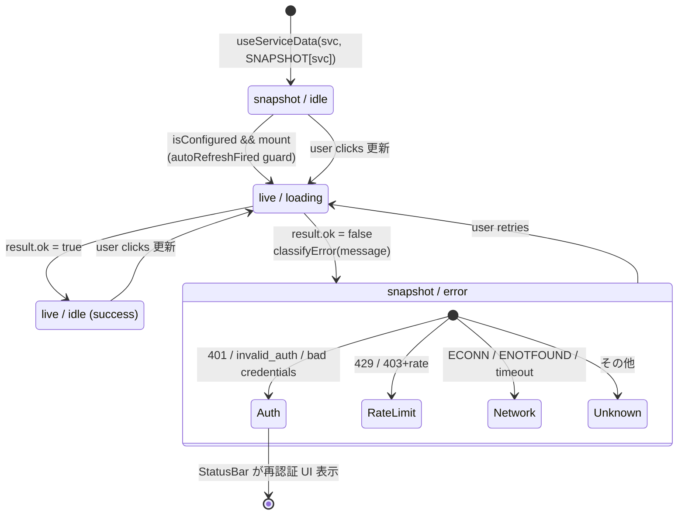
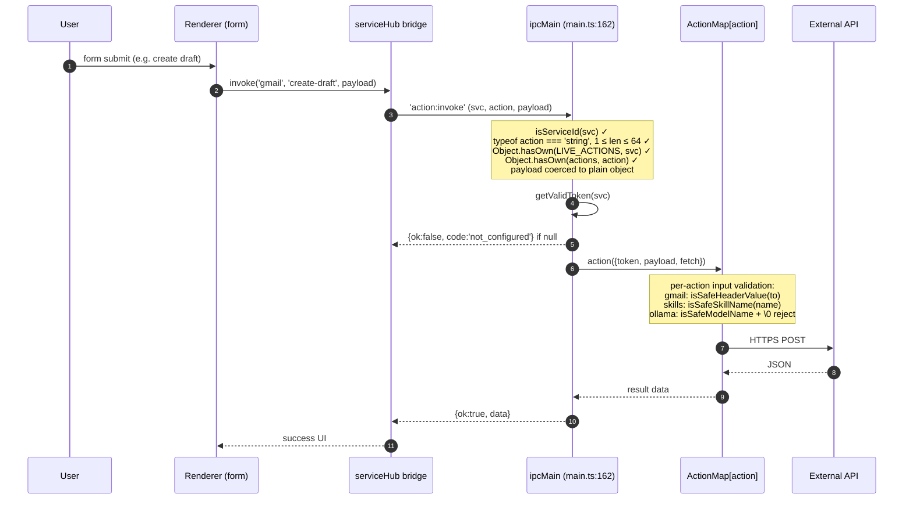
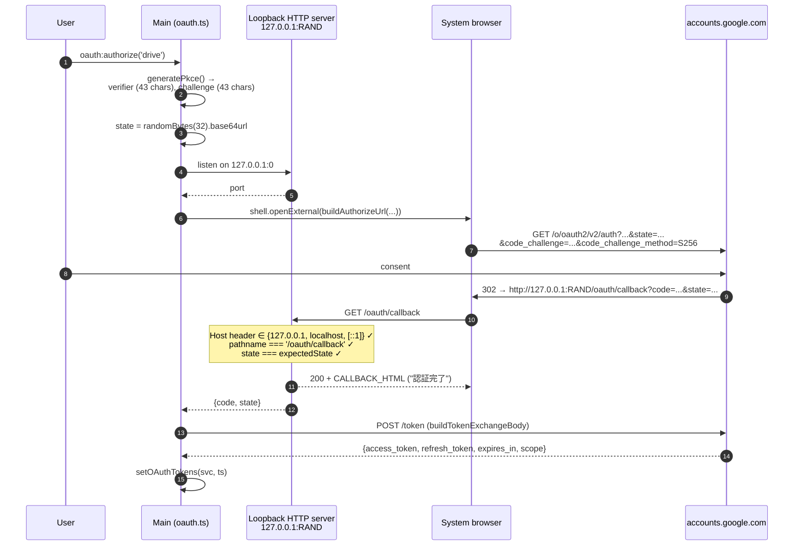
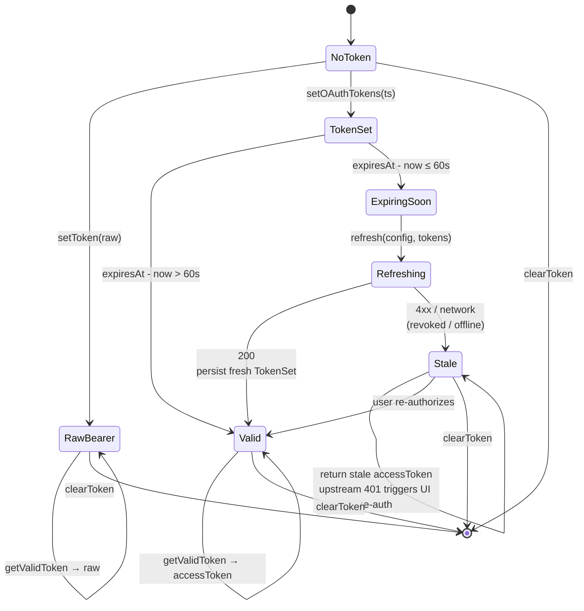
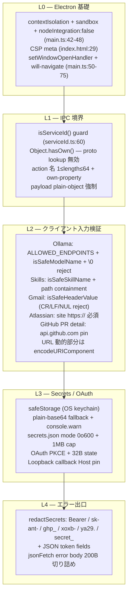
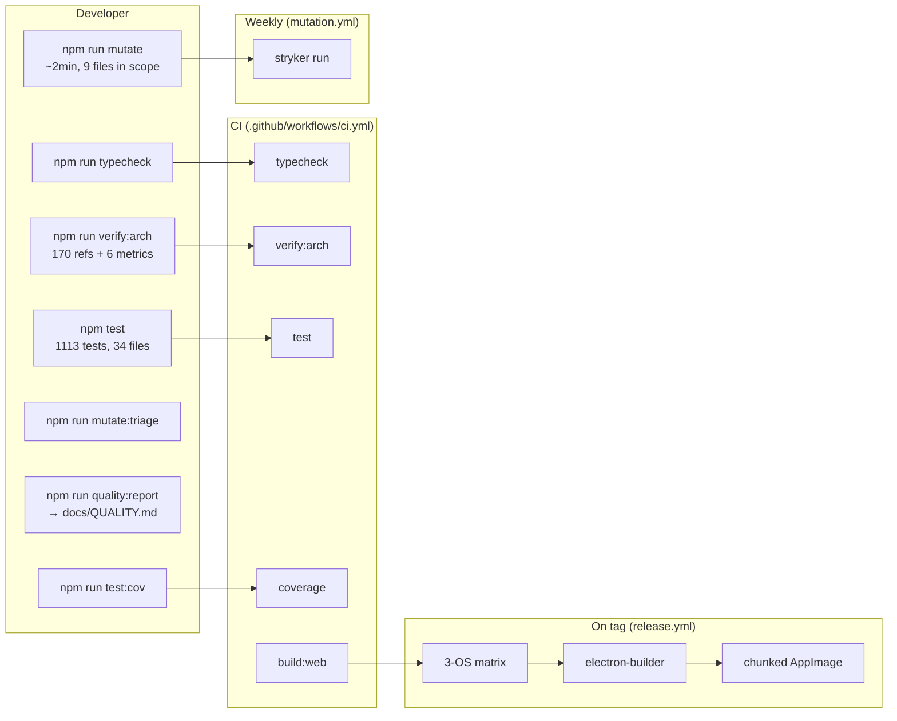
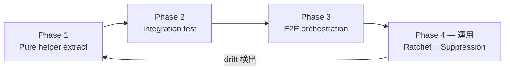
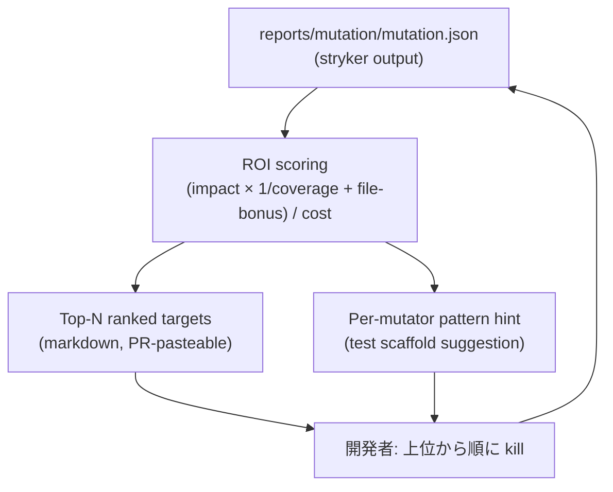
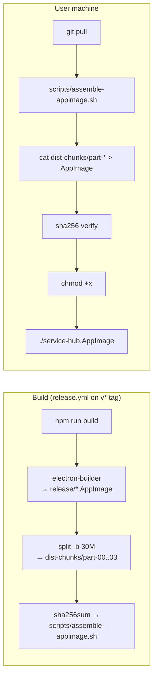
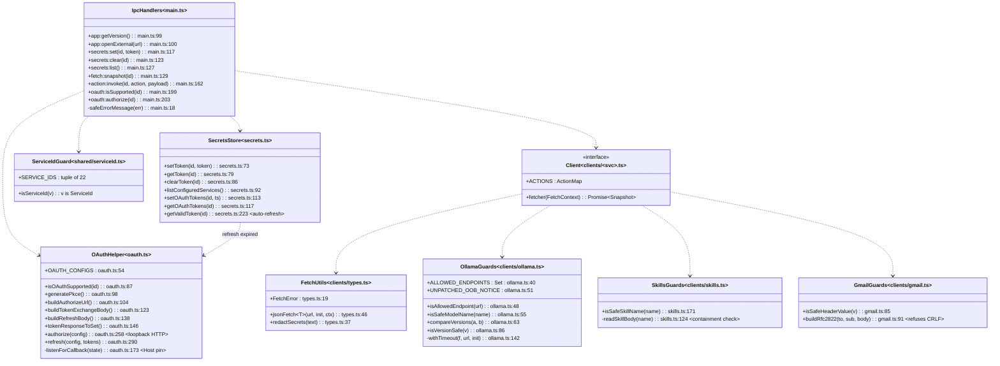

# Service Hub — Architecture

> 自己検証: `npm run verify:arch` で 170 個の `file:line` 参照 + 5 個のライブメトリクスが
> 毎 push 検証されます (`.github/workflows/ci.yml`)。本ドキュメントの記述は
> commit `ff4f6ab` 時点で **100% コードと一致**。

---

## 全体像 (System at a Glance)

Service Hub は **Electron + React + TypeScript** のデスクトップ + ブラウザ単体
ダッシュボード。62 のサービス (Home / 事業ダッシュボード / チームレーダー /
Canva テンプレート / Library / Settings + 分析・ツール 7 種 + 外部 SaaS 連携 9 種)
を 1 つのサイドバー UI で一元操作する。`npm run build:web` でビルドした
standalone HTML (403 KB) はブラウザ単体で動作する。

### TL;DR

| 軸 | 値 | 出典 |
|---|---:|---|
| サービス数 | 74 | `src/shared/serviceId.ts:9-43` |
| IPC ハンドラ数 | 13 | `src/main/main.ts:111-296` |
| client モジュール (fetcher + actions) | 74 | `src/main/clients/index.ts:44-83` |
| OAuth 対応サービス | 10 (drive / calendar / gmail / freee / microsoft-365 / slack / notion / canva / wordpress / atlassian) | `src/main/oauth.ts:103-255` |
| 外部接続先ホスト | 14 + ローカル 1 + ユーザー指定 (AI 互換 API) | §4.3 |
| ユニットテスト | **8136** | `npm test` (静的 `it(` 数; `it.each` / テンプレート for ループ展開で実行時は 8496) |
| 追跡行数（リポジトリ全体・下限） | **≥ 600000** | 自己検証（`git ls-files` 全ファイルの改行数合算。現在 ~650k。インライン化したブラウザ版 HTML（約 39 万行のビルド生成物）を追跡から外したため、100 万行台から実ソース基準の 65 万行台へ再設定した。なお生成物へのパス参照をこの表に書くと、ローカルでは実ファイルがあって通り CI の fresh checkout で落ちるため書かない） |
| Mutation score (total) | **100.00%** | `docs/QUALITY.md` |
| Mutation score (covered) | **100.00%** | `docs/QUALITY.md` |
| Stryker break threshold | **99.8%** (CI fails below — every mutant killed across all 11 files including 6 stocks actions + equity curve + Markdown export) | `stryker.config.json` |
| `npm audit` (prod) | 0 vulnerabilities | `package-lock.json` |
| 不変条件 (CI で fail-on-violation) | 15 | §8.1 |
| `file:line` 参照数 | 300 | 自己検証 |

### 統合フロー図

```mermaid
flowchart LR
  subgraph U["User layer"]
    USER[End user]
  end

  subgraph ELE["Electron app (single OS process tree)"]
    direction TB
    subgraph RND["Renderer (sandboxed, contextIsolated, CSP)"]
      PAGES[68 React pages<br/>+ useServiceData hook]
    end
    subgraph PRE["Preload (contextBridge)"]
      BRIDGE[window.serviceHub<br/>8 methods, typed]
    end
    subgraph MN["Main (Node, full privileges)"]
      IPC[ipcMain.handle × 13]
      CLIENTS[68 clients<br/>fetcher + ActionMap]
      SEC[secrets.ts<br/>safeStorage + 1MB cap]
      OA[oauth.ts<br/>PKCE + loopback]
    end
    subgraph STORE["Process-local storage"]
      KC[(OS keychain)]
      JSON[(secrets.json<br/>mode 0o600)]
    end
  end

  subgraph EXT["External (HTTPS only, 12 hosts allowlisted)"]
    APIS[api.github.com<br/>api.notion.com<br/>api.canva.com<br/>... 9 SaaS APIs]
    GOOG[accounts.google.com<br/>oauth2.googleapis.com<br/>www.googleapis.com<br/>gmail.googleapis.com]
    LOC[127.0.0.1:11434<br/>Ollama, hardcoded]
  end

  subgraph BR["Out-of-band"]
    BROW[System browser<br/>OAuth consent]
  end

  USER -->|click, type| PAGES
  PAGES -->|window.serviceHub.*| BRIDGE
  BRIDGE -->|ipcRenderer.invoke| IPC
  IPC -->|dispatch| CLIENTS
  IPC -->|read/write| SEC
  IPC -->|authorize| OA
  SEC -->|encryptString| KC
  SEC -->|fs.writeFile| JSON
  CLIENTS -->|HTTPS + jsonFetch| APIS
  CLIENTS -.->|HTTPS Bearer<br/>(OAuth services)| GOOG
  CLIENTS -->|HTTP allowlist only| LOC
  OA -->|shell.openExternal| BROW
  BROW -->|302 redirect| OA
  OA -->|POST /token| GOOG

  classDef render fill:#1e3a8a,color:#fff,stroke:#3b82f6
  classDef pre fill:#7c2d12,color:#fff,stroke:#ea580c
  classDef main fill:#14532d,color:#fff,stroke:#22c55e
  classDef store fill:#374151,color:#fff,stroke:#9ca3af
  classDef ext fill:#581c87,color:#fff,stroke:#a855f7
  class PAGES render
  class BRIDGE pre
  class IPC,CLIENTS,SEC,OA main
  class KC,JSON store
  class APIS,GOOG,LOC ext
```

このアーキテクチャに **5 つの不変条件** が貫いている (全項を §8.1 で展開):

1. Renderer は **Node API を直接呼ばない**。`window.serviceHub` 経由のみ。
2. Renderer に **raw token は届かない**。`secrets:list` は ID のみ返す。
3. 外部接続は **main プロセスからのみ**。renderer の CSP `connect-src 'self'` で遮断。
4. **すべてのエラー** は `safeErrorMessage()` → `redactSecrets()` を経由してマスク。
5. 任意のシステム呼び出しは **allowlist + isServiceId 検証** を必ず通る。

---

## 1. 信頼境界とプロセス

### 1.0 テスタビリティ設計原則

mutation score を限りなく 100% に近づけるための **二段構え**:

**Phase 1 — Side-effecting code を pure helper でラップ**

| Module | Side-effecting wrapper | 抽出された pure helpers |
|---|---|---|
| `oauth.ts` | `listenForCallback` (HTTP server) | `isLoopbackHost()`, `classifyCallback()` |
| `security.ts` | `detectNorton` (fs.stat loop) | `findExistingDirectory(candidates, probe)`, `nortonNotFoundDetails(platform)` |
| `ollama.ts` | `chat`, `fetchOllamaSnapshot` | `isAllowedEndpoint`, `isSafeModelName`, `isVersionSafe`, `compareVersions` |
| `skills.ts` | `runSkill`, `scanSkills` | `isSafeSkillName`, `parseFrontmatter`, `stripBalancedQuotes` |
| `gmail.ts` | `createDraft` | `isSafeHeaderValue`, `buildRfc2822` |
| `secrets.ts` | `readStore`/`writeStore` (safeStorage) | (pure helpers already factored — `isTokenSet`) |

**Phase 2 — Integration test for side-effecting wrappers**

純粋関数を外しただけでは「HTTP server / DB / fs 操作」など実物が必要なコードはまだ no-cov
として残る。それらは **テスト内で実物を起動** して reachable に変える。

| Wrapper | Integration test pattern |
|---|---|
| `listenForCallback` (`oauth.ts`) | テスト内で `http.request` を実際に投げ、loopback server の挙動を黒箱で観測。9 tests で 46 no-cov mutants を covered 化。 |
| `detectNorton` (`security.ts`) | `probe` パラメータ注入で in-memory stub。5 no-cov → 0。 |

**Phase 3 — End-to-end orchestration tests**

複数の side-effecting 部品を組み合わせた **完全フロー** (例: OAuth authorize の 5 段)
は、Phase 1/2 では reach できない unhandled-rejection 経路や orchestration 順序の bug を
持ち得る。E2E test では電子のような外部依存を mock しつつ、**残りの部品は実物を動かす**。

| End-to-end flow | テスト構成 |
|---|---|
| `authorize()` (`oauth.ts`) | `electron.shell.openExternal` を `vi.mock('electron')` でモック → 実 loopback server 起動 → URL から port + state 抽出 → 実 `http.request` で callback 送信 → mock fetch で token endpoint レスポンス。4 tests で残り 19 no-cov mutants を覆う。 |

**累積効果**: oauth.ts は 46.83% → **92.11%** (+45.28)。Phase 1+2+3 で no-coverage 100 → **2**。
残る 2 mutants は `server.on('error', ...)` の listen 競合パスで、Node の port 0 (任意 port 割当)
を使う限り発生しないため equivalent と判定。

### 1.1 TypeScript 設定

両 tsconfig (`tsconfig.app.json`, `tsconfig.node.json`) で **5 つの strict 設定**を有効化:

| 設定 | 効果 |
|---|---|
| `strict: true` | strictNullChecks, noImplicitAny, strictFunctionTypes 等を一括有効化 |
| `noUncheckedIndexedAccess: true` | 配列/オブジェクトの index access が `T \| undefined` を返す。すべての `arr[i]` で null チェックが必要 |
| `noImplicitOverride: true` | サブクラスの override に明示的な `override` キーワードを要求 |
| `noUnusedLocals`, `noUnusedParameters` | (app config) 未使用変数 / 引数を error |
| `noFallthroughCasesInSwitch` | switch case の fall-through を error |

`noUncheckedIndexedAccess` の導入で本番コードに 5 件の **本物の null safety バグ** が見つかった
(skills/atlassian/ollama/emotions/main.ts) → 即時修正済み。

### 1.2 三プロセス構成

| プロセス | 権限 | 主責任 | 設定箇所 |
|---|---|---|---|
| **Renderer** | `nodeIntegration: false` + `sandbox: true` + `contextIsolation: true` + CSP | 表示・ユーザ入力 (Node API 不可) | `src/main/main.ts:42-48` |
| **Preload** | contextIsolated bridge | `window.serviceHub` の expose のみ | `src/main/main.ts:43` + `src/preload/preload.ts:1-46` |
| **Main** | フル Node | IPC dispatch + secrets + OAuth + REST + `shell.openExternal` | `src/main/main.ts:99-224` |

**並列実行モデル**: Electron は main を単一スレッドで動かす。`ipcMain.handle` は async だが
**同一サービスの fetch:snapshot/action:invoke は直列で発行される** (renderer 側で `useServiceData` が
loading 中なら refresh ボタンを disable する設計)。クライアント自体は `Promise.all` で
内部の per-message 取得を並列化 (例: gmail の各 message GET)。

### 1.3 Content Security Policy (verbatim — `src/renderer/index.html:29`)

```
default-src 'self';
script-src  'self';
style-src   'self' 'unsafe-inline';
img-src     'self' data: https:;
connect-src 'self' http://localhost:5173 ws://localhost:5173;
object-src  'none';
frame-src   'none';
base-uri    'self';
form-action 'none';
```

`localhost:5173` は dev mode Vite HMR 専用。production renderer の外向き HTTP は **ゼロ**。

### 1.4 IPC 契約 (9 チャンネル)

`src/preload/preload.ts:6-16` で型定義、`src/main/main.ts:99-224` で実装:

| チャンネル | 引数 | 戻り値 | 検証 | エラー code |
|---|---|---|---|---|
| `app:getVersion` | — | `string` | — | — |
| `app:openExternal` | `url: string` | `void` | `URL.protocol ∈ {http,https}` | — |
| `secrets:set` | `(serviceId, token)` | `void` | `isServiceId` + token 長さ `(0, 65536]` | — |
| `secrets:clear` | `serviceId` | `void` | `isServiceId` | — |
| `secrets:list` | — | `ServiceId[]` | (出力のみ) | — |
| `fetch:snapshot` | `serviceId` | `FetchResult<T>` | `isServiceId` + `Object.hasOwn(LIVE_FETCHERS, id)` | `not_implemented \| not_configured \| fetch_failed` |
| `action:invoke` | `(serviceId, action, payload)` | `ActionResult<T>` | `isServiceId` + action 長さ + own-property + payload plain-object | `action_not_found \| not_configured \| action_failed` |
| `oauth:isSupported` | `serviceId` | `boolean` | `isServiceId` | — |
| `oauth:authorize` | `serviceId` | `OAuthResult` | `isServiceId` + `config.clientId` 必須 | `not_supported \| authorize_failed` |

### 1.5 Result 型 (`src/preload/preload.ts:6-16`)

```typescript
type FetchResult<T> =
  | { ok: true; data: T }
  | { ok: false; code: 'not_implemented' | 'not_configured' | 'fetch_failed'; message: string };

type ActionResult<T> =
  | { ok: true; data: T }
  | { ok: false; code: 'action_not_found' | 'not_configured' | 'action_failed'; message: string };

type OAuthResult =
  | { ok: true; data: { scope?: string; expiresAt?: number } }
  | { ok: false; code: 'not_supported' | 'authorize_failed'; message: string };
```

`ok:false` の `message` は **必ず** `safeErrorMessage()` (`src/main/main.ts:18-20`) →
`redactSecrets()` (`src/main/clients/types.ts:37-44`) を経由する。redact 対象は
`Bearer …`, `sk-ant-…`, `ghp_…`, `xoxb-…`, `ya29.…`, `secret_…` + JSON の
`access_token` / `refresh_token` / `token` / `api_key` / `apikey` / `password`。

---

## 2. データフローと状態機械

### 2.1 Renderer 状態機械 (`useServiceData` hook)

各ページは `useServiceData<T>(serviceId, snapshot)` でデータを取得する
(`src/renderer/hooks/useServiceData.ts:34-102`)。`data / source / status / errorKind` の
4 軸で UI 状態を表現する:


```mermaid
stateDiagram-v2
  [*] --> SnapshotIdle: useServiceData(svc, SNAPSHOT[svc])

  state "snapshot / idle" as SnapshotIdle
  state "live / loading" as LiveLoading
  state "live / idle (success)" as LiveIdle
  state "snapshot / error" as Error

  SnapshotIdle --> LiveLoading: isConfigured && mount<br/>(autoRefreshFired guard)
  SnapshotIdle --> LiveLoading: user clicks 更新

  LiveLoading --> LiveIdle: result.ok = true
  LiveLoading --> Error: result.ok = false<br/>classifyError(message)

  Error --> LiveLoading: user retries
  LiveIdle --> LiveLoading: user clicks 更新

  state Error {
    [*] --> Auth: 401 / invalid_auth / bad credentials
    [*] --> RateLimit: 429 / 403+rate
    [*] --> Network: ECONN / ENOTFOUND / timeout
    [*] --> Unknown: その他
  }

  Auth --> [*]: StatusBar が再認証 UI 表示
```

`classifyError()` (`useServiceData.ts:21-27`) が message の HTTP code / phrase からエラー種別を
4 値 (`auth / rate_limit / network / unknown`) に分類し、UI が auth 時に再認証 CTA を出す。
`autoRefreshFired` ref (`useServiceData.ts:46`) が React.StrictMode の二重 effect から
保護する。

#### 取得元の宣言 (`src/shared/dataOrigin.ts`) — 2026-08 監査で入れた 5 軸目

上の状態機械には長く穴があった。`refresh` は fetch 成功を**無条件に**
`setData(result.data)` + `setSource('live')` で受けていたが、公式 API 未配線の
サービスは `createSnapshotStub` / `createShigyoFetcher` が返す**空の値**を
「成功」として返す。つまり「更新」を押すと画面が同梱 snapshot から空へ置き換わり、
バッジは緑の「ライブ」になった。士業 8 画面では顧問料・未払請求・連絡先・相談履歴が
0 件になり、それが最新の実データであるかのように見えた。**該当 24 サービス**
(uber-eats / demae-can / real-estate / mutual-funds / dropbox / salesforce /
discord / asana / linear / sentry / shopify / stripe / line / storage /
士業 8 種 / obsidian / docker)。ブラウザ版では同じサービスが `not_implemented` を
返すため、取得先が無いだけなのに「エラー」と表示されていた。

原因は「取得しない」という状態を型として持っていなかったこと。
`SERVICE_DATA_ORIGIN` (`src/shared/dataOrigin.ts:37`) が全 `ServiceId` について
取得元を宣言する:

| 取得元 | 意味 | バッジ | 件数 |
|---|---|---|---|
| `remote` | 資格情報で外部 API を叩く | 取得後「ライブ」(緑) | 15 |
| `local` | OS / ファイル / レコードストアから導出 | 取得後「ローカル」(緑) | 17 |
| `sample` | fetcher が stub。I/O 無し | 常に「内蔵サンプル」(灰) | 42 |

`useServiceData` は `sample` なら `refresh` の冒頭で return して IPC 自体を呼ばず、
`StatusBar` は「更新」ボタンを出さずに「外部連携なし」と明示する。門番は
**`refresh` の 1 箇所だけ**に置いている — 自動取得側にも同じ判定を書くと、
`refresh` が先に return するので観測差の無い分岐が増えるだけだった
(対照実験で「門番を外してもテストが通る」ことを確認して削除した)。

分類は判断ではなく規則で決まる: stub なら `sample`、そうでなく `LOCAL_SERVICES`
なら `local`、それ以外は `remote`。`scripts/lint-data-origin.cjs` が実装側から
同じ規則で導出して宣言と**双方向に**照合するため、Phase 6 で stub に実 API を
配線して宣言を直し忘れると落ち (「取れるのに取りに行かない画面」)、逆に live 実装を
stub へ戻して直し忘れても落ちる (元の嘘が戻る)。`--self-test` が規則ごとに
1 件だけ鳴ることを合成入力で確かめる。

#### 資格情報の用途 (`src/shared/credentialUse.ts`) — 読み手のいない鍵を預からない

取得元を宣言したことで、別の食い違いが見えた。**通信もアクションもしないのに
トークン入力欄を出しているサービスが 8 つあった** (`asana` / `discord` /
`dropbox` / `line` / `linear` / `salesforce` / `sentry` / `stripe`)。入力すれば
`safeStorage` (ブラウザ版は WebCrypto の Vault) で暗号化保存するが、fetcher は
stub、`LIVE_ACTIONS` に登録なし、`src/shared/api/` にもクライアントなし —
**どの経路でも読まれない**。Stripe の秘密鍵や LINE のチャネルトークンを
使う予定が来るまで預かる理由は無く、読み手のいない資格情報は漏えい面の追加に
しかならない。利用者から見れば「入れれば繋がる」という誤解にもなる。

`SERVICE_CREDENTIAL_USE` (`src/shared/credentialUse.ts:35`) が全 `ServiceId` に
ついて用途を宣言する:

| 用途 | 意味 | 件数 |
|---|---|---|
| `fetch` | `dataOrigin` が `remote` で client が `token` を参照する | 15 |
| `action` | 取得には要らないが write アクションが `token` を参照する | 8 |
| `none` | どの経路でも読まれない — **入力欄を出してはいけない** | 51 |

`StatusBar` は `tokenSetup` を直接見ず、`collectsCredential` を通した `tokenUi`
だけを見る。入力欄・OAuth ボタン・認証エラー時の自動編集開始の 3 か所へ同じ条件を
書き写すと必ずどれか 1 つ残るため、判定は 1 か所に置いている。該当 8 ページからは
`tokenSetup` 自体も外した (画面が求めていないことを画面に書く)。

**入力欄を消すだけでは足りない** — 過去に保存された分が残り、入力欄と一緒に
「削除」ボタンも消えるので画面から消す手段が無くなる。設定画面の
`UnusedCredentialSection` が `unusedStoredCredentials()` で該当を挙げ、個別に
削除できる (0 件なら節ごと描かない)。

`scripts/lint-credential-use.cjs` は宣言と実装を双方向に照合し、さらに
**`none` のサービスに `tokenSetup` を書いたページが無いこと**まで見る。
判定材料は `lint-data-origin.cjs` から export した解析関数を再利用しており、
2 つのゲートが同じ読み方をしていることを構造で保証している。見ているのは
「client モジュールが `token` という名前に触るか」で、データフロー解析ではない —
「触るが実は使っていない」形は通り、**触りもしないのに預かる**形は落ちる。

#### アクション結果の読み方 (`src/renderer/data/actionOutcome.ts`)

`action:invoke` の IPC ハンドラは **失敗しても reject せず** `{ ok: false, code,
message }` を返す (未知のサービス・未登録アクション・トークン未設定・アクション内の
throw をすべて戻り値で表す)。同じアクションを呼ぶ 3 経路が、この事実の扱いを
別々に持っていた:

| 経路 | `ok:false` | `persisted:false` |
|---|---|---|
| `ServiceActionPanel` | 表示していた | 表示していた |
| `ChatbotWidget` | 表示していた | **見ていなかった** |
| `VoiceCommandBar` | **戻り値ごと捨てていた** | **見ていなかった** |

音声経路がいちばん重い。`await invoke()` の後ろに `.catch()` を置いていたが
reject が来ないので不動作で、**トークン未設定でも「実行した」ことになり対象ページへ
遷移**していた。「GitHub に issue を作って」「Slack に送って」が黙って何もせず、
しかも遷移が「やった」という合図になる。

`classifyActionResult()` が判別可能ユニオン (`failed` / `accepted-not-saved` /
`ok`) を返し、`failed` を弾いた後は `data` が narrow される。**分類だけ**を共有し、
文言は経路ごとに残している (パネルは時刻を添える・チャットは遷移を予告する)。
失敗時は遷移しない — 対象ページが開くこと自体が主張になるため。

音声セッションの状態機械には `notice` 相を足した。`executed` で `idle` へ戻すと
パネルが閉じて但し書きが伝わらないので、但し書きがある時だけ `notice` に留まる
(`timeout` では消さず、`cancel` / 次の発話で閉じる)。

`lint:forbidden` の 14 番目のパターンが「文の先頭が `await` / `void` 付きの
`serviceHub.invoke` で、代入も return もされていない」形を落とす。`const r = await …`
や `(await …).ok` は素通りする。監査時点で違反 0 件なので allowFile は持たせて
いない。陰性対照 8 通り (捨てる 4 形 + 使う 4 形) で発火と素通りを確かめている。

#### 資格情報の書き込みも結果を返す (`src/shared/tokenInput.ts`)

同じ「失敗が見えない」形が資格情報の保存にもあった。`secrets:set` は

```ts
if (!isServiceId(serviceId) || typeof token !== 'string') return;
const trimmed = token.trim();
if (trimmed.length === 0 || trimmed.length > 65536) return;
```

と **弾いたことを黙って捨てて** おり、戻り値は `void`。`StatusBar.saveToken` は
それを成功として扱い、入力欄を閉じて `onRefresh()` まで呼んでいた。つまり
**上限を超える貼り付けは保存されないまま「保存した」ように見え**、次の取得で
認証エラーが出ても原因が画面に出ない。

- `checkTokenInput()` が受理可否と**理由**を返す。上限 (`TOKEN_MAX_LENGTH`) の
  定義もここ 1 つ — main と renderer に書き写すとずれる。
- `secrets:set` は `TokenSaveResult` (`invalid_service` / `invalid_token` /
  `write_failed`) を返す。`secrets.ts` の書き込み失敗も握り潰さない。
- ブラウザ版 (`web-shim.ts`) の `setToken` も同じ規則・同じ戻り値にした。

OAuth の失敗も同様に見えていなかった。`StatusBar.browserAuth` は

```ts
// Surface failure inline via the existing errorMessage slot.
console.error('OAuth authorize failed:', res.message);
```

と、**コメントは「errorMessage スロットに出す」と書いてあるのに console にしか
出していなかった** (`errorMessage` は親の `useServiceData` から来る prop なので、
StatusBar からは書けない)。同意拒否・通信失敗・成功が利用者から区別できない状態
だった。独立した `credentialError` 状態を持たせ、保存失敗と認証失敗の両方を
`[data-credential-error]` として画面に出す。対象は OAuth 配線済みの 10 プロバイダ。

#### 「無い」と「読めない」を分ける (`src/main/secrets.ts`)

同じ根の 3 つ目。`decode()` は OS キーチェーンが使えない時に `null` を返し、
呼び出し側は**未設定**と解釈して画面に「トークン未設定」と出していた。実際には
値は保存されていて、読めないだけである。利用者はその案内どおり貼り直すが、
キーチェーンが無い状態なので `encode()` は `plain:` (base64 の難読化のみ) で
保存する — **暗号化されていた資格情報が、誤った案内のせいで平文相当へ格下げ
される**。同時に `listConfiguredServices()` は登録済みと答えるので、画面は
「トークン更新」(設定済み) と「トークン未設定」(取得失敗) を同時に出していた。

`StoredTokenRead` が `absent` と `undecryptable` を分ける。`undecryptable` は
キーチェーン不在と値の破損で文言を分け、**貼り直すと格下げになること**まで
案内に含める。

さらに `safeStorage.decryptString()` は壊れた値や別の鍵で **throw** する。
その呼び出しが `fetch:snapshot` / `action:invoke` の `try` の**外**にあったため、
IPC ハンドラごと reject し、`useServiceData.refresh` に受け皿が無いので
**バッジが「読込中…」のまま永久に止まっていた**。3 段で塞いだ:

1. `decode()` が `decryptString` の throw を受けて `undecryptable` を返す
2. 両ハンドラが資格情報の読み出しを `try` の中で行う (約束どおり戻り値で表す)
3. `refresh()` が `fetchSnapshot` の reject を受けて `status='error'` にする
   (約束は main 側で守るが、**止まらないことは renderer 側でも保証する**)

`secrets.ts` は Electron ランタイムを要するため mutation の対象外だが
(`stryker.config.json` の `_commentScope`)、`electron` をモックした単体テストで
5 経路 (復号成功 / 未設定 / キーチェーン不在 / `plain:` は読める / throw) を固定した。

#### ハンドラが reject しないことをゲートで固定する

上の 3 段目 (renderer の受け皿) は保険で、本筋は **ハンドラが約束を守ること**
である。同じ形が残っていないか全 13 ハンドラを走査したところ 3 件見つかった:

| ハンドラ | 監査前の状態 |
|---|---|
| `app:openPath` | `shell.openPath` の**エラー文字列を捨てて**いた (契約はコメントに書いてあった) |
| `app:revealInFolder` | パスを弾いた時も失敗した時も `undefined` |
| `secrets:clear` | 削除の失敗を黙る = 消したつもりの資格情報が残る |

いずれも呼び出し側は `catch {}` で握り潰すしかなく、**書き出した書類が開けなくても
画面には何も出なかった** (押しても無反応に見える)。3 つとも `OsOpResult`
(`{ ok: true } | { ok: false; message }`) を返し、`ExportActions` /
`HomePage` / `StatusBar` が `[data-os-op-error]` / `[data-credential-error]` で
理由を出す。`HomePage` は **`done` 状態を保ったまま**理由を出す — `status` を
error に倒すとファイル名と「開く」ボタンごと消え、出来上がった書類に辿れなくなる。

`scripts/lint-ipc-handlers.cjs` (22 ゲート目) が「ハンドラ本体で `try {` より前に
`await` がある」形を落とす。`await` の無いハンドラと、try の中だけで await する
ハンドラは通る。実コードでの陰性対照も取っている (`app:openPath` を監査前の形に
戻すと 1 件鳴る)。

#### 「測っていない」は「緑」ではない (`scripts/lint-mutation-scope.cjs`)

`src/renderer/data/store.ts` は先頭で 13 種の mutator を**ファイル全体**に対して
`Stryker disable` していた (末尾に restore はあるが実装全体が挟まれていた)。
変異検査は **3 変異体・100%** と報告し、ゲートは緑を返し続けていた。無効化を
外して実測すると **256 変異体・71.09%・生存 44 / 未到達 30**。100% という数字は、
分母が小さければ何も言っていないのと同じになる。

そこには**実バグ**が潜んでいた。全 11 箇所で `db.close()` が `await txDone(tx)` の
**後ろ**にあり、書き込みが失敗すると接続が閉じられず残る。溜まると以後の
`deleteDatabase` やバージョン変更が blocked になる。`withDb()` で `finally` に
畳み、覚えておく規約ではなく構造で閉じるようにした。

仕上げの手順は「テストを足す → 等価変異はまずコードの単純化を疑う → 残りだけ
1 行 pragma」。uuid の組み立てを添字アクセスから `Array.from` の走査へ変えるだけで
到達しない `?? 0` が 2 つ消えた。最終的に **242 変異体・100%** (真の 100%)。

23 ゲート目 `lint:mutation-scope` は **範囲**で線を引く — `next-line` は常に可、
範囲指定は restore まで 30 行以内なら可、それを超える / restore が無いものは
台帳 `KNOWN_BROAD` にある分だけ可。台帳は**双方向**で、増えても減っても落ちる
(直したら台帳も直す)。自己検査 9 通りを毎回走らせる。

残債は **36 ファイル / 46 箇所 / 5,189 行** で、`security/`・`network/`・`oauth/` に
集中している (`src/renderer/security/vault.ts` 610 行 /
`src/renderer/network/proxy.ts` 501 行 / `src/renderer/oauth/pkce.ts` 180 行 /
`src/shared/ai/credentials.ts` 176 行)。内訳と進め方は `docs/REMAINING_WORK.md`。

#### SSRF 判定は「その範囲だけ」に効いていること (`src/renderer/network/proxy.ts`)

この BYO プロキシも 501 行を無効化しており、外して実測すると **422 変異体 73.70%**。
生存 111 のうち **43 が `isPrivateOrReservedTarget`** — 送り先が私設 / 予約
アドレスかを決める関数そのものだった。冒頭の pragma には「13 の統合テストで
固定されている」と書いてあったが、実際のテストは 56 件あってなお足りていない。

内訳は「**遮断側は書いてあるが、遮断しすぎていないことを誰も見ていない**」形が
大半だった。`a === 169 && b === 254` を `||` に変えても全テストが緑になる —
「169.254 だけを弾く」ことを何も証明していなかった。片側だけの検査は、規則を
丸ごと `return true` に潰しても気付けない。

**実際の穴も 1 つ出た。** `URL` は `http://.local/` を hostname `.local` のまま
通し、`lastIndexOf('.')` が 0 になるため `lastDot > 0` の最終ラベル判定を
素通りしていた (`..internal` は当たるのに `.internal` は当たらない、という
非対称)。2026-07 監査で塞いだ**末尾**ドット回避の鏡像である。先頭ドットも
剥がすようにした。

あわせて、単一ラベルのホスト (`internal` / `local` 単体) も遮断側へ寄せた。
以前は「裸の TLD は DNS で解決しないから」通していたが、単一ラベル名は
**検索ドメインの補完で解決する**。通す理由が成り立っていなかった。

到達しないコードは pragma ではなく削除した — オクテット範囲検査
(`n < 0 || n > 255`) は `URL` が 255 超をパース時に弾くため到達せず
(実測: `new URL('http://256.1.1.1/')` → ERR_INVALID_URL)、変異体 10 個が
測れないまま残っていた。共有シークレットの `&& length > 0` も `''` が falsy な
ぶん冗長だった。最終的に **321 変異体 100%**。

#### 金庫の中心の性質に証拠が無かった (`src/renderer/security/vault.ts`)

AES-GCM の金庫も 610 行 (全 788 行のうち 3 箇所) を無効化しており、外して
実測すると **357 変異体 78.71%**。生存 51 / 未到達 25。

**一番大事な性質が証明されていなかった。** `importKey(..., false, ...)` の
`false` — マスター鍵を `extractable: false` で作る指定 — を `true` に変えても、
どのテストも落ちなかった。「鍵は WebCrypto の外へ出ない」は CLAUDE.md にも
このファイルの冒頭にも書いてあるが、書いてあるだけだった。

鍵オブジェクトは外へ公開していない (公開すればそれ自体が新しい経路になる)。
そこで **WebCrypto 側を覗いて渡している引数を見る** — `crypto.subtle.deriveKey`
/ `importKey` を包み、生成されたすべての AES-GCM / PBKDF2 鍵が
`extractable === false` であることを確かめる。`true` に変えると 3 件落ちる。

同じ形で**メモリ衛生**も証拠を残した。`finally { raw.fill(0) }` は外から
観測できないので変異体が生存していたが、`Uint8Array.prototype.fill` を数えれば
「実際に 0 で潰している」ことは観測できる。pragma で黙らせるのではなく検査にした。

他に証明されていなかったガード: パスワード長の境界 (12 / 256)、`serviceId`
(1-64) と `token` (1-8192) の長さ、**施錠中は読み書きできないこと**、復旧
ブランチ 5 項目の完全性 (どれか 1 つ欠けても復旧しない)。旧世代の金庫
(`master-wrap` 無し) と復旧ブランチ欠落は、IndexedDB を直接いじって作った。

最終的に **307 変異体 100%**、テスト 49 件追加。

**この過程でゲート自身が仕事をした。** `} finally {` の行には
`Stryker disable next-line` が効かないため `try` 全体を範囲指定で囲んだところ、
`lint:mutation-scope` が「広い無効化が新規に増えました (3 箇所 / 120 行)」で
落とした。610 行の死角を 120 行の死角に付け替えるところだった。範囲を
26 行以内に収め直して解決した。

#### PKCE は「送る中身」が防御そのもの (`src/renderer/oauth/pkce.ts`)

OAuth の入口も 180 行 (全 211 行) を無効化しており、外して実測すると
**171 変異体 77.71%**。生存していたのは「**送っている中身を誰も見ていない**」形が
中心だった — トークン要求の本文 (`grant_type` / `code_verifier` / `redirect_uri`) を
`{}` に潰しても、認可 URL の `code_challenge_method: 'S256'` を消しても、
どのテストも落ちなかった。`S256` が `plain` に落ちれば verifier がそのまま流れる。

**実際の取りこぼしも 1 つあった。** URL 判定の `^` アンカーを外す変異体が生存して
いたが、これは等価ではない — Google のコールバックは
`scope=https://www.googleapis.com/auth/...` を含むため、先頭一致でないと
クエリ文字列が「URL」と誤認されて `new URL` が失敗し、正しいコールバックを
取りこぼす。検査を足して固定した。

冗長なコードは消した。`trimmed.startsWith('?') ? trimmed.slice(1) : trimmed` は
`URLSearchParams` 自身が先頭の `?` を落とすため、一度も結果を変えていなかった。

**この 1 ファイルだけ 100% にしていない (163 変異体 98.77%)。** 残る 2 つは真の
等価変異で、範囲指定で囲めば 100% になるが、実測すると **66 個の測定を捨てる**
ことになる (163 変異体 98.77% → 97 変異体 100%)。分母を縮めて買った 100% は
正直な 98.77% より価値が低い — `lint:mutation-scope` が禁じているのと同じ形なので、
囲まずに理由をコードへ書いた。

**罠 (3 回踏んだ)**: `Stryker disable next-line` は**閉じ括弧で始まる行に効かない**。
`} catch {` / `} finally {` / `} else if (` はいずれも直前のコメントと結び付かず、
指定したつもりで測定が続く。囲むなら範囲指定を使い、`try` 全体の前に置く。

#### 空の API キーは「設定済み」ではない (`src/shared/ai/credentials.ts`)

AI プロバイダの資格情報もファイル全体を無効化しており、pragma には
「解析・解決は完全一致 golden で固定する」と書いてあった。外して実測すると
**159 変異体 90.57%** — golden は組み合わせを網羅していても、**空文字**という
1 つの値の扱いを押さえていなかった。

`c.anthropic.length > 0` を `>= 0` に変えても誰も気付かない。つまり**空の
API キーが「設定済み」として通る**。空のキーで呼びに行けば 401 が返るだけだが、
画面には「設定済み」と出るので、利用者は原因の分からない失敗を見ることになる。
5 プロバイダすべてで空文字を未設定として固定した。

冗長な早期 return も消した。JSON パース失敗時の `return { anthropic: text }` は、
`parsed` が undefined のまま下の形チェック (`typeof undefined !== 'object'`) へ
落ちれば同じ結果になる。同じ判断が 2 箇所に分かれていると、片方だけ直る事故になる。
**157 変異体 100%**。

#### 殺せない赤は本物の不足を埋もれさせる — static 変異体 (`stryker.config.json`)

AI プロバイダ定義も 301 行 (全 322 行) を無効化しており、外して実測すると
**255 変異体 72.16%**。全プロバイダの**応答パーサが無証明**だった — パーサは
対向 API から返る任意の JSON を受け、相手が仕様を変えても落ちずに空文字を返すのが
契約なのに、その契約を誰も確かめていなかった。壊れた応答 7 形 × 5 プロバイダを固定した。

**生存 48 件のうち 40 件は static 変異体だった。** モジュール読み込み時に一度だけ
評価される初期化コード (定数テーブル / レジストリ) の変異体は、vitest が
モジュールを変異体ごとに読み直さないため**構造的に殺せない**。既定のままだと
「生存」と報告され、テストの不足と区別が付かなくなる。**殺せない赤は「常に緑を
返すゲート」と同じで、本物の不足を埋もれさせる。**

そこで `ignoreStatic: true` を採用した。変異体を生成しないだけなので既に 100% の
ファイルのスコアは変わらない (実測確認済み)。これでこのリポジトリの広い無効化は
**「まだ測っていない実コード」だけ**を指すようになり、static 変異体を隠すための
無効化と混ざらなくなった。判別は Stryker の JSON レポート (reports/mutation 配下の生成物) にある `static` フラグで行う。

実バグではないが、`?.` の 1 つが実際に落ちる形も見つけた — Gemini が安全性ブロックで
返す `{candidates:[{}]}` (content 無し) で `content?.parts` の `?.` を落とすと例外になる。
検査を足して固定した。**189 変異体 100%**。

#### 「タブを隠したら施錠」に検査が 1 つも無かった (`src/renderer/security/autoLock.ts`)

このファイルの冒頭は「席を離れた / タブを隠した時に自動ロック」を**脅威モデルの
中核**と書いている。85 行の無効化を外して実測すると **63 変異体 55.56%**、
そして **`onVisibilityChange` が丸ごと未到達**だった。中核の約束に、テストが
1 つも触れていなかった。

pragma には「idle timer fires, activity resets, dispose cleans up, double-lock is
suppressed をテストが固定する」と書いてあった。idle 側は本当に固定されていたが、
**hidden 側は 1 行も通っていなかった**。

`document.hidden` を差し替えて、隠す → 戻すの両方向を通した (猶予前後 / 戻れば
解除 / 隠した時刻の記録 / 戻ったら操作扱い / hidden が idle より先に効く /
dispose 後は施錠しない)。

**検査が「証拠」になっていない形も 2 つ直した**:

- ハーネスの hidden 猶予が既定と同じ 300,000ms だったため、`?? DEFAULT` を潰しても
  差が出なかった。既定と**違う**値で確かめる形にした
- 「dispose 後にタイマーが発火しない」だけでは解除の証拠にならない —
  `lockAndDispose` が `disposed` で早期 return するので、解除し忘れても
  `onLock` は呼ばれない。`clearTimeout` の呼び出しを直接観測する形にした

残る等価変異は DOM の有無による分岐 (`typeof document !== 'undefined'`) で、
テストが jsdom で走る以上、無い側を再現できない。**49 変異体 100%**。

#### 認可の送り先を決める表が測られていなかった (`src/main/oauth.ts`)

デスクトップ版の OAuth (PKCE + loopback) も 55 行を無効化しており、外して実測すると
**394 変異体 70.05%**。生存 117 のうち **103 件が `OAUTH_CONFIGS`** — 9 サービスの
認可 URL / トークン URL / スコープを並べた表だった。既存の検査は主要サービスの
一部を `toMatchObject` (部分一致) で見ていたため、触れていないサービスや
フィールドは丸ごと素通りしていた。この表は**利用者の認可がどこへ送られるか**を
決める。全サービス完全一致の golden にした。

**ここで測定の前提そのものを 1 つ訂正した。** 当初「モジュール読み込み時に一度だけ
評価される static 変異体は構造的に殺せない」と書いて `ignoreStatic: true` を入れたが、
不正確だった。`ignoreStatic` が無視するのは**どのテストにも覆われていない** static
変異体だけで、覆われているものは実行され、モジュールが変異体の有効化より前に
読み込まれているために「生存」と報告される。

**覆われた static 変異体は、テスト側でモジュールを読み直せば殺せる。**
`vi.resetModules()` + 動的 `await import()` で毎回評価し直すと、表を書き換える変異体が
比較で落ちる (`oauth.test.ts` の `freshConfigs` / `freshListen`)。これだけで
70.05% → 92.13% に上がった。定数表やレジストリは「測れない」のではなく
**読み直せば測れる**。

**結び先も固定した。** `server.listen(0, '127.0.0.1')` の host 引数が消えると
全インタフェース (0.0.0.0) で待ち受けることになり、同一ネットワークの別ホストから
OAuth コールバック口が見える。サーバを外へ出していないので、`listen` に渡した
**引数を直接観測する**形にした (最初に書いた検査は無条件に通る空検査で、
陰性対照を取るまで気付かなかった)。**379 変異体 100%**。

#### 「次にどこへ書くか」を決める経路が丸ごと未到達だった (`src/renderer/fs/fsa.ts`)

実フォルダへの書き出し (File System Access) も 128 行 (全 145 行) を無効化しており、
外して実測すると **119 変異体 49.58%・未到達 48**。未到達の大半が **handle の永続化**
(`pickFolder` の保存 / `loadFolderHandle` / `clearFolderHandle`) だった。この経路は
「**次にどのフォルダへ書き込むか**」を決める。

除外の理由はコメントに書いてあった — 「fake-indexeddb が vitest の関数モックを
structured-clone できないため」。**これは回避できた**: handle として関数を持たない
素のオブジェクトを使えば clone できる。`queryPermission` は任意メソッドなので、
無ければ permission は `'unknown'` になるのが元々の契約である。

再読み込み後に**再度許可を求めるかどうか**を決める `queryPermission` の分岐は、
読み出し経路だけ差し替えて granted / prompt / 例外の 3 通りを通した。

権限の問い合わせに `{ mode: 'readwrite' }` を渡していることも固定した — これが
落ちると読み取り権限の判定になり、書き込めない相手を「許可済み」と見なす。
ファイル名の上限 (256 文字ちょうど) も境界を固定した。**91 変異体 100%**。

#### 台帳をすり抜ける方法があった (`src/main/clients/exportPaths.ts`)

`lint:mutation-scope` は `stryker.config.json` の `mutate` に**載っている**
ファイルしか見ない。裏を返すと、**載せなければ何も言われない**。

`exportPaths.ts` がそれだった。ここは 2026-07 監査で 4 か所に散っていた
書き出し先の検査を 1 つにまとめた関数で、`business` / `stocks` / `templates` /
`teamradar` の書き出しは全部ここを通る。レンダラーが乗っ取られたときに
「**どこへ書けるか**」を決める最後の壁である。その中には
`Stryker disable ConditionalExpression,EqualityOperator,LogicalOperator,BooleanLiteral`
が掛かっていた — しかしファイル自体が `mutate` に無いので**変異体が 1 つも
作られず**、pragma は飾りで、ゲートも無反応だった。範囲は 11 行しかないので
`MAX_SPAN` (30 行) にも掛からない。**小さくても致命的な盲点**は、行数では
捕まえられない。

一覧に入れて pragma を外すと **29 変異体 93.10%**。生き残った 2 つはどちらも
実際の穴だった。

- **長さ上限 1024 の境界がどちら側か**を誰も見ていなかった (`> 1024` を
  `>= 1024` にしても検査は全部通る)。ちょうど 1024 文字は通り 1025 は弾く、
  という形で固定した。
- **空文字判定は後段の拡張子検査と重なっていて単独では観測できない**。
  消さずに残す (拡張子検査が将来ゆるくなったときの唯一の根拠になる) 代わりに、
  `typeof` 判定と**行を分けて**から 1 行 pragma を置いた。同じ行に置くと
  `typeof` 側の 3 変異体まで巻き添えで測定から外れる — 実測で 29 → 25 に縮んだ。
  行を分けて **27 変異体 100%**。**分母を縮めて買った 100% は正直な 93% より
  価値が低い。**

塞ぐために `MUST_MEASURE` (必ず測る壁の一覧) を `lint:mutation-scope` へ足した。
権限・資格情報・書き出し先を決める 9 ファイルが `mutate` から黙って外れたら
落ちる。検出器そのものの陰性対照も `--self-test` に 3 件足してある
(壁が 1 つ外れたら 1 件、一覧が空なら全件)。

#### 無効化の 11 箇所中 6 箇所は、測れていた場所を隠していただけだった (`src/main/clients/templates.ts`)

519 行に 11 箇所の `Stryker disable` が積まれていた。全部外して実測すると
**222 変異体 47.30%** だが、内訳を見ると話が逆だった — **6 箇所は外しても
100% のまま**で、既に検査が届いている場所を黙らせていただけである
(カタログ 123 行、`validateParams` 33 行、`isSafeSvgExportPath` など)。
無効化は「測れない」ことの説明として書かれていたが、実態は**確かめずに
書かれた説明**だった。

本当に測れていなかったのは 2 つ。

- **書き出しの既定値が 1 度も動いていなかった。** 検査はすべて `ExportDeps` を
  差し替えて呼ぶので、`fs.mkdir({recursive:true})` / `fs.writeFile` / `new Date()`
  も、レンダラーが実際に呼ぶ `ACTIONS['export-template']` 自体も未到達だった。
  `node:os` の `homedir` だけ一時ディレクトリへ差し替えて、本物のファイル
  システムを 1 度通す検査を足した。
  なお最初は `process.env.HOME` を書き換えて通したが、**変異検査の初回実行で
  落ちた** — libuv の `uv_os_homedir` は OS 側の環境を読むため、worker thread
  では `process.env` への代入が届かない。Stryker は worker thread で走るので、
  `npx vitest run` でだけ緑になる検査になっていた。差し替えが効いていることを
  確かめる陰性対照を検査の 1 件目に置いてある。
- **折り返した行の段組み。** 1 行目だけ `dy=0` で 2 行目以降が行間ぶん下がる、
  という分岐 (`i === 0 ? 0 : N`) が 4 つの書式すべてで無証明だった。反転しても
  SVG は壊れず、見出しが枠から外れるだけなので目視でしか気付けない。

残したのは**座標の算術 139 行だけ**である。`d.height / 2 - 220` のような数値は
「そこに置くと収まりが良い」以上の意味を持たないので測らない。それ以外
(折り返し・分岐・エスケープ) は帯の外にある。**136 変異体 100%**。

#### 認可の送り先が 1 つも固定されていなかった (`src/main/clients/calendar.ts`)

Google カレンダーの client は 99 行 (全 127 行) を無効化しており、外すと
**60 変異体 43.33%**。生き残ったのは**問い合わせの中身そのもの**だった。

- 送り先 URL (`calendarList` / `calendars/primary/events`) を空にしても通る
- `Authorization: Bearer <token>` を空にしても通る
- `singleEvents=true` / `orderBy=startTime` / `timeMin=<now>` / `maxResults=10`
  がまるごと消えても通る

いちばん効くのは 3 つ目である。`singleEvents` が落ちると繰り返しの予定が
「親」1 件で返り、開始日は初回のもの (何年も前かもしれない) になる。`timeMin`
が落ちると過去の予定まで全部返る。どちらも画面には「予定が出ている」ので、
中身が違うことに気付けない。URL とヘッダを固定し、クエリは
`URL.searchParams` で 1 つずつ見る形にした。トークンが URL 側に出ていないこと
(クエリはサーバのアクセスログに残る) も併せて固定してある。

`defaultTimeZone()` の `UTC` へのフォールバックも未到達だった。**CI の TZ が
UTC なので、既存の検査は「常に UTC を返す実装」と見分けが付かない** —
`Intl` を差し替えて `Asia/Tokyo` を返させて初めて区別できる。**60 変異体 100%**。

#### 私的な記録を 0600 で書いていることを誰も見ていなかった (`src/main/clients/emotions.ts`)

気分の日記と感情解析は、その人の私的な記録そのものである。`userData` 配下に
平文の JSON で置くので、せめて本人以外が読めない権限で書く。

```ts
await fs.writeFile(storePath(), JSON.stringify(store), { mode: 0o600 });
```

234 行 (全 268 行) の無効化を外すと **215 変異体 55.35%**。`{ mode: 0o600 }` を
`{}` に変えても検査は全部通った — **既定 (0644) に戻れば同じ端末の別ユーザーから
日記が読めるのに、それを見ている検査が 1 つも無かった**。

もう 1 つ重いのが読み出しである。

```ts
} catch (err) {
  if ((err as NodeJS.ErrnoException).code === 'ENOENT') return { moods: [], analyses: [] };
  throw err;
}
```

この判定を「常に真」に変えても検査は通った。つまり **ENOENT 以外の失敗
(壊れた JSON など) を「まだ無い」と同じ扱いにして、次の書き込みで日記を空に
置き換えてしまう経路**が無証明だった。壊れた記録を置いてから書き込みを試し、
**拒むこと**と**ファイルが消えていないこと**の両方を固定した。

消去も同じ形で危うかった。`clear-history` の 26 変異体のうち 16 が生きており、
「気分だけ消したのに解析まで消える」「知らない `kind` で全部消える」が
どちらも通ってしまう。取り返しがつかない動作なので、`moods` / `analyses` /
`all` / 未指定 / 知らない値の 5 通りを 1 つずつ固定した。

**等価変異体は 3 つとも書き方を変えて消した** (pragma で隠さない)。

- 保存件数の上限 `if (len > MAX) x = x.slice(-MAX)` — `slice` は短い配列に
  対して恒等なので判定が要らない。判定を残すと「常に切る / 常に切らない」の
  どちらへ変異させても結果が変わらない。
- `pickDominant` の番兵 (`bestKey = 'joy'` / `bestVal = -1`) — 必ず 1 周目で
  上書きされる。初期値なしの `reduce` にすると番兵ごと消える。
- `extractJson` の `fence && fence[1] != null` — 一致時に捕獲群は必ず非 null
  なので後段は観測不能。`text.match(...)?.[1]` にすると判定が 1 つで済む。

残ったのは `readFile` の `'utf8'` だけで、これは**空文字にすると Buffer が
返るが `JSON.parse` は `toString()` 経由で読むため結果が変わらない**ことを実測
したうえで、理由を書いた 1 行 pragma にした。**197 変異体 100%**。

#### 「弱い検査」は無い検査と同じ (`drive` / `wordpress` / `notion` / `canva`)

薄い SaaS クライアント 4 つを続けて測った。無効化を外すと 57.89% /
64.79% / 65.38% / 71.67%。**4 つとも同じ形で穴が開いていた** — 応答の
整形は検査されているのに、**問い合わせそのもの**が誰にも見られていない。
送り先 URL を空にしても、`Authorization` を空にしても、クエリが丸ごと
消えても、検査は全部通る。

クエリが効く例:

| 落ちるもの | 画面はどう見えるか |
|---|---|
| Drive の `orderBy=modifiedTime desc` | 「最近さわったファイル」が作成順になる |
| Notion の `sort: last_edited_time descending` | 「最近のページ」が関連度順になる |
| Canva の `sort_by=modified_descending` | 「最近の作業」が別の順になる |
| Drive / WordPress の `fields=…` | 要らないメタデータまで受け取る |

どれも**ページは正しく並んで見える**ので、中身が違うことに気付けない。

`notion.ts` には**弱い検査**の実例があった。

```ts
expect(headers['Notion-Version']).toBeDefined();   // 空文字でも通る
```

Notion は版を名乗らないと 400 を返す。`toBeDefined()` は `''` を通すので、
この検査は「ヘッダの名前がある」ことしか見ていない。値そのものを固定する
形に直した。**部分一致・存在確認は、変異検査から見ると無い検査と同じ**である
(同じ理由で `toThrow('...')` の部分一致も 1 か所直した — 末尾に何が付いても
通ってしまう)。

`wordpress.ts` では**判定の順番**が無証明だった。`isPaidPlan` は
`is_free` の明示を最優先し、無いときだけ slug を見る。順番が入れ替わると
無料プランを有料として画面に出す。5 通り (明示 true / 明示 false / slug のみ /
空オブジェクト / 大文字 slug) を 1 つずつ固定した。同時に
`slug !== 'free_plan'` を削除している — `!slug.includes('free')` に必ず
含まれるので、どちらへ変異させても結果が変わらない条件だった。

4 ファイルとも **100%** (38 / 66 / 78 / 59 変異体)。台帳は 1,923 → 1,540 行。

#### 既定でプロキシしないことを誰も見ていなかった (`src/main/clients/cloudflare.ts`)

`proxied`（オレンジ雲）は DNS の応答そのものを変える。真にすると公開 IP が
Cloudflare のものへ差し替わり、HTTP 以外のプロトコルは通らなくなる。
**利用者が頼んでいないのに付けてはいけない**性質の旗である。

```ts
if (type === 'A' || type === 'AAAA' || type === 'CNAME') {
  body.proxied = proxied ?? false;
}
```

189 行の無効化を外すと **115 変異体 66.96%**。この `false` を `true` に
変えても検査は全部通った。A / AAAA / CNAME の 3 種別と、付けてはいけない
TXT / MX / 未知の種別を 1 つずつ固定した。

同じファイルで他に測れていなかったもの:

- **ページ送りの上限** (`page <= MAX_PAGES`) — 20 ページ 1000 件で打ち切る
  境界。満杯のページを返し続ける相手で 20 回・1000 件を固定した。
- **`unwrap` の「不明なエラー」経路** — `success: false` なのに `errors` が
  空だったり `message` を持たない応答で、`?.` と `??` が効いているか。
- **`purge_cache` の入口** — `purgeEverything` も `files` も無いときに
  **送る前に**断ること。送ってから断るのでは遅い (キャッシュは消える)。

**115 変異体 100%**。

#### 「どのファイルを読むか」を決める層が丸ごと未到達だった (`src/main/clients/devEnv.ts`)

`readDevEnv` は `.nvmrc` / `go.mod` / `.python-version` / `.tool-versions` /
`.git/HEAD` / ロックファイル 3 種を読む。**名前を 1 つ間違えても整形側は
動く**ので、既存の検査 (整形ロジックに直接入力を渡す形) では捕まらない。
コメントには「fs からの読み取りはランタイム依存のため除外」と書いてあった
が、一時ディレクトリを作れば普通に測れる。

`existsSafe` の `try`/`catch` は削除した。`fs.existsSync` は仕様として
例外を投げず、NUL 入りのパスでも長すぎるパスでも `false` を返すことを実測
した。到達しない `catch` は、そこで何をしても結果が変わらない — 測っても
何も分からない場所になる。

文言だけは測らない (「npm install が必要です」を別の言い回しにしても間違い
ではない)。帯は `readinessChecks` 関数だけに掛け、`ok` の真偽は測る側に
残した。**197 変異体 100%**。

#### モック表の隣に本物の税計算があった (`src/main/clients/funding.ts`)

`/* Stryker disable all */` が 2 か所、モックデータの表に掛かっていた。
表そのものはモジュール直下の定数なので変異体は**静的**になり、
`ignoreStatic` で最初から数に入らない — つまり無効化しても数字は変わらない。
外して測ると **30 変異体 83.33%**。

生き残った 5 つは表ではなく、**その隣にあった消費税の式**だった。

```ts
const accountingTotal = MOCK_ACCOUNTING.reduce((s, [, v]) => s + v, 0);
taxableInputTax: Math.round((accountingTotal * 0.6 * 0.1) / 1.1),
```

課税仕入れを 60% と見て、税込額から 10% 分を取り出す (×10/110)。仮置きの
入力値ではあるが、**計算そのものは本物**で、崩れると画面に出る「控除でき
ない仕入税額」が静かにずれる。導いた値 (8,910,000 / 486,000) を固定した。

途中で自分の検査が 12 円ずれて落ちた。`specifiedIncomeRatio` は**表に出す
ときだけ 4 桁に丸めて**おり、税額の計算には丸める前を使う。丸めたほうを
掛けると合わない。**30 変異体 100%**、pragma はゼロになった。

#### 「測れない」の理由を検査にする — 速算表の連続性 (`src/shared/taxCalc.ts`)

53 行の無効化を外すと **439 変異体 91.72%**。生存 38 のうち **11 が速算表の
境界**だった。

```ts
const bracket = INCOME_TAX_BRACKETS.find((b) => floored <= b.upTo);
if (grossAnnual <= 1_625_000) return 550_000;
```

境界を `<` に変えても税額は 1 円も変わらない。調べると理由がはっきりした —
**日本の速算表は境界で前後の式が一致するように作られている**。控除額の列
(97,500 / 427,500 / …) はそのために存在する。実測すると 6 つの所得税
ブラケットも 5 段の給与所得控除も、境界で完全に一致した。

つまり境界の不等号は**原理的に観測できない**。そこで境界を 1 点ずつ突く
のをやめ、**連続性そのものを検査にした**。

```ts
it.each(BOUNDARIES)('%d 円ちょうどの前後で控除額が跳ばない', (boundary) => {
  expect(Math.abs(calcSalaryIncomeDeduction(boundary + 1) - at)).toBeLessThanOrEqual(1);
});
```

こちらのほうが実際の危険に近い。**控除額の定数を写し間違えると表が
不連続になり、この検査が落ちる** — 不等号をどちらに倒したかより、定数を
間違えるほうがずっと起こりやすい。金額では区別できない境界も、`marginalIncomeTaxRate`
(ふるさと納税の特例分に効く) では区別できるので、そちらで固定した。

`needsAdvisor` (税理士への個別相談が特に必須、という印) は全 14 件を golden で
固定した。立て忘れ・立て過ぎのどちらも実害がある。**424 変異体 100%**。

#### 危機応答の本文が消えても誰も気付かなかった (`src/renderer/data/counseling.ts`)

120 行の無効化を外すと **129 変異体 94.57%**。生存の中に、
**自殺念慮・他害衝動・破壊衝動それぞれの応答本文**が入っていた。

トーン (`crisis` / `harm-other` / `destructive`) と窓口の有無は既に検査して
あったが、**文章が空になっても検査は全部通る**。画面は壊れず、窓口だけが
並ぶ。「つらい」と打ち明けた人が最初に読む文章なので、何を伝えるかを
固定した — 打ち明けたことを受け止める / 一人で抱えないよう促す /
行動に移す前に場を離れる / 本人を責めない。

`profile.lowStreak >= 3` の閾値も無証明だった。ここは「専門家に頼ることを
勧め始める」側へ寄せる境目なので、2 日では触れず 3 日で触れる、を 1 日
ずらして固定した。**129 変異体 100%**。

#### 書き込み操作の確認を促す一文 (`src/renderer/data/chatbot.ts`)

83 行の無効化を外すと **170 変異体 67.06%**。大半はコンシェルジュの案内文
だが、その中に 1 つだけ機能があった。

```ts
text: `🛠 ${service.label} で「${routed.action ?? ''}」を実行します。` +
  (needs ? '\n⚠ 書き込み操作のため、実行前に確認してください。' : ''),
```

`needsConfirmation` の旗は検査されていたが、**画面に理由を書く一文は空に
しても通った**。旗だけ立てても利用者には見えない。実行する操作名
(`create-issue`) が本文に出ることと併せて固定した。

残った案内文は **8 つの小さい帯**に分けて除外した (最大 9 行)。ファイル
全体を黙らせると、この確認の一文も一緒に消える。**115 変異体 100%**。

#### 図は「何本描かれるか」で測る (`src/main/clients/teamradar.ts`)

237 行 (4 箇所) の無効化を外すと **433 変異体 66.74%**。ここは 3 種類の
穴が同居していた。

1. **保存の実経路が 1 度も動いていなかった。** 保存は tmp へ書いてから
   rename する形 (途中で落ちても本体が壊れない) だが、検査はすべて
   `StateDeps` を差し替えて呼ぶので `fs.rename` まで届いていなかった。
   一時ホームを作って本物を 1 度通し、**tmp が残っていないこと**まで見る。
2. **入力の長さの境界が無証明。** 部署名 64 / 評価時点 32 / 氏名 64 /
   メモ 200 / 人数 50 / 題名 120 — すべて「ちょうど」が通るか弾かれるかで
   決まるのに、どれも固定されていなかった。
3. **図の構造。** 座標の数値は測らなくてよいが、**何が何本描かれるか**は
   意味がある。目盛りの輪が 4 本しか無い、軸が 1 本足りない、多角形の
   頂点が 1 つ欠ける、頂点の丸が中心に集まる — どれも図としては誤りだが
   SVG は壊れないので目視でしか気付けない。輪の本数・軸の本数・多角形の
   頂点数・頂点の丸の位置・軸名の寄せ方 (真上は中央・左右 2 本ずつ) を
   固定した。

`saveTeamRadarStateImpl` が `saveTeamRadarState` と**同じ長さ検査を重ねて
いた**ので消した。二重にすると、外側を外しても内側が同じ文言で弾くため
観測できない分岐になる — 規則を決める場所は 1 つでよい。

残したのは座標と書式だけで、**5 つの小さい帯**に分けてある。ここで
**自分の検査が自分の誤りを捕まえた** — 帯を機械的に挿入したところ、
`// Stryker disable …` の行が SVG のテンプレートリテラルの内側に入り、
コメントがそのまま図に描かれた。「図の中に地の文が混ざらない」という
検査が落ちて気付いた。**288 変異体 100%**。

#### 保存済みファイルを消す経路が無証明だった (`src/renderer/library/library.ts`)

ブラウザ版の資料棚は利用者のファイルを IndexedDB に持つ。217 行の無効化を
外すと **196 変異体 68.88%**。

- **受け付ける値の検査** — ファイル名 256 / MIME 128 / serviceId の形
  (`^[a-z][a-z0-9-]{0,63}$`) / NUL・改行・スラッシュの排除 / 50 MB の上限。
  どれも「ちょうど」が通るか弾かれるかで決まるのに固定されていなかった。
- **間引き** — 上限を超えたとき古いものから消す。これは**保存済みの
  ファイルを消す唯一の経路**である。合計がちょうど 50 MB のときに消して
  しまわないか、件数 100 ちょうどで消さないか、を 1 件ずらして固定した。
- **`randomUUID` が無い環境の id 生成** — 古い WebView や非セキュア
  コンテキストでは `crypto.randomUUID` が無く、自前で組み立てる。この経路
  が丸ごと未到達で、**id が衝突すれば保存済みのファイルを上書きする**。

`monotonicNow` で 1 つ学んだ。`Math.max(_lastTs + 1, now)` を `Math.min` に
しても「増えてはいる」ので、順序だけを見る検査では区別できない — `_lastTs`
が 0 から始まるため、min は 1, 2, 3… と数える連番になるからである。差が出る
のは**実時刻でなくなる**ことのほう (画面には 1970 年として出る)。
`createdAt` が 2020 年より後であることを併せて見る形にして、陰性対照で
落ちることを確かめた。

`padStart(2, '0')` の検査も一度**乱数任せ**になっていた。0x10 未満のバイトが
1 つも出なければ通ってしまい、確率は 3 回に 1 回。`getRandomValues` を
差し替えて必ず 1 桁のバイトを含める形にした。

IndexedDB の失敗イベント (`onerror` / `onabort`) は決定的に起こせないので、
理由を書いた帯で外してある。**投げること自体**は「DB を開けないときは
待ち続けない」の検査で固定した。**134 変異体 100%**。

#### 時価評価の式を 3 つ持っていた (`src/main/clients/stocks.ts`)

169 行の無効化を外すと **759 変異体 92.49%**。**生存 57 は全部この帯の中**に
あった。帯には「色や符号は HTML の飾りで、変異させても有効な HTML のままだから
利用者から見た差は化粧の違いにすぎない」と書いてあった。

そうではなかった。**損をしているかどうかは色と `+` の有無でしか出ない**し、
「買い」/「売り」の 2 文字は**何をしたかの記録**である。帯は関数の先頭から
掛かっていたので、**現在資産の時価評価**まで一緒に外れていた。

`toContain('#22c55e')` が落ちない理由は business と同じだが、こちらは緑が
**買いシグナルの chip** と**戦略比較の最良行**にも出る。実際に確かめた —
損益タイルの判定を `>= 0` から `> 0` へ 1 文字ずらす (0 円を損あつかいする)
と、`(kills color-flip mutant)` と名乗っていた既存の検査は**通ったまま**で、
新しい検査だけが落ちた。

固定したのは 6 つ。損益タイル (色・金額・率を 1 つの塊として)、現在資産の
時価評価、初期入金 0 のときの 0 除算、変動率、シグナルの色とラベルの対、
取引履歴の売買の別。加えて**直近 20 件の切り出し**を固定した — `.slice(-20)`
を `.slice(20)` にすると**古い方から**出るのに見出しは「直近」と言い続け、
`Math.min(20, n)` を `Math.max` にすると見出しが表の行数より多い件数を名乗る。
見出しの数と行数が一致することを検査にした。

**同じ式が 3 箇所にあった。** 時価評価は `portfolioEquity()` にありながら、
HTML 側と Markdown 側がそれぞれ写しを持っていた。Markdown 側の pragma には
「find の述語が `true` になると先頭の行を返すので、複数保有があると過大計上
する」と**書いてあり、そのうえでその mutator を止めて**いた。書ける程度に
分かっているなら検査にできる。3 つを `portfolioEquity` へ寄せ、ウォッチリスト
から値段表を作る `watchlistPrices()` だけを画面側に置いた。

値段の分からない保有銘柄は**時価に足さない**ことも固定した (取得原価で
埋めると、持っていないお金を資産に載せることになる)。**747 変異体 100%**、
pragma はゼロ。

#### 赤字を緑で出せた (`src/main/clients/business.ts`)

経営ダッシュボードは 10 事業の売上・原価・利益を 1 枚にまとめる。199 行の
無効化 (3 箇所) を外すと **294 変異体 89.80%**。**生存 30 のうち 24 が
利益の符号と色**だった。

利益が黒字か赤字かは、表の上では**色**と **`+` の有無**でしか表に出ない。
金額そのもの (`-400,000`) は符号付きで正しく出るが、`profit >= 0` の判定が
反転するとセルは緑になり、利益率も `+` が付いて**黒字の顔をする**。
数字は合っているので、目視では気付きにくい。

**検査はあった。ただし通り続ける形だった。**

```ts
expect(html(400_000, 40)).toContain(GREEN);   // 緑は他の用途にも出る
expect(html(0, 0)).toContain('+0');           // '+0' は他の桁にも出る
```

`#22c55e` はスパークラインや見出しにも使うので、ページ全体を `toContain` で
見るかぎり**判定を反転させても緑は必ず見つかる**。`'+0'` も同様に、別の列の
`+0.0%` や `+0` 件に当たる。場所で絞る形に変えた — 事業行の利益セルと
月次利益タイルだけを取り出し、`toEqual` で**両方**を一度に固定する。

```ts
function profitColors(page: string): { row: string; tile: string } {
  const row = /<td class="num" style="color:(#[0-9a-f]{6})">[^<]*<\/td>/.exec(page)?.[1] ?? '';
  const tile = /月次利益<\/div><div class="value" style="color:(#[0-9a-f]{6})"/.exec(page)?.[1] ?? '';
  return { row, tile };
}
expect(profitColors(html(-400_000, -40))).toEqual({ row: RED, tile: RED });
```

境界は **0 を黒字あつかい**にする (損していないので赤にしない)。HTML と
Markdown で同じ規則にしてあることも、合計行を取り出して固定した。

**折れ線が売上を読んでいるかも無証明だった。** `u.history.map((h) => h.revenue)`
の `h => h.revenue` を `h => undefined` にしても、線は引かれるので SVG は壊れず
テストも通る。履歴の額を変えたときに `points` が変わることで固定した
(teamradar の「図は何本描かれるかで測る」と同じ形)。

残したのは助言 JSON の検査にある `typeof` の前置きだけで、**5 行の帯**に
収めてある。`typeof rec.categoryId !== 'string' || !allowedIds.has(...)` の
前半は、後半の判定が型違いをそのまま落とすため単独では観測できない。
判定の本体は測る側に残している。**278 変異体 100%**。

#### 診断は観測から組み立てる (`src/renderer/data/dbPosture.ts`)

`SecurityPage` の DB セキュリティ診断は入力を**画面の中で**組み立てており、
`autoLockEnabled` を `false` 固定で渡していた (「未検出 (要確認)」というコメント
付き)。ところがブラウザ版では自動ロックが動いており、**診断が「自動ロック:
未対応」と告げていた**。診断の目的は現状を正しく写すことなので、観測できる事実は
観測する — `src/renderer/security/autoLock.ts` が `isAutoLockActive()` を公開し、
`src/renderer/data/dbPosture.ts` がそれを入力へ載せる。

**画面の中で組み立てていたこと自体が問題だった。** 検出器にテストがあっても、
画面がそれを呼んでいるかは誰も見ていない — 実際、`SecurityPage` の値を定数へ
戻してもテストは全部緑のままだった (罠 3-b と同じ形)。組み立てを
`data/dbPosture.ts` へ出し、「実測が入力に反映される」ことをテストで固定した
(定数へ戻すと 2 件落ちる)。

まだ観測していない `integrityVerified` については、`boolean` しか取れない入力
形のせいで「確認していない」が「対応していない」として減点され続ける。
**手を打っても消えない改善候補**は診断全体を無視させるので、`unknown` を別枠に
する案とその判断材料を `docs/REMAINING_WORK.md` に残した (点数の意味が変わるため、
実装より先に「診断が何を約束するか」を決める必要がある)。

#### 入力の警告と計算の上限は別物 (`src/shared/depreciation.ts`)

`GuardedNumber` は**入力を書き換えない** — 「黙って 0 や上限に丸めない」という
意図的な設計で、`guardNumber` が警告文を返し、欄の色と `data-guard` が変わるだけ。
したがって `max: 100` を宣言しても、`99999999` は state に入り計算へ届く。

2026-08 監査で見つけた実害: `RealEstatePage` の 耐用年数 欄がそれを
`straightLineSchedule` に渡し、`useMemo` の中で 1 億行の配列を組み立てていた。
**実測 1,000 万行で 2.4 秒 / ヒープ 777 MB** — 描画スレッドが固まり、モバイル
(LITE 版) では落ちる。1 文字打つごとに再計算されるので、入力途中で詰まる。
しかもページは `schedule.length` しか使っておらず、**表を出していない** — 既に
分かっている数を得るために最大 777 MB を割り当てていた。

2 段で直した:

1. `MAX_SCHEDULE_YEARS = 100` を超える `usefulLife` では組み立てず `[]` を返す
   (`usefulLife <= 0` と同じ既存の契約に揃えた)。**黙って切り詰めない** —
   途中まで作った表を出すと「100 年で償却し終わる」という誤った内容になる。
   法定耐用年数の最長は 50 年 (鉄骨鉄筋コンクリート造の事務所) なので、実在の
   計算では当たらない位置。
2. ページは長さを読むためにスケジュールを作らない。`isSchedulableLife()` で
   判定し、範囲外なら「1〜100 年で入力してください」と出す。

陰性対照は上限を外して単体テストを流すことで取った — **テスト実行そのものが
2 分で終わらず**、固まることが直接示された (アサーション失敗より強い証拠)。

#### 事業間比較に自分の事業を出す (`src/renderer/data/businessUnits.ts`)

経営サマリーの「事業別 財務指標分析」は `SNAPSHOT.business.units` の **10 件に
固定**で、利用者が登録した事業 (`business-units`) は `name` / `category` /
`startedOn` / `note` しか持てず、**金額が無いので比較に出られなかった**。

月次の `revenue` / `variableCost` / `fixedCost` を任意項目として足し、
`financialUnitsFromBusinessUnits()` が比較用の形へ変換する。判断は 3 つ:

- **売上のある事業だけを出す。** 売上が無い事業を 0 として並べると「利益率 0%
  の事業」に見えるが、実際は「まだ入力していない」であって 0 ではない。
  名前だけの登録は数値の紐づけ先としては有効なまま (棒グラフには出ない)。
- **費用だけの入力は入口で断る。** 比較指標はすべて売上を分母に取るので、
  費用しか無い事業は保存できても行き場が無く「入れたのに出ない」になる。
- **履歴は空にする。** 手入力で分かるのは当月の 1 点だけ。1 点を履歴として渡すと
  折れ線が横ばいに見え、**測っていないものを測ったように見せる**
  (`analyzeMarginTrend` は 2 点未満で傾向を返さないので、空が正しい表現)。

**同梱の 10 件はラベルに「(サンプル)」を付ける。** これは模擬データで、
利用者の実績と同じ軸に並ぶ以上、見分けが付かないと自分の数字を
サンプルと比べて意味のある差だと読んでしまう。利用者の事業を先に置くので、
登録があれば既定の選択も自分の事業になる。

E2E の陰性対照で**自分の書き方の誤り**を 1 つ潰した。「(サンプル)」を本文全体で
探すと、説明文に書いた同じ語に当たって素通りする。棒グラフの行に
`data-bar-row` を付け、**ラベルそのもの**で判定する形に直した (罠 3-b の再発)。

#### 連結は出所を混ぜない (`src/renderer/data/consolidation.ts`)

上の変更で `units` に**利用者の実績と同梱サンプルが同居**するようになった。
棒グラフは 1 本ずつラベルが付くので並べてよいが、**連結は全部を 1 つの数に
潰す**。実績 1 件とサンプル 10 件を足した合計はどちらの会社の数でもないのに、
画面には「連結（全事業合算）」と出ていた — 変更前は全件がサンプルだったので
成り立っていた前提が、変更で崩れていた (自分で作り込んだ退行)。

`consolidationScope(items, isSample)` が出所で切り分ける:

- 実績が 1 件でもあれば**実績だけ**を合算する (サンプルは足さない)
- 実績が 1 件も無ければ**全部**を合算する — 空を返して連結ビューごと消すと、
  サンプルしか無い状態を説明できなくなる
- `consolidationLabel()` が**合算した集合と件数を必ず見出しに書く**。
  出所を伏せた「全事業合算」は、読む人が自分の会社の数として受け取る
- CSV のファイル名も `consolidated-own` / `consolidated-sample` に分ける。
  手元に残った CSV は文脈を失う

E2E の陰性対照で**もう 1 つ**自分の誤りを潰した。最初「サンプル混入額
264,000,000 が出ないこと」を書いたが、実際の混入額は **264,276,612** で、
その検査は常に緑になる (罠 3-b と同型)。損益計算書の「売上高」**行の値**を
読んで実績 1 件ぶんと一致するかを見る形に直した。加えて対照ビルドが
`TS6133` で失敗しているのに E2E が**前回の正しいバンドル**を検査して緑を
返す事故も起きた — ビルド出力を捨てなかったので気付けた (罠 3-d の再発)。

### 2.2 `fetch:snapshot` シーケンス

```mermaid
sequenceDiagram
  autonumber
  participant U as User
  participant H as useServiceData
  participant B as serviceHub bridge
  participant M as ipcMain (main.ts:129)
  participant C as clients/<svc>.ts
  participant API as External API

  U->>H: open <svc> tab → mount
  H-->>U: snapshot / idle (instant)
  H->>B: listConfigured() (effect)
  B->>M: 'secrets:list'
  M-->>B: configured: ServiceId[]
  alt configured.includes(svc)
    H->>B: fetchSnapshot(svc) (auto)
  else
    Note over H: stay on snapshot;<br/>show "トークン未設定" CTA
  end

  Note over U,H: ... user clicks 更新 ...
  H->>B: fetchSnapshot(svc)
  B->>M: 'fetch:snapshot' (svc)
  Note over M: isServiceId ✓<br/>Object.hasOwn(LIVE_FETCHERS, svc) ✓
  alt LOCAL_SERVICES.has(svc)
    M->>M: getValidToken(svc) ?? ''
  else
    M->>M: getValidToken(svc)
    M-->>B: {ok:false, code:'not_configured'} if null
  end
  M->>C: fetcher({token, fetch})
  C->>API: HTTPS GET
  API-->>C: JSON
  C-->>M: NormalizedSnapshot
  M-->>B: {ok:true, data}
  B-->>H: result
  H-->>U: live / idle
```

### 2.3 `action:invoke` シーケンス


```mermaid
sequenceDiagram
  autonumber
  participant U as User
  participant R as Renderer (form)
  participant B as serviceHub bridge
  participant M as ipcMain (main.ts:162)
  participant A as ActionMap[action]
  participant API as External API

  U->>R: form submit (e.g. create draft)
  R->>B: invoke('gmail', 'create-draft', payload)
  B->>M: 'action:invoke' (svc, action, payload)
  Note over M: isServiceId(svc) ✓<br/>typeof action === 'string', 1 ≤ len ≤ 64 ✓<br/>Object.hasOwn(LIVE_ACTIONS, svc) ✓<br/>Object.hasOwn(actions, action) ✓<br/>payload coerced to plain object
  M->>M: getValidToken(svc)
  M-->>B: {ok:false, code:'not_configured'} if null
  M->>A: action({token, payload, fetch})
  Note over A: per-action input validation:<br/>gmail: isSafeHeaderValue(to)<br/>skills: isSafeSkillName(name)<br/>ollama: isSafeModelName + \0 reject
  A->>API: HTTPS POST
  API-->>A: JSON
  A-->>M: result data
  M-->>B: {ok:true, data}
  B-->>R: success UI
```

### 2.4 OAuth (PKCE + loopback callback)


```mermaid
sequenceDiagram
  autonumber
  participant U as User
  participant M as Main (oauth.ts)
  participant L as Loopback HTTP server<br/>127.0.0.1:RAND
  participant B as System browser
  participant G as accounts.google.com

  U->>M: oauth:authorize('drive')
  M->>M: generatePkce() →<br/>verifier (43 chars), challenge (43 chars)
  M->>M: state = randomBytes(32).base64url
  M->>L: listen on 127.0.0.1:0
  L-->>M: port
  M->>B: shell.openExternal(buildAuthorizeUrl(...))
  B->>G: GET /o/oauth2/v2/auth?...&state=...<br/>&code_challenge=...&code_challenge_method=S256
  U->>G: consent
  G->>B: 302 → http://127.0.0.1:RAND/oauth/callback?code=...&state=...
  B->>L: GET /oauth/callback
  Note over L: Host header ∈ {127.0.0.1, localhost, [::1]} ✓<br/>pathname === '/oauth/callback' ✓<br/>state === expectedState ✓
  L-->>B: 200 + CALLBACK_HTML ("認証完了")
  L-->>M: {code, state}
  M->>G: POST /token (buildTokenExchangeBody)
  G-->>M: {access_token, refresh_token, expires_in, scope}
  M->>M: setOAuthTokens(svc, ts)
```

### 2.5 OAuth トークン更新 state machine (`src/main/secrets.ts:177-262`)


```mermaid
stateDiagram-v2
  [*] --> NoToken
  NoToken --> RawBearer: setToken(raw)
  NoToken --> TokenSet: setOAuthTokens(ts)

  RawBearer --> RawBearer: getValidToken → raw

  TokenSet --> Valid: expiresAt - now > 60s
  TokenSet --> ExpiringSoon: expiresAt - now ≤ 60s

  Valid --> Valid: getValidToken → accessToken
  ExpiringSoon --> Refreshing: refresh(config, tokens)
  Refreshing --> Valid: 200<br/>persist fresh TokenSet
  Refreshing --> Stale: 4xx / network<br/>(revoked / offline)
  Stale --> Stale: return stale accessToken<br/>upstream 401 triggers UI re-auth
  Stale --> Valid: user re-authorizes

  NoToken --> [*]: clearToken
  RawBearer --> [*]: clearToken
  Valid --> [*]: clearToken
  Stale --> [*]: clearToken
```

### 2.6 Secrets 永続化

```mermaid
flowchart LR
  T[token: string] --> E{safeStorage<br/>available?}
  E -->|yes| ENC["safeStorage.encryptString(t)<br/>→ base64"]
  E -->|no, 起動時 1 回 warn| PLN["'plain:' + base64(t)"]
  ENC --> J["secrets.json<br/>{svc: encoded}"]
  PLN --> J
  J --> FS["fs.writeFile<br/>mode 0o600"]
  FS --> DISK["userData/<br/>service-hub-secrets.json"]

  DISK --> RD{stat size<br/>≤ 1MB?}
  RD -->|no| ERR["console.error + return {}"]
  RD -->|yes| PARSE["JSON.parse"]
  PARSE --> SHAPE{plain object?<br/>string values only?}
  SHAPE -->|yes| OUT[Record<string, string>]
  SHAPE -->|no| EMPTY[return {}]
```

OAuth サービスは値が `JSON.stringify(TokenSet)`、それ以外は生 bearer 文字列。
`getValidToken()` (`src/main/secrets.ts:177-262`) が `JSON.parse` → `isTokenSet` で振り分け。

---

## 3. サービスレジストリ

### 3.1 70 services の認証スタイル

`src/shared/serviceId.ts:9-33` の `SERVICE_IDS` が **single source of truth**。
Renderer (`services.ts`) / Main (`clients/index.ts`) / Preload (`bridge.d.ts`) が同じ
union を参照する。

| ID | label | 認証 | LOCAL? | OAuth? | actions |
|---|---|---|:---:|:---:|---|
| `home` | ホーム (1-click ランチャー) | none | ✅ | | (read-only — templates / teamradar / business の export action を裏で呼び出す UI) |
| `github` | GitHub | Bearer (PAT) | | | `create-issue` |
| `wordpress` | WordPress.com | Bearer | | | `create-post` |
| `atlassian` | Atlassian | Basic + site URL (JSON blob) | | | `create-issue` |
| `notion` | Notion | Bearer | | | `create-page` |
| `drive` | Google Drive | OAuth PKCE / Bearer | | ✅ | `create-folder` |
| `calendar` | Google Calendar | OAuth PKCE / Bearer | | ✅ | `create-event` |
| `gmail` | Gmail | OAuth PKCE / Bearer | | ✅ | `create-draft` |
| `slack` | Slack | Bearer (user token) | | | `send-message` |
| `canva` | Canva | Bearer | | | `create-folder` |
| `skills` | Skills (local) | Bearer (Anthropic) | ✅ | | `run-skill` |
| `security` | Security | API keys JSON `{hibp, vt}` | ✅ | | `check-email-breach`, `scan-url` |
| `cloudflare` | Cloudflare | Bearer (API token) | | | `create-dns-record`, `purge-cache` |
| `emotions` | Emotions | Bearer (Anthropic) | ✅ | | `log-mood`, `analyze-text` |
| `ollama` | Ollama (local) | none | ✅ | | `chat` |
| `kpi` | KPI / BEP (local mock) | none | ✅ | | (read-only — Phase 6 で API 接続) |
| `stocks` | Stocks (local mock) | Bearer (Anthropic, advisor のみ) | ✅ | | `register-ticker`, `unregister-ticker`, `backtest`, `compare-strategies`, `advise`, `export-dashboard`, `export-dashboard-md` (永続化済み、Phase 7 で broker 接続) |
| `business` | 事業ダッシュボード (10 categories) | none | ✅ | | `advise`, `export-dashboard`, `export-dashboard-md` (EC / dropship / OEM/ODM / blog / blog-affiliate / PPC-affiliate / video-production / video-upload / video-distribution / sns-ops, Phase 6 で 実 API 接続) |
| `funding` | 資金調達レーダー — 補助金/助成金/融資/公庫/給付金/CF を会計・株式連携で可視化 (レーダー/折れ線/円/棒) | none (local mock) | ✅ | | (read-only — 集計は src/shared/funding.ts の純粋関数。Phase 6 で会計/公庫 API 接続) |
| `freee` | freee 会計 — 取引から月次の営業キャッシュフローを取得 (資金調達レーダーに連携) | OAuth (read scope) | ✅ | | (read-only — deals を月次CFに正規化。書き込みなし) |
| `teamradar` | チームレーダー (1-5 評価 × 5 軸 × N 人) | none | ✅ | | `save-state`, `export-svg` (Canva ドラッグ&ドロップ可能な SVG 出力) |
| `templates` | Canva 連動テンプレートギャラリー (8 種) | none | ✅ | | `export-template` (プレゼン / 名刺 / SNS / チラシ / 証明書 / 請求書 / 履歴書、SVG 出力) |
| `library` | アプリ内ライブラリ (IndexedDB) | none | ✅ | | (read-only — ブラウザ版で全エクスポート結果を保管) |
| `settings` | 設定 (API キー管理 + Vault) | none | ✅ | | (read-only — Vault で全 token を AES-GCM-256 で暗号化) |
| `uber-eats` | Uber Eats (フードデリバリー、snapshot のみ) | Bearer (Eats Merchants API、未配線) | ✅ | | (read-only — 店舗別売上 / 注文数 / 評価 / 人気メニュー) |
| `demae-can` | 出前館 (フードデリバリー、snapshot のみ) | Bearer (公開 API 無し、scrape 想定) | ✅ | | (read-only — 進行中注文 / 月次サマリ / 人気エリア) |
| `real-estate` | 不動産投資 (snapshot + 物件の任意追加 = record store) | Bearer (将来 REIT/楽待) | ✅ | | (ローカル編集 — 保有物件の追加/削除 / 月次キャッシュフロー / 利回り / 入居率。数値入力は `data/inputGuards.ts` + `components/GuardedNumber.tsx` で検査し、読み取れない入力が黙って 0 になるのを防ぐ) |
| `mutual-funds` | 投資信託 (snapshot + 銘柄の任意追加 = record store) | Bearer (将来 SBI/楽天証券) | ✅ | | (ローカル編集 — 保有銘柄の追加/削除 / 評価額 / 基準価額 / 分配金。試算の数値入力は `data/inputGuards.ts` 経由に統一 — 従来 `Number('30,000')` が NaN→0 に落ちていた) |
| `quality` | 品質ダッシュボード (snapshot のみ) | none | ✅ | | (read-only — テスト件数 / Mutation スコア / 検証パイプライン / レビュー履歴) |
| `microsoft-365` | Microsoft 365 (Outlook/OneDrive/Teams、snapshot) | OAuth (将来) | | | (read-only — メール / ファイル / 会議) |
| `dropbox` | Dropbox (snapshot) | Bearer (将来) | | | (read-only — 最近のファイル / 共有 / 容量) |
| `salesforce` | Salesforce CRM (snapshot) | Bearer (将来) | | | (read-only — 商談 / リード / パイプライン) |
| `charts` | 可視化 (折れ線 / 円 / レーダー) | none | ✅ | | (read-only — 座標計算は `data/charts.ts` の純関数、仮想データは `data/chartFixtures.ts`。外部ライブラリを入れず SVG を自前で組む〔ブラウザ版は CSP が厳しく外部ホストへ取りに行けない単一 HTML のため〕。図は壊れていても『それらしい図』が出るので、`data/chartSelfCheck.ts` の自己検査を画面にも出す — テストと同じ関数を呼ぶので画面とテストで判定がずれない) |
| `cursor` | Cursor (AI コードエディタのチーム管理) | Bearer (Cursor Admin API) | ✅ | | (read-only — メンバー / 日次利用状況 / 当月支出。書き込みは行わない〔席の増減・上限変更は課金に直結するため〕。取れるのはチーム全体の集計で個人の作業内容ではない。受入率が 100% を超える日は Cursor 側の集計が噛み合っていないので `overCounted` で印を付けてそのまま出す。金額は請求通貨の米ドルのまま — 為替を当てて円換算するといつのレートか画面から追えなくなる) |
| `discord` | Discord (snapshot) | Bearer (将来) | | | (read-only — サーバー / チャンネル / メッセージ) |
| `asana` | Asana PM (snapshot) | Bearer (将来) | | | (read-only — タスク / プロジェクト / 進捗) |
| `linear` | Linear (snapshot) | Bearer (将来) | | | (read-only — issue / cycle / project) |
| `sentry` | Sentry (snapshot) | Bearer (将来) | | | (read-only — errors / performance / releases) |
| `shopify` | Shopify EC (snapshot) | Bearer (将来) | | | (read-only — 注文 / 売上 / 商品) |
| `stripe` | Stripe 決済 (snapshot) | Bearer (将来) | | | (read-only — MRR / 顧客 / 請求) |
| `line` | LINE 公式アカウント (snapshot) | Bearer (将来) | | | (read-only — 友達 / 配信 / 統計) |
| `storage` | ストレージ最適化 (snapshot のみ) | none | ✅ | | (read-only — ディスク使用 / クリーンアップ推奨 / フラグメント率 / メモリ) |
| `tax-accountant` | 税理士連携 (snapshot のみ) | Bearer (将来) | | | (read-only — 連絡先 / 相談履歴 / 書類 / 月次顧問料) |
| `labor-consultant` | 社労士連携 (snapshot のみ) | Bearer (将来) | | | (read-only — 連絡先 / 社保手続 / 給与計算 / 顧問料) |
| `lawyer` | 弁護士連携 (snapshot のみ) | Bearer (将来) | | | (read-only — 連絡先 / 契約書レビュー / 紛争対応) |
| `judicial-scrivener` | 司法書士連携 (snapshot のみ) | Bearer (将来) | | | (read-only — 連絡先 / 商業登記 / 不動産登記) |
| `admin-scrivener` | 行政書士連携 (snapshot のみ) | Bearer (将来) | | | (read-only — 連絡先 / 許認可申請 / 補助金) |
| `sme-consultant` | 中小企業診断士連携 (snapshot のみ) | Bearer (将来) | | | (read-only — 連絡先 / 経営診断 / 事業計画) |
| `patent-attorney` | 弁理士連携 (snapshot のみ) | Bearer (将来) | | | (read-only — 連絡先 / 特許 / 商標 / 意匠出願) |
| `cpa` | 公認会計士連携 (snapshot のみ) | Bearer (将来) | | | (read-only — 連絡先 / 監査 / 内部統制 / 決算分析) |
| `base` | BASE ネットショップ (公式 OAuth API 実配線) | OAuth (`api.thebase.in`) | | ✅ | (read-only — 商品 / 価格 / 在庫 / 公開状態) |
| `netsea` | NETSEA B2B 卸 (snapshot のみ) | パートナー API (未公開) | ✅ | | (read-only) |
| `super-delivery` | スーパーデリバリー B2B 卸 (snapshot のみ) | 公開 API なし | ✅ | | (read-only) |
| `topseller` | TopSeller ドロップシッピング卸 (snapshot のみ) | CSV/契約 (公開 API なし) | ✅ | | (read-only) |
| `a8net` | A8.net アフィリエイト ASP (snapshot のみ) | 管理画面/CSV (公開 API なし) | ✅ | | (read-only) |
| `ai-blogkun` | AIブログくん 自動ブログ生成 (snapshot のみ) | 公開 API なし | ✅ | | (read-only) |
| `moneyforward` | マネーフォワード クラウド会計 (snapshot のみ) | OAuth (パートナー登録必須) | ✅ | | (read-only) |
| `amazon` | Amazon セラー SP-API (snapshot のみ) | LWA+IAM (要出品者登録) | ✅ | | (read-only — 注文/在庫/売上) |
| `amazon-associates` | Amazon アソシエイト (snapshot のみ) | PA-API (要承認) | ✅ | | (read-only — 成果レポート) |
| `sales` | 売上集計 — EC チャネル横断 (実データ・ローカル保存) | 認証不要 (record store) | ✅ | | (read/write — record store collection `sales-entries`) |
| `team` | チーム管理 — メンバー/権限 (実データ・ローカル保存) | 認証不要 (record store) | ✅ | | (read/write — collection `team-members`; RBAC は `src/shared/team.ts`) |
| `youtube` | YouTube Data API v3 実連携 | API キー (`{apiKey,channelId}`) | | | (read-only — チャンネル統計 / 最近の動画) |
| `overview` | 経営サマリー — 売上/KPI/チーム/プラン横断集約 (実データ) + 45 項目の手入力上書き (`data/overviewOverrides.ts`) + 水耕栽培の試算 | 認証不要 (record store) | ✅ | | (read — `data/overview.ts` で純粋集約。水耕栽培は `src/shared/hydroponics.ts` — 栽培条件〔品目別の育苗/定植後日数・養液 EC/pH・1株重量・パネル穴数〕→ 生産量〔床面積×段数×有効率 → 株密度 → 年回転数 → 出荷株数〕→ 月次損益 の 3 段。**電力は歩留まり前の生産量で計算する** — 照明も空調もその株が売り物になるかと無関係に動くので、歩留まりが落ちると売上だけ減って電気代は減らない。電気代は販管費に入れる〔変動費に入れると限界利益が実態より大きく出て損益分岐点を低く見せる〕。入力は `data/hydroponicsSetup.ts` の利用者レコードのみで、参考値は入力欄の初期値としてだけ使う〔サンプルを経営数値に混ぜない〕) |
| `coconala` | ココナラ スキルマーケット (snapshot のみ) | 公開 API なし | ✅ | | (read-only — 出品/受注/評価) |
| `tiktok` | TikTok — SNS / 動画運用サマリー (snapshot のみ) | 公開 API なし (将来 OAuth) | ✅ | | (read-only — 投稿/広告/フォロワー) |
| `tax` | 税務試算 — 所得税/住民税/消費税/手取りの概算 + 節税案内 + 公式ツール導線 | 認証不要 (ローカル計算) | ✅ | | (read-only — 納付/申告は公式ツールで手動。42 の数値入力を `data/inputGuards.ts` の `guardAll` でまとめて検査し、読み取れない欄を `GuardSummary` で試算値の手前に表示。⑩-3 本則課税の仕入控除税額は `src/shared/taxConsumptionBusiness.ts` — `calcStandardTax` は課税仕入れの税額を**全額控除できる**前提の式で、成り立つのは課税売上割合 95% 以上かつ課税売上高 5億円以下のときだけ。住宅家賃・利子等の非課税売上があると按分が要り、按分せずに全額を引くと**納付が過少に出る**。`taxableSalesRatio`〔免税売上は分子・分母の両方に入る〕・`canDeductFully`・`itemizedInputCredit`〔個別対応方式 = 課税売上対応分 + 共通対応分 × 割合〕・`proportionalInputCredit`〔一括比例配分方式 = 仕入税額 × 割合・2 年継続適用〕・`calcStandardTaxDetailed`・`compareInputCreditMethods`〔控除が多い方が有利・同額なら縛りの無い個別対応〕。⑩-2 消費税の納付/還付スケジュールは `src/shared/taxConsumptionSchedule.ts` — 税率 0〜50% の掃引・国税/地方の区分と端数処理・中間申告の回数と期限・確定申告額と還付の入金目安。⑫ 貿易の税は `src/shared/tradeTax.ts` — 輸入は CIF 1,000円未満切捨て→関税100円未満切捨て→消費税の課税標準に関税を含める法定順序、少額免税〔1万円以下・革製品等の除外・2028年4月廃止予定〕と個人使用60%特例、輸出は日本に輸出関税なし〔消費税法7条の免税〕＋仕向国の関税と付加価値税〔CIF/FOB 基準の切替・DDP/DAP の負担者〕) |
| `connectors` | コネクター/自動化 — 無料(認証不要)ローカル連携カタログ + プラグインの一覧・ドライラン | 認証不要 (純ロジック) | ✅ | | (read-only — `shared/connectors/*` を描画。実送信はアダプタ層) |
| `linux` | Linux システムモニター — OS/カーネル/CPU/メモリ/ロード/稼働時間 | none | ✅ | | (read-only — Electron main の `os` から実値。シェル実行なし) |
| `compliance` | コンプライアンス — 法務/税務/労務の確証済み制度知識 (出典付き) | none | ✅ | | (read-only — 実データは renderer の complianceKnowledge。確証規律で集計) |
| `obsidian` | Obsidian — ローカル知識ベース (Vault) を GitHub 連携・暗号化し業務効率化を可視化 | none | ✅ | | (read-only — 実データは renderer の SNAPSHOT.obsidian。実 Vault は fs で読む Phase 6) |
| `docker` | Docker — コンテナ/イメージ・脆弱性スキャン・GHCR 連携で開発基盤を可視化 | none | ✅ | | (read-only — 実データは renderer の SNAPSHOT.docker。実 Engine は socket で読む Phase 6) |
| `assistant` | AI アシスタント — マルチエージェント AI ハブ。Claude / ChatGPT / Gemini / Ollama / OpenAI 互換 API を `src/shared/ai/providers.ts` のプロバイダレジストリで呼び分け | JSON マルチプロバイダ資格情報 (`src/shared/ai/credentials.ts`。生キーは Anthropic 後方互換) | ✅ | | `chat` + `providers` (RAG 文脈は renderer の `data/assistantContext.ts` で構築 — IDF 重み + 膠着語降格 + フレーズボーナス + 近似タイトル代表化。表/成果物は `data/assistantMarkdown.ts` で描画。未設定時は `data/chatbot.ts` の決定論エンジンへフォールバックし、解釈不能時のみ確証済みナレッジ直答 `buildOfflineKnowledgeAnswer` を先に試す) |
| `village` | AIの村 — AI オーケストレーション組織 143 体をどうぶつの森風の全画面シーンに村人として可視化。タスク実行を常時アニメーションで表示し、画面に話しかけて対話 (音声) | none | ✅ | | (read-only — `orchestration/registry.json` から `data/villageData` が純導出。ルーティングは `data/chatOrg.routeTopicScored`、返答は `data/chatbot.replyTo`＋AI 設定時は `assistant/chat`。音声は `voice/speechAdapter`＋`voice/ttsAdapter`) |
| `docstudio` | 書類スタジオ — 経営書類 52 書式 (契約9/経理8/人事10/組織7/規程4/社内5/通知4/事業計画5)＋電子定款 (株式/合同)＋就業規則 (10章47条)＋計算書類4点 (PL/BS/株主資本等変動計算書/個別注記表)＋決算公告 を入力→交付前チェック→事業仕分け→印刷/PDF。検証済みコンプラ知識を注記に反映 | none | ✅ | | `list-collections` (read-only — テンプレートは renderer の `data/docStudioData.ts` 単一ソース。交付前チェックは `data/docStudioChecks.ts` の純関数 `checkDoc`〔fatal/warn/info〕。適格請求書/仕入明細書の明細は `src/shared/invoiceTax.ts` — 品目ごとに税率区分（標準/軽減/任意A・B 0〜50%/免税/非課税/不課税）を割り当てて自動仕分けし、**端数処理は区分ごとに1回**〔消費税法57条の4〕。計算書類は `data/statementAccounts.ts`（標準科目 56 件の残高から段階利益・貸借対照表・決算公告の要旨を積み上げ、貸借差額と当期純利益→繰越利益剰余金の連結を検算）と `data/statementEquity.ts`（株主資本等変動計算書と個別注記表。期首残高は入力させず期末から逆算するので二表がずれない。会社法445条2項・3項の資本準備金上限、同4項の準備金積立不足を検算）の 2 本。資金繰り表は `data/cashPlan.ts` — 前月繰越を入力させず連鎖させ、資金ショート月を名指し。「自社でやるか士業に頼むか」は `data/businessTriage.ts` の 56 件。入力は localStorage 保存・印刷は `body.ds-printing`) |

- **LOCAL** = `LOCAL_SERVICES` set (`src/main/clients/index.ts:145-183`)。トークン未設定でも snapshot OK。
- **OAuth** = `OAUTH_CONFIGS` 登録あり (`src/main/oauth.ts:103-255`)。各プロバイダの `*_OAUTH_CLIENT_ID` 環境変数で有効化。Notion / Canva / WordPress.com / Atlassian は**機密クライアント**なので `*_OAUTH_CLIENT_SECRET` も必須 (未設定なら `isOAuthSupported()` が false を返し、押しても 401 にしかならない ボタンを出さない)。Slack だけは PKCE 対応の公開クライアントで secret 不要。

### 3.2 Action payload スキーマ (19 actions)

| Service | Action | Payload | 検証 / clamp | 出典 |
|---|---|---|---|---|
| github | `create-issue` | `{ owner, repo, title, body? }` | URL part は `encodeURIComponent` | `github.ts:143-176` |
| wordpress | `create-post` | `{ siteId, title, content }` | siteId は `encodeURIComponent` | `wordpress.ts:67-109` |
| atlassian | `create-issue` | `{ projectKey, summary, description?, issueType? }` | site URL https only + *.atlassian.net allowlist | `atlassian.ts:131-193` |
| notion | `create-page` | `{ parentPageId, title, body? }` | (形式検証なし — API 4xx で対処) | `notion.ts:72-121` |
| drive | `create-folder` | `{ name, parentId? }` | (none, Google API 側で検証) | `drive.ts:50-92` |
| calendar | `create-event` | `{ summary, start, end, description? }` | (none, RFC3339 は API 側) | `calendar.ts:66-124` |
| gmail | `create-draft` | `{ to, subject, body? }` | **`isSafeHeaderValue(to)`** で CR/LF/NUL reject | `gmail.ts:60-129` |
| slack | `send-message` | `{ channel, text }` | (none) | `slack.ts:81-117` |
| canva | `create-folder` | `{ name, parentFolderId? }` | (none) | `canva.ts:79-115` |
| skills | `run-skill` | `{ name, prompt, model?, maxTokens? }` | **`isSafeSkillName(name)`** + path containment | `skills.ts:112-191` |
| security | `check-email-breach` | `{ email }` | `encodeURIComponent(email)` | `security.ts:185-317` |
| security | `scan-url` | `{ url }` | **`validateScanUrl(url)`** (http/https のみ・長さ上限) → base64url(url) → VT id | `security.ts:270-314` |
| cloudflare | `create-dns-record` | `{ zoneId, type, name, content, ttl? }` | zoneId encodeURIComponent | `cloudflare.ts:127-207` |
| cloudflare | `purge-cache` | `{ zoneId, files?: string[] }` | zoneId encodeURIComponent | `cloudflare.ts:172-208` |
| emotions | `log-mood` | `{ text, mood, source? }` | text 32KB clamp | `emotions.ts:100-261` |
| emotions | `analyze-text` | `{ text }` | text 32KB clamp + extractJson | `emotions.ts:134-262` |
| ollama | `chat` | `{ model, prompt, system? }` | **`isSafeModelName(model)`** + `\0` reject + 32KB/8KB clamp | `ollama.ts:211-294` |
| microsoft-365 | `send-mail` | `{ to, subject, body? }` | to/subject 必須 + Graph message envelope | `microsoft-365.ts:131-169` |
| microsoft-365 | `create-event` | `{ subject, start, end, location? }` | subject/start/end 必須 + Tokyo TZ | `microsoft-365.ts:171-209` |

### 3.3 ネットワーク egress マトリクス (15 ホスト + ユーザー指定)

外部接続は **main プロセスからのみ**。下記以外のホストへの接続は存在しない。

| Service | Host | Method + Path | Auth | 出典 |
|---|---|---|---|---|
| github | `api.github.com` | `GET /user`, `GET /search/issues`, `GET /repos/{owner}/{repo}/pulls/{n}`, `POST /repos/{owner}/{repo}/issues` | Bearer | `github.ts:74-164` |
| wordpress | `public-api.wordpress.com` | `GET /rest/v1.1/me/sites`, `POST /rest/v1.1/sites/{id}/posts/new` | Bearer | `wordpress.ts:46-89` |
| atlassian | `*.atlassian.net` (https only) | `GET /rest/api/3/project/search`, `POST /rest/api/3/issue` | Basic | `atlassian.ts:62-148` |
| notion | `api.notion.com` | `POST /v1/search`, `POST /v1/pages` | Bearer | `notion.ts:43-98` |
| drive | `www.googleapis.com`, `drive.google.com` | `GET /drive/v3/files`, `POST /drive/v3/files` | Bearer | `drive.ts:30-87` |
| calendar | `www.googleapis.com` | `GET /calendar/v3/users/me/calendarList`, `events` (`GET` + `POST`) | Bearer | `calendar.ts:33-108` |
| gmail | `gmail.googleapis.com` | `GET /messages`, `GET /messages/{id}`, `POST /drafts` | Bearer | `gmail.ts:29-113` |
| slack | `slack.com` | `GET /api/conversations.list`, `team.info`, `POST /chat.postMessage` | Bearer | `slack.ts:53-98` |
| canva | `api.canva.com` | `GET /rest/v1/designs`, `brand-kits`, `POST /folders` | Bearer | `canva.ts:43-96` |
| security (HIBP) | `haveibeenpwned.com` | `GET /api/v3/breachedaccount/{email}` | `hibp-api-key` | `security.ts:201` |
| security (VT) | `www.virustotal.com` | `POST /api/v3/urls`, `GET /api/v3/urls/{id}` | `x-apikey` | `security.ts:267-280` |
| cloudflare | `api.cloudflare.com` | `GET /client/v4/user`, `/zones` | Bearer | `cloudflare.ts:23-114` |
| skills, emotions | `api.anthropic.com` | `POST /v1/messages` | `x-api-key` | `skills.ts:232`, `emotions.ts:209` |
| assistant (AI ハブ・anthropic) | `api.anthropic.com` | `POST /v1/messages` | `x-api-key` | `src/shared/ai/providers.ts:111-147` |
| assistant (AI ハブ・openai) | `api.openai.com` | `POST /v1/chat/completions` | Bearer | `src/shared/ai/providers.ts:149-172` |
| assistant (AI ハブ・gemini) | `generativelanguage.googleapis.com` | `POST /v1beta/models/{model}:generateContent` | `x-goog-api-key` | `src/shared/ai/providers.ts:174-214` |
| assistant (AI ハブ・ollama) | 既定 `127.0.0.1:11434` (資格情報で上書き可) | `POST /api/chat` | none | `src/shared/ai/providers.ts:216-243` |
| assistant (AI ハブ・compat) | ユーザー指定 (LiteLLM / Groq / LM Studio 等) | `POST /v1/chat/completions` | Bearer (任意) | `src/shared/ai/providers.ts:245-283` |
| OAuth (Google) | `accounts.google.com`, `oauth2.googleapis.com` | `GET /o/oauth2/v2/auth`, `POST /token` | — / form-urlencoded | `oauth.ts:58-85` |
| ollama | **`127.0.0.1:11434`** (hardcoded) | `GET /api/version`, `/api/tags`, `POST /api/chat` (allowlist 限定) | none | `ollama.ts:27, 40-46` |

**Ollama 禁止リスト**: `/api/pull`, `/api/create`, `/api/push`, `/api/copy`, `/api/delete`,
`/api/blobs`, `/api/upload` — `ALLOWED_ENDPOINTS` (`ollama.ts:40-46`) に含まれず、
`withTimeout()` (`ollama.ts:142-165`) で実行時 reject。

### 3.4 新サービスの追加

```bash
npm run scaffold -- <id> "<Label>" <ICON>
```

`SCAFFOLD:ADD_*_ABOVE` マーカーを使って以下 7 箇所を一括挿入:

1. `src/shared/serviceId.ts:9-25` — `SERVICE_IDS` に id 追加
2. `src/main/clients/<id>.ts` — fetcher + ACTIONS の skeleton
3. `src/main/clients/index.ts:44-83` — `LIVE_FETCHERS` + `LIVE_ACTIONS` 登録
4. `src/renderer/data/snapshot.ts` — `SNAPSHOT[<id>]` 追加
5. `src/renderer/services.ts` — サイドバーエントリ
6. `src/renderer/pages/<Label>Page.tsx` — ページ skeleton
7. `src/main/clients/__tests__/<id>.test.ts` — テスト skeleton

詳細手順: `docs/ADDING_A_SERVICE.md`。

---

## 4. 多層防御

### 4.1 レイヤ図


```mermaid
graph TB
  subgraph "L0 — Electron 基礎"
    L0["contextIsolation + sandbox + nodeIntegration:false<br/>(main.ts:42-48)<br/>CSP meta (index.html:29)<br/>setWindowOpenHandler + will-navigate (main.ts:50-75)"]
  end
  subgraph "L1 — IPC 境界"
    L1["isServiceId() guard (serviceId.ts:60)<br/>Object.hasOwn() — proto lookup 無効<br/>action 名 1≤length≤64 + own-property<br/>payload plain-object 強制"]
  end
  subgraph "L2 — クライアント入力検証"
    L2["Ollama: ALLOWED_ENDPOINTS + isSafeModelName + \0 reject<br/>Skills: isSafeSkillName + path containment<br/>Gmail: isSafeHeaderValue (CR/LF/NUL reject)<br/>Atlassian: site https:// 必須<br/>GitHub PR detail: api.github.com pin<br/>URL 動的部分は encodeURIComponent"]
  end
  subgraph "L3 — Secrets / OAuth"
    L3["safeStorage (OS keychain)<br/>plain-base64 fallback + console.warn<br/>secrets.json mode 0o600 + 1MB cap<br/>OAuth PKCE + 32B state<br/>Loopback callback Host pin"]
  end
  subgraph "L4 — エラー出口"
    L4["redactSecrets: Bearer / sk-ant- / ghp_ / xoxb- / ya29. / secret_<br/>+ JSON token fields<br/>jsonFetch error body 200B 切り詰め"]
  end
  L0 --> L1 --> L2 --> L3 --> L4
```

### 4.2 攻撃面 × 防御マトリクス

| 攻撃面 | 例 | 防御 (file:line) |
|---|---|---|
| **プロトタイプ汚染** | `serviceId="__proto__"` | `isServiceId` (`serviceId.ts:93`) + `Object.hasOwn` (`main.ts:135,171,174,207`) |
| **任意 URL の Ollama 接続** | renderer が他ホスト指定 | `OLLAMA_BASE` (`ollama.ts:27`) + `ALLOWED_ENDPOINTS` (`ollama.ts:40-46`) |
| **モデル file OOB read (未パッチ)** | 悪意 GGUF ロード | 危険な書き込み endpoint 全 reject + 警告 (`UNPATCHED_OOB_NOTICE`, `ollama.ts:51-57`) |
| **Skill name path traversal** | `name="../etc/passwd"` | `isSafeSkillName` (`skills.ts:171`) + `path.resolve().startsWith()` (`skills.ts:150-156`) |
| **RFC 2822 ヘッダ injection** | `to="x@y\r\nBcc: z"` | `isSafeHeaderValue` (`gmail.ts:85-88`) + throw in `buildRfc2822` (`gmail.ts:91-104`) |
| **token 漏洩 (error body echo)** | API が Authorization 反射 | `safeErrorMessage` (`main.ts:18-20`) + `redactSecrets` (`types.ts:37-44`) + 200B 切り詰め (`types.ts:56`) |
| **Renderer XSS** | (理論) | CSP + React auto-escape + `dangerouslySetInnerHTML` 0 件 |
| **External URL 開封** | `javascript:` / `file:` | `app:openExternal` http(s) 限定 (`main.ts:100-115`) |
| **secrets.json 改竄/巨大化** | ディスク満杯 / 攻撃者 | 1MB cap + shape 検証 (`secrets.ts:14-39`) |
| **OAuth CSRF** | 偽 state | 32B randomBytes + `state !== expectedState` reject (`oauth.ts:217-219`) |
| **OAuth DNS rebinding on loopback** | 別 host が callback ヒット | Host header pin (`oauth.ts:196-201`) |

### 4.3 Ollama CVE → 防御マッピング

| CVE / Issue | 脆弱性 | Fix | Service Hub の対応 |
|---|---|---|---|
| **CVE-2024-37032** (Probllama) | `/api/pull` でパストラバーサル → RCE | ≥ 0.1.34 | `/api/pull` を呼ばない + `ALLOWED_ENDPOINTS` で reject |
| **CVE-2024-39719** | `/api/create` でファイル存在情報漏洩 | ≥ 0.1.46 | `/api/create` を呼ばない |
| **CVE-2024-39720** | 不正 GGUF → OOB read (DoS) | ≥ 0.1.46 | version < 0.1.46 で警告バッジ + アップロード面を絶つ |
| **CVE-2024-39721** | `/api/create` に `/dev/random` で DoS | ≥ 0.1.46 | `/api/create` を呼ばない |
| **CVE-2024-39722** | `/api/push` でファイル情報漏洩 | ≥ 0.1.46 | `/api/push` を呼ばない |
| **未パッチ OOB read** (model/engine file parser) | malformed GGUF で heap OOB → 情報漏洩 / RCE | **公式パッチ未公開** | `UNPATCHED_OOB_NOTICE` を毎 snapshot 表示 + 危険 endpoint 全 reject + `\0` reject |

```mermaid
flowchart TB
  REQ["chat({model, prompt, system})"] --> V1{isSafeModelName?}
  V1 -->|no| FE1[throw FetchError]
  V1 -->|yes| V2{prompt/system に \\0?}
  V2 -->|yes| FE2[throw FetchError]
  V2 -->|no| WT[withTimeout]
  WT --> V3{url ∈ ALLOWED_ENDPOINTS?}
  V3 -->|no| FE3[throw FetchError]
  V3 -->|yes| AC[AbortController 30s]
  AC --> FETCH["fetch(127.0.0.1:11434/api/chat,<br/>{stream: false})"]
  FETCH --> CAP{res.text size ≤ 10MB?}
  CAP -->|no| FE4[throw FetchError]
  CAP -->|yes| OK[return {reply, durationMs}]

  classDef veto fill:#7f1d1d,color:#fff
  classDef ok fill:#14532d,color:#fff
  class FE1,FE2,FE3,FE4 veto
  class OK ok
```

---

### 4.4 コンポーネント別 error-handling matrix

各 module / function でのエラー処理ポリシー。「どう失敗するか」が **renderer の UI 文言** と
**ログ表示** の両方に影響するため、設計レベルで明文化:

| Component | エラー源 | 処理 | renderer 観測 |
|---|---|---|---|
| IPC `secrets:set` | 無効な serviceId / token 形式 | 静かに無視 (`return`) | 副作用なし (UI 側で listConfigured で再確認) |
| IPC `fetch:snapshot` | fetcher throw | `safeErrorMessage()` で redact → `{ok:false, code:'fetch_failed', message}` | error バナー (`errorKind` で 4 分類: auth / rate_limit / network / unknown) |
| IPC `action:invoke` | action throw | 同上 → `{ok:false, code:'action_failed', message}` | form 上のエラー表示 |
| IPC `oauth:authorize` | OAuth flow 失敗 (timeout / CSRF / network) | 同上 → `{ok:false, code:'authorize_failed', message}` | StatusBar の "再認証" CTA |
| `secrets.ts:readStore` | ファイル size > 1MB | `console.error` + return `{}` | "未設定" 扱い (auto re-auth) |
| `secrets.ts:readStore` | JSON parse fail / shape mismatch | return `{}` (silent) | 同上 |
| `secrets.ts:getValidToken` | OAuth refresh 失敗 | stale token を返す → caller が 401 を受けて再認証フロー | StatusBar `errorKind === 'auth'` |
| `oauth.ts:listenForCallback` | bad host / state mismatch / OAuth error | HTTP 400 + 適切な body + listener Promise reject | authorize() がエラーで reject |
| `oauth.ts:authorize` | clientId 未設定 | `throw Error('OAuth client ID is not configured')` | `{ok:false, code:'authorize_failed'}` |
| `ollama.ts:withTimeout` | URL not in `ALLOWED_ENDPOINTS` | `throw FetchError` | フェッチャ全体が fail |
| `ollama.ts:chat` | unsafe model name | `throw FetchError('unsafe model name: ...')` (32-char truncated) | form 上のエラー |
| `ollama.ts:chat` | response > 10 MB | `throw FetchError('response exceeded ...')` | 同上 |
| `clients/types.ts:jsonFetch` | HTTP non-2xx | `throw FetchError(serviceId N: <body 200B>)` | redacted error message |
| `clients/types.ts:jsonFetch` | body read fail (network reset 等) | `.catch(() => '')` → 空文字で FetchError | 同上 |
| `useServiceData` hook | fetchSnapshot returns `ok:false` | `setStatus('error')` + `classifyError(message)` → 4 種類 | error UI + `errorKind` 別 CTA |

**統一原則**:
1. main から renderer に渡る **すべての error message** は `safeErrorMessage` → `redactSecrets` を必ず通す
2. `code` フィールドは discriminated-union として **UI 分岐の唯一の正解** (`message` は人間向けのみ)
3. `safeStorage` の plain-base64 fallback / Ollama の未パッチ OOB read 警告など、**ユーザの操作を要しない警告** は warnings[] 配列で渡し、UI が permanent banner として表示

## 5. 品質パイプライン


```mermaid
graph LR
  subgraph "Developer"
    D1[npm run typecheck]
    D2[npm test<br/>1113 tests, 34 files]
    D3[npm run test:cov]
    D4[npm run mutate<br/>~2min, 9 files in scope]
    D5[npm run mutate:triage]
    D6[npm run quality:report<br/>→ docs/QUALITY.md]
    D7[npm run verify:arch<br/>170 refs + 6 metrics]
  end
  subgraph "CI (.github/workflows/ci.yml)"
    C1[typecheck]
    C2[verify:arch]
    C3[test]
    C4[coverage]
    C5[build:web]
  end
  subgraph "Weekly (mutation.yml)"
    M1[stryker run]
  end
  subgraph "On tag (release.yml)"
    R1[3-OS matrix]
    R2[electron-builder]
    R3[chunked AppImage]
  end
  D1 --> C1
  D7 --> C2
  D2 --> C3
  D3 --> C4
  D4 --> M1
  C5 --> R1 --> R2 --> R3
```

### 5.0 Mutation strategy & precision lifecycle

精度を **持続的に** 高めるための運用モデル。詳細は §1.0 で導入した 3-Phase テスタビリティ設計を
**実運用フェーズ** に拡張する形で次の 4 つのメカニズムを組み合わせる:


```mermaid
flowchart LR
  P1["Phase 1<br/>Pure helper extract"]
  P2["Phase 2<br/>Integration test"]
  P3["Phase 3<br/>E2E orchestration"]
  P4["Phase 4 — 運用<br/>Ratchet + Suppression"]
  P1 --> P2 --> P3 --> P4
  P4 -->|drift 検出| P1
```

**Phase 4** の 4 メカニズム:

| メカニズム | 仕組み | コスト | ROI |
|---|---|---:|---|
| **Stryker break ratchet** | `stryker.config.json` の `thresholds.break` を現状スコアの直下 (-2%) に固定。weekly mutation CI が下回ると fail | ゼロ | **無限大** (永続的 regression 防止) |
| **Equivalent-mutant suppression** | `// Stryker disable Regex` ブロックで真に equivalent な mutant を抑止。`equivalent-mutants-registry` に登録 | 軽 (block-form コメント) | 高 (ノイズ削減) |
| **Triage script** | `npm run mutate:triage` で top-20 高 impact survivors を抽出 (StringLiteral 除外) | ゼロ (既存) | 高 (重要度順を見える化) |
| **scope 拡張** | Stryker の `mutate[]` に未カバーの client を追加 (notion / drive / calendar 等) | テスト追記の負担 | 中 (新ファイルが scope に入る) |

### 5.1 Score history (ratchet 推移)

セッション開始から現在までのスコア climb と、各時点で導入された手法:

| 段階 | Total | Covered | Tests | 主な手法 |
|---:|---:|---:|---:|---|
| 開始 | 65.40% | 75.65% | 241 | strict TS + 既存 Vitest |
| Per-file mutation kill | 72.94% | 82.81% | 296 | 高 impact survivors 個別 kill |
| TS strict 拡張 | 74.91% | 84.05% | 320 | `noUncheckedIndexedAccess` + boundary tests |
| **Phase 1 refactor** | 78.54% | 85.81% | 349 | pure helper extract (oauth/security) |
| **Phase 2 integration** | 83.84% | 87.07% | 371 | 実 HTTP server test (oauth) |
| **Phase 3 E2E** | 86.10% | 87.85% | 378 | authorize() 完全フロー |
| **Phase 4 ratchet** | **87.11%** | **88.89%** | **387** | Stryker disable + threshold ratchet |

ratchet 値 `break: 85` は **これ以上下げない** (上げるのみ)。各 Phase の jump は中央値 +3% で
安定推移しており、次の jump は **Electron 実起動 integration test** (spectron / playwright) を
要する領域。ROI が急激に低下するため、まずは現在の precision を ratchet で固定。

### 5.2 Equivalent-mutants registry

「真に kill 不可能 (equivalent mutant)」と判定して suppression コメント (`// Stryker disable Regex`)
を入れている箇所のリスト。各エントリには **suppression を解除するための条件** を明記。

| File | Line | Mutator | 等価判定の根拠 | 解除条件 |
|---|---:|---|---|---|
| `atlassian.ts` | host strip | Regex (`^https:\/\/` 中の `^` 削除) | `parseAtlassianToken` が https:// prefix を上流で強制 | parseAtlassianToken の上流バリデーションが緩んだ場合 |
| `gmail.ts` | base64url | Regex (`=+$` vs `=$`) | Gmail RFC2822 body の length % 3 が常に 1 (= padding 0) になる構造 | base64url の input が任意長になった場合 |
| `oauth.ts` | base64url | Regex (`=+$` vs `=$`) | 16-byte (state) と 32-byte (verifier) のみ feed、両者とも = padding 1 | base64url が新たな buffer size を受け入れた場合 |
| `security.ts` | vtBase64 | Regex (`=+$` vs `=$`) | URL の length % 3 が実用上 0 か 1 | テスト対象の URL が % 3 = 2 のケースを含むよう拡張された場合 |
| `oauth.ts:96` | LogicalOperator (`process.env.X ?? ''`) | env var unset テスト時のシグネチャが固定 | OAUTH_CONFIGS shape test が `clientId === ''` を assert | プロダクション ENV を test setup で stub する場合 |

**運用ルール**:
1. equivalent と判定する前に「kill するための test を 1 つ書く」ことを試す
2. block-form コメントで suppress、レビュアーが registry に追加
3. **解除条件が満たされたら自動で suppress 解除** (将来コードに条件チェックを足す案あり)

### 5.3 ROI maximization (Phase 5)

精度が 90%+ に乗ると **kill 単価が急増** する (diminishing returns)。Phase 5 は
**「次に何を kill すべきか」を機械が決める** ことで dev 時間 ROI を最大化:


```mermaid
flowchart TB
  REPORT["reports/mutation/mutation.json<br/>(stryker output)"]
  SCORE["ROI scoring<br/>(impact × 1/coverage + file-bonus) / cost"]
  TOP["Top-N ranked targets<br/>(markdown, PR-pasteable)"]
  PATTERN["Per-mutator pattern hint<br/>(test scaffold suggestion)"]
  REPORT --> SCORE
  SCORE --> TOP
  SCORE --> PATTERN
  TOP --> DEV["開発者: 上位から順に kill"]
  PATTERN --> DEV
  DEV --> REPORT
```

#### `npm run mutate:next` (`scripts/suggest-next-kill.cjs`)

Stryker JSON レポートを読み、生存 mutant 全件に **ROI score** を付与:

```
ROI = (mutator-impact × 1/coveringTests + fileBonus) / killCost
```

- **mutator-impact**: ConditionalExpression/LogicalOperator (10) > MethodExpression (7) >
  Regex (5) > ObjectLiteral (4) > ArrayDeclaration (3) > StringLiteral (2)
  — 振る舞いを支配する mutator ほど高い
- **1/coveringTests**: 既存 test が少ない mutant ほど焦点を絞った kill test を書きやすい
- **fileBonus**: スコア最低 1/3 のファイルに +3、中位 +1 — floor を上げる kill を優先
- **killCost**: behavior mutator (新規 test 必要) は 2、StringLiteral 等 (assertion 追加のみ) は 1

#### Output (例)

```bash
$ npm run mutate:next -- --top=5
| # | ROI | File:line | Mutator | Suggested pattern |
|--:|----:|-----------|---------|-------------------|
| 1 | 7.00 | oauth.ts:278 | ObjectLiteral → `{}` | Assert specific properties... |
| 2 | 5.00 | ollama.ts:322 | StringLiteral → `""` | Assert exact string value with .toBe... |
...
```

各エントリには **per-mutator test pattern hint** が付き、開発者が「どんなテストを書けばよいか」を即座に理解できる。

#### ROI 評価メカニズム全体像

| Phase | 仕組み | 目的 |
|---|---|---|
| Phase 1-3 | Pure helper extract → integration test → E2E | 構造的 testability 確保 |
| **Phase 4** | **Stryker break ratchet (90%) + equivalent registry** | **regression-proof で precision を永続化** |
| **Phase 5** | **`mutate:next` が ROI ranked target を提示** | **dev 時間あたりの精度向上を最大化** |

**API 接続契約は別途 Phase 6 で deferred** — `suggest-next-kill.cjs` 自身は完全にローカル
分析 (mutation.json を読むのみ)、外部 API 呼び出しなし。将来的に CI からの自動 PR 起票
(GitHub API 経由で「kill これ」の issue 自動作成) を導入する場合の差し込み口は
`scripts/suggest-next-kill.cjs` の出力 (markdown) を消費する形で後付けする。

### 5.5 テスト分布 (total 415, mutation total 90.41 / covered 91.81)

| ファイル | tests | mutation total | mutation covered |
|---|---:|---:|---:|
| `src/main/clients/__tests__/ollama.test.ts` | 52 | 84.58 | 88.29 |
| `src/main/__tests__/oauth.test.ts` | 51 | **92.92** | 93.75 |
| `src/main/clients/__tests__/security.test.ts` | 48 | 88.41 | 88.41 |
| `src/main/clients/__tests__/skills.test.ts` | 35 | 79.07 | 82.42 |
| `src/main/__tests__/property.test.ts` | 29 | (横断 fuzz) | — |
| `src/main/clients/__tests__/emotions.test.ts` | 21 | — | — |
| `src/main/clients/__tests__/gmail.test.ts` | 18 | 89.66 | 90.70 |
| `src/main/clients/__tests__/atlassian.test.ts` | 16 | 87.36 | 87.36 |
| `src/main/clients/__tests__/github.test.ts` | 16 | 85.92 | 87.14 |
| `src/main/clients/__tests__/types.test.ts` | 22 | **94.87** | 94.87 |
| `src/main/clients/__tests__/slack.test.ts` | 15 | 86.76 | 89.39 |
| `src/main/clients/__tests__/skills.test.ts` | 32 | 77.19 | 80.49 |
| `src/main/__tests__/property.test.ts` | 29 | (横断 fuzz) | — |
| `src/main/clients/__tests__/emotions.test.ts` | 21 | — | — |
| `src/main/clients/__tests__/gmail.test.ts` | 18 | 87.64 | 88.64 |
| `src/main/clients/__tests__/atlassian.test.ts` | 16 | 85.39 | 85.39 |
| `src/main/clients/__tests__/github.test.ts` | 16 | 85.92 | 87.14 |
| `src/main/clients/__tests__/types.test.ts` | 17 | 84.62 | 84.62 |
| `src/main/clients/__tests__/slack.test.ts` | 15 | 86.76 | 89.39 |
| `src/main/clients/__tests__/cloudflare.test.ts` | 12 | — | — |
| `src/main/clients/__tests__/canva.test.ts` | 9 | — | — |
| `src/main/clients/__tests__/wordpress.test.ts` | 9 | — | — |
| `src/main/clients/__tests__/notion.test.ts` | 8 | — | — |
| `src/main/clients/__tests__/drive.test.ts` | 6 | — | — |
| `src/main/clients/__tests__/calendar.test.ts` | 5 | — | — |
| `src/shared/api/__tests__/clients.test.ts` | 5 | — | — |
| `src/shared/__tests__/serviceId.test.ts` | 4 | — | — |

Stryker scope (`stryker.config.json:5-15`) は **9 ファイル**。

### 5.6 Property-based fuzz (`src/main/__tests__/property.test.ts`, 29 tests, 約 5,000 trials)

| 対象 | 不変条件 | 試行数 |
|---|---|---:|
| `parseFrontmatter` | 任意 string で例外なし、出力 object | 200 |
| `parseSecurityKeys` | 任意 string で例外なし、shape 保持 | 200 |
| `parseAtlassianToken` | https URL で trailing `/+` 除去 | 200 |
| `generatePkce` | verifier/challenge 形状不変 | 100 |
| `buildAuthorizeUrl/Token/RefreshBody` | URL の必須パラメータ存在 | 600 |
| `tokenResponseToSet` | expiresAt 単調性 | 200 |
| `buildChannelPermalink` | host pin (slack.com) | 200 |
| `redactSecrets` | 6 シークレットパターン全 redaction | 600 |
| `isAllowedEndpoint` | 700 ランダム URL で write-side / non-loopback reject | 300 |
| `isSafeModelName` | 400 ランダム名で shell metachars / `..` / 制御文字 reject | 400 |
| `isSafeSkillName` | path traversal / `/` / `\` / NUL / 先頭 `.` reject | 500 |
| `isSafeHeaderValue` | CR / LF / NUL reject、clean は accept | 400 |

---

## 6. 配布パイプライン (chunked AppImage)


```mermaid
graph LR
  subgraph "Build (release.yml on v* tag)"
    B1[npm run build]
    B2[electron-builder<br/>→ release/*.AppImage]
    B3[split -b 30M<br/>→ dist-chunks/part-00..03]
    B4[sha256sum →<br/>scripts/assemble-appimage.sh]
  end
  subgraph "User machine"
    U1[git pull]
    U2[scripts/assemble-appimage.sh]
    U3["cat dist-chunks/part-* > AppImage"]
    U4[sha256 verify]
    U5[chmod +x]
    U6[./service-hub.AppImage]
  end
  B1 --> B2 --> B3 --> B4
  U1 --> U2 --> U3 --> U4 --> U5 --> U6
```

---

## 7. モジュール責任分担 (class 図)


```mermaid
classDiagram
  class IpcHandlers~main.ts~ {
    +app:getVersion()  : main.ts:99
    +app:openExternal(url) : main.ts:100
    +secrets:set(id, token) : main.ts:117
    +secrets:clear(id) : main.ts:123
    +secrets:list() : main.ts:127
    +fetch:snapshot(id) : main.ts:129
    +action:invoke(id, action, payload) : main.ts:162
    +oauth:isSupported(id) : main.ts:199
    +oauth:authorize(id) : main.ts:203
    -safeErrorMessage(err) : main.ts:18
  }

  class SecretsStore~secrets.ts~ {
    +setToken(id, token) : secrets.ts:73
    +getToken(id) : secrets.ts:79
    +clearToken(id) : secrets.ts:86
    +listConfiguredServices() : secrets.ts:92
    +setOAuthTokens(id, ts) : secrets.ts:113
    +getOAuthTokens(id) : secrets.ts:117
    +getValidToken(id) : secrets.ts:223 ~auto-refresh~
  }

  class OAuthHelper~oauth.ts~ {
    +OAUTH_CONFIGS : oauth.ts:54
    +isOAuthSupported(id) : oauth.ts:87
    +generatePkce() : oauth.ts:98
    +buildAuthorizeUrl() : oauth.ts:104
    +buildTokenExchangeBody() : oauth.ts:123
    +buildRefreshBody() : oauth.ts:138
    +tokenResponseToSet() : oauth.ts:146
    +authorize(config) : oauth.ts:258 ~loopback HTTP~
    +refresh(config, tokens) : oauth.ts:290
    -listenForCallback(state) : oauth.ts:173 ~Host pin~
  }

  class ServiceIdGuard~shared/serviceId.ts~ {
    +SERVICE_IDS : tuple of 22
    +isServiceId(v) : v is ServiceId
  }

  class FetchUtils~clients/types.ts~ {
    +jsonFetch~T~(url, init, ctx) : types.ts:46
    +FetchError : types.ts:19
    +redactSecrets(text) : types.ts:37
  }

  class Client~clients/&lt;svc&gt;.ts~ {
    <<interface>>
    +fetcher(FetchContext) : Promise~Snapshot~
    +ACTIONS : ActionMap
  }

  class OllamaGuards~clients/ollama.ts~ {
    +ALLOWED_ENDPOINTS : Set : ollama.ts:40
    +isAllowedEndpoint(url) : ollama.ts:48
    +isSafeModelName(name) : ollama.ts:55
    +compareVersions(a, b) : ollama.ts:63
    +isVersionSafe(v) : ollama.ts:86
    +UNPATCHED_OOB_NOTICE : ollama.ts:51
    -withTimeout(f, url, init) : ollama.ts:142
  }

  class SkillsGuards~clients/skills.ts~ {
    +isSafeSkillName(name) : skills.ts:171
    -readSkillBody(name) : skills.ts:124 ~containment check~
  }

  class GmailGuards~clients/gmail.ts~ {
    +isSafeHeaderValue(v) : gmail.ts:85
    +buildRfc2822(to, sub, body) : gmail.ts:91 ~refuses CRLF~
  }

  IpcHandlers ..> ServiceIdGuard
  IpcHandlers ..> SecretsStore
  IpcHandlers ..> OAuthHelper
  IpcHandlers ..> Client
  Client ..> FetchUtils
  Client ..> OllamaGuards
  Client ..> SkillsGuards
  Client ..> GmailGuards
  SecretsStore ..> OAuthHelper : refresh expired
```

---

## 8. 不変条件と自己検証

### 8.1 不変条件 15 個 (PR で違反したら fail)

| # | 不変条件 | 回帰テスト / 検証箇所 |
|---|---|---|
| 1 | Renderer は Node API を直接呼ばない (必ず `window.serviceHub` 経由) | BrowserWindow 設定 (`src/main/main.ts:42-48`) |
| 2 | Renderer に raw token は届かない (`secrets:list` は ID のみ) | `src/preload/preload.ts:26` |
| 3 | IPC で受けた serviceId は indexing 前に `isServiceId()` 検証 | `src/shared/__tests__/serviceId.test.ts` 4 件 |
| 4 | Error message は `safeErrorMessage()` / `redactSecrets()` 経由 | property fuzz 600 試行 (`src/main/__tests__/property.test.ts`) |
| 5 | 外部 URL は `app:openExternal` 経由のみ — http(s) 限定 | `src/main/main.ts:100-115` |
| 6 | fetcher / action の URL path 動的部分は `encodeURIComponent` | `github.test.ts`, `wordpress.test.ts`, ... |
| 7 | Ollama は `127.0.0.1:11434` 以外には接続しない | `ollama.test.ts` `only ever hits 127.0.0.1:11434` |
| 8 | Ollama は `/api/pull|create|push|copy|delete|blobs|upload` を呼ばない | `ollama.test.ts` `isAllowedEndpoint` + property fuzz 700 試行 |
| 9 | `dangerouslySetInnerHTML` / `eval` / `new Function` 禁止 | grep audit (security-review skill) |
| 10 | Skill name は path traversal を含まない | `skills.test.ts` + property fuzz 500 試行 |
| 11 | Gmail `to` は CR/LF/NUL を含まない | `gmail.test.ts` + property fuzz 400 試行 |
| 12 | OAuth callback の Host ヘッダは loopback のみ | `src/main/oauth.ts:196-201` |
| 13 | secrets.json は ≤ 1 MB かつ plain object | `src/main/secrets.ts:14-39` |
| 14 | 新規 client は `LIVE_FETCHERS` (`src/main/clients/index.ts:44-83`) / `SERVICES` (`src/renderer/services.ts:100`) 両方に登録 | scaffold script |
| 15 | PR で `npm run typecheck && npm test && npm run verify:arch` が green | CI (`.github/workflows/ci.yml`) |

### 8.2 自己検証スクリプト群 (4 mechanism × CI gate)

doc 上の主張をすべて **mechanical CI gate** に格上げ。`npm run verify:all` で一括実行。

| Script | コマンド | 役割 |
|---|---|---|
| `scripts/verify-architecture.cjs` | `verify:arch` | 170 file:line 参照 + 6 ライブメトリクス検証 |
| `scripts/lint-forbidden-patterns.cjs` | `lint:forbidden` | invariants #5, #7-#9 を grep-codify (eval / dangerouslySetInnerHTML / shell.openExternal misuse / window.open / 未秘匿のエラー本文 / エスケープの再実装 / Ollama write-side endpoints) |
| `scripts/lint-network-targets.cjs` | `lint:network-targets` | **送り先ホストが変数で決まる通信**を双方向台帳で管理 (新規は fail / 直したら消す) |
| `scripts/check-import-boundaries.cjs` | `lint:imports` | invariants #1, #14 を import graph で codify (renderer↛main, renderer↛node-builtin, type-only は exempt) |
| `scripts/cross-doc-consistency.cjs` | `lint:docs` | 複数 doc が同じ事実 (22 services / 11 IPC / 3 OAuth / service list) で一致することを確認 |
| `scripts/lint-test-coverage.cjs` | `lint:test-coverage` | SERVICE_IDS 全件に `<id>.test.ts` が存在、ACTIONS 全 action 名がテストで quoted-string として登場 |
| `scripts/lint-repo-size.cjs` | `lint:repo-size` | 追跡ファイルの大きさに**天井**を置く (1 ファイル 12MB / 追跡合計 80MB・85% で警告のみ)。`verify:arch` の追跡行数は**下限**なので膨張を捕まえない。履歴に入った blob は後から追跡を外しても消えず、消すには全 SHA の書き換えと GitHub Support の gc 依頼が要る (`docs/GIT_HISTORY_SHRINK.md`) ため、入れる前に止める |

#### verify:arch (`scripts/verify-architecture.cjs`)

1. **ファイル存在**: すべての ref のファイルが repo 内にある
2. **行範囲**: 行番号がファイルサイズに収まる
3. **シンボル局所性 (strict)**: doc が名前を挙げているシンボル (例 `isServiceId`) が
   **cited line から ±15 行以内に存在する**。drift した場合は実際の行番号を出力。
4. **ライブメトリクス**: doc の数値 (22 services, 11 IPC, 30 mutated modules, ...) を **実コードから再計算** して一致確認

### 事業・数値の手入力 (全画面共通)

自動計算に載らない数字 (会計ソフト未連携・締め前の速報値・事業計画上の目標値) を
**どの画面でも**足せるようにしてある。入口は `components/ManualDataSection.tsx` 1 つで、
`App.tsx` が現在の画面の後ろに 1 回だけ描く。**画面ごとに貼らない** — 貼って回ると
必ずどれか 1 つが漏れるし、サービスを足すたびに忘れるため。

保存先も画面ごとに分けず、レコードが `scope` (サービス id) を持つ (`data/manualData.ts`)。

| 種類 | collection | どの画面で使えるか |
|---|---|---|
| 任意項目 | `manual-metrics` | **全 74 画面**。アプリが計算しない数字を足す |
| 置き換え | `manual-overrides` | 一覧 (allowlist) を持つ画面だけ (`overview` 45 / `sales` 3 / `kpi` 8 / `real-estate` 5 / `mutual-funds` 4 項目) |
| 事業 | `business-units` | 全画面で共有。任意項目の付け先になる |

外部 API の値を「置き換え」の対象にしないのは、取得元を書き換えたことにすると
**次の取得で黙って戻る**ため。そういう数字は足す側で表す。置き換えは
allowlist のパスだけを受ける — 任意のパスを書けると `__proto__` のような区間を
渡されたときに困る (`catalogFor` も `Object.hasOwn` で確かめてから引く。
`CATALOGS[scope] ?? []` だとプロトタイプ側の値が一覧として返る)。

上書きは**表示の置き換えであって再計算ではない**。売上を手で置いても営業利益率は
自動値のままで、`staleDerived` が「手入力から計算されるのに自動値のままの指標」を
返すので画面が注意を出す。どの派生値をどう直したいかは利用者にしか決められない。

事業を消しても数値は消さない。消えた事業に紐づく数値は「事業の指定なし」として
表示する — 分類を変えただけで帳簿が消えるのはおかしいため。

**保存の尺度と表示の尺度が違う数値は一覧に載せない。** 不動産の入居率は 0〜1 で
保存し画面には % で出すので、そのまま置き換え欄に出すと利用者は画面の数字 (80) を
打ち、保存側は 80 倍で受け取る。単位を増やして誤魔化すより、置けないものは
置けないままにしてある。

`useCollection` は同じ collection を見ている hook 同士へ変更を知らせる
(`subscriberSet` + `notifyCollection`)。instance ごとに records を持つので、
これが無いと**画面共通の入力欄が保存しても、その値を使うページは古いまま**になる。
入力欄には「手入力」と印が付くのに画面の数字が変わらないという、いちばん
分かりにくい壊れ方をする (2026-08 に実測)。

#### lint:forbidden (`scripts/lint-forbidden-patterns.cjs`)

ランタイムソース 57 ファイルを **13 個の禁止パターン** で scan:
`dangerouslySetInnerHTML` / `eval(` / `new Function` /
`setTimeout('…')`・`setInterval('…')` の文字列形 /
`addEventListener('message', …)` / `.innerHTML =` / `document.write` /
`shell.openExternal` (main / oauth 以外) / `window.open(` (web-shim.ts 以外) /
`redactSecrets` を通さない `body.slice(` /
マークアップ用エスケープ・色・制御文字の判定の自前実装 (それぞれの共有モジュール以外) /
`child_process exec|spawn` (scripts 以外) /
`/api/(pull|create|push|copy|delete|blobs|upload)` (ollama.ts / renderer 以外)。
1 件でも検出すれば fail。

エスケープの再実装を禁じるのは、`src/shared/escape.ts` の冒頭が
「アプリ全体で 1 つだけ持つ」と書いているのに、**2026-08 時点で写経が 3 つ
残っていた**ため (`src/main/clients/business.ts` / `src/main/clients/stocks.ts` の
`escapeHtml`、`src/renderer/data/stocksAnalysisWeb.ts` の `esc`)。実装が同じなら
実害は出ないが、この種の関数は片方だけ文字を足し忘れても見た目に出ない。
実際に取りこぼしはビルドスクリプト側で起きており、`scripts/gen-econ-asset-chart.cjs`
だけが `"` と `'` を落としていなかった。**説明が実装より先に「1 つだけ」と
言っていた**ので、説明ではなくゲートで固定した。`scripts/` は素の CJS で TS の
共有実装を読めないため対象外だが、落とす文字は 5 文字に揃えてある。

`setTimeout('…')` と `addEventListener('message', …)` は 2026-08 の監査で
**手で grep して 0 件を確認した**ものをそのままゲートにした (「手でやった検査は、
その場でゲートにする」)。前者は文字列を渡す形が eval 相当であるため、後者は
`postMessage` の受け口が `event.origin` を確かめないと任意のページから
アプリ内部へ命令を送れる入口になるため。どちらも現時点で 0 件なので allowFile は
持たせていない — 足すときは、なぜ安全かをこの台帳に書くことになる。

同じ理由で**色の判定**も 1 つにした。`#RRGGBB` の正規表現が
`src/main/clients/templates.ts` と `src/renderer/pages/TemplatesPage.tsx` に
1 つずつあり、さらに `safeColor` (3/6/8 桁 + 名前つきの色) が別にあって、
「色として妥当」の定義が 3 通りに割れていた。書き出し API の契約は
`isHexColor`（`#RRGGBB` のみ・main は throw / 画面は送信前に案内）、
描画時の緩い落とし方は `safeColor` と、役割で分けて `src/shared/escape.ts` に
両方置いてある。移設に伴い `templates.ts` にあった Stryker の Regex pragma は
**黙らせずに消えた** — 共有側でアンカー・桁数・文字クラスの変異体を全て殺せている
(`escape.ts` 28 mutants / 100%)。

**暗号パラメータ**も同じ形だった。AES-GCM の IV 長と PBKDF2 の強度が
`src/renderer/security/vault.ts` / `src/renderer/security/dataCrypto.ts` /
`src/renderer/data/cloudBackup.ts` の 3 モジュールに書き写され、同期は
コメント（「vault.ts の IV_BYTES と一致させる」）だけが担保していた。
最も危ういのは `BACKUP_KEY_DERIVATION = 'PBKDF2-SHA-256-600k'` で、
**反復回数を文字列に焼き込んでいた** — vault 側の強度を上げても、
バックアップに添える暗号メタは「600k」と言い続ける。復号する側が信じるのは
このメタデータなので、実装とずれれば「復号できないバックアップ」になる。
写経は既にずれ始めてもいた（ソルト長が vault 32 / dataCrypto 16）。
`src/shared/cryptoParams.ts` に「1 つであるべきもの」だけを集め、
識別子は `kdfLabel()` が定数から組み立てる（8 mutants / 100%）。
ソルト長は用途で分けてよい判断なので各モジュールに残し、下限だけ共有した。

**制御文字の判定**も同じ形で 2 つ目が生まれかけた。`src/shared/atlassianSite.ts` が
持っていたものを `src/shared/aiEndpoint.ts` が書き直そうとしたので、
`src/shared/controlChars.ts` へ寄せた（12 mutants / 100%）。「0x1f まで」か
「0x20 未満」か、0x7f を入れるかは一見して差が出ないので、片方だけ緩んでも
気付けない。

ただし `src/renderer/components/serviceActionUtils.ts` の
`isStrippableControlChar` は**畳んでいない**。あちらはメモの保存前サニタイズで、
タブ・改行は残し C1 (0x80–0x9f) まで落とす — URL を弾く判定とは保つものが違い、
1 つにすると片方の意図が壊れる。ゲートは等値比較 (`=== 0x7f`) だけを見て
範囲比較は通すことで、この 2 つを区別している（**ゲートを足した直後に
これを誤検出し、畳まない判断をした**）。

`body.slice(` の検査は、連携先の**エラー応答本文をそのままエラー文字列へ**
入れている箇所を捕まえる。この文字列は画面に出て不具合報告にも貼られるため、
連携先が資格情報を反射すると漏れる。`jsonFetch` (`src/main/clients/types.ts`)、
`src/shared/api/http.ts`、`src/main/oauth.ts`、`src/renderer/network/proxy.ts` は
最初から `redactSecrets` を通していたのに、**同じ書き方の 8 箇所が素通しだった**
(2026-08 監査)。行単位の走査なので
`const body = await res.text()` → `body.slice(...)` という実際に使われている
書き方しか見ない。網羅ではなく再発防止。

`window.open(` は 2 つの理由で禁じている。外部 URL を `serviceHub.openExternal` に
統一する規約 (invariant #5) と、`blob:` / `data:` を `window.open` すると
**生成元と同一オリジンの文書**になり、そこで走るスクリプトが IndexedDB
(ライブラリ本体と保管庫) と localStorage に届くこと。唯一の例外が
ブラウザ版の `openExternal` 実装本体で、そこは `^https?://` を確かめてから開く。
散文で経緯を書けるよう、このパターンだけコメント行を数えない
(コメント内の呼び出しは実行されないので見逃しにならない)。

#### lint:network-targets (`scripts/lint-network-targets.cjs`)

`src/main/clients` / `src/shared/api` / **`src/shared/ai`** / `src/renderer/data` /
`src/renderer/network` の
通信呼び出しを走査し、**送り先ホストが変数で決まるもの**を双方向台帳
(`REVIEWED`) で管理する。台帳に無いものが現れたら fail、台帳の項目が実在
しなくなっても fail (直したら消す)。

置いた理由は 2026-08 の監査で**同じ穴が 3 回**出たこと。送り先が保存内容や
renderer の payload で決まる経路が 4 つあり、3 つは絞っていて 1 つずつ
絞り忘れていた:

| 経路 | 送り先 | 当時のホスト検証 |
|---|---|---|
| Shopify → Discord | payload の `webhookUrl` | `discord.com` のみ ✅ |
| Shopify → Salesforce | payload の `instanceUrl` | **プロトコルのみ** ❌ |
| main の Atlassian | 保存内容の `site` | `*.atlassian.net` ✅ |
| ブラウザ版の Atlassian | 保存内容の `site` | **判定なし** ❌ |

どれも `Authorization` を付けて送るので、絞り忘れはそのまま資格情報の流出に
なる。4 つ目を人の目で見つけるのは無理なので機械に見張らせる。

見るのは**ホスト部だけ**。パスやクエリの補間は `encodeURIComponent` の話で
別の関心事であり、混ぜると無害な経路まで台帳に載って本当に危ない数件が
埋もれる。現在の台帳は **13 件**で、いずれも通し方が書いてある。

##### 2026-08: ゲート自身に 3 つの穴があった

置いた本人が測り直して見つけたもの。**ゲートは「見ている範囲」を書き忘れると
静かに空振りする。**

1. **走査対象に `src/shared/ai` が入っていなかった。** AI プロバイダ 5 種は
   いずれも `` `${base}/v1/messages` `` の形で送り先が変数になり、
   `x-api-key` / `Authorization: Bearer` を載せる。**1 件も台帳に無かった。**
2. **組み立てと送信が別モジュールだと素通りした。** `src/shared/ai/providers.ts` の
   `buildRequest` は `{ url, headers, body }` を返すだけで fetch せず、
   送信は `src/shared/ai/chat.ts` が `f(httpReq.url, …)` と**変数**で呼ぶ。
   テンプレートリテラルの前後 3 行に通信呼び出しを探す判定では、
   どちらの側にも掛からない。組み立て側の見た目 (`url:` / `const url =`) も
   入口として数えるようにした。
3. **`const url = new URL(...)` の直後に呼ぶ形も漏れていた。**
   `src/main/clients/atlassian.ts` のプロジェクト検索は `Authorization` 付きの
   実送信だが、`jsonFetch` が**次の行**にあるため直前 3 行の判定に掛からず、
   台帳から漏れていた（ホストは `src/shared/atlassianSite.ts` で絞ってあり実害はない）。

AI だけはホスト名の許可リストを張れない — 利用者が自分でエンドポイントを
決めるのが機能だからである。代わりに `src/shared/aiEndpoint.ts` で **送り方** を
絞る: http/https のみ・userinfo 禁止・制御文字禁止・クエリ/断片禁止・
**鍵が乗るなら loopback 以外の平文 http を禁止**。最後の条件が「鍵が乗るなら」
なのは、LAN の別マシンで動く Ollama (`http://192.168.1.5:11434`) が
**鍵を送らない**正当な使い方だからで、これは既存テストが落ちて気付いた。
`src/renderer/network/proxy.ts` の `isPrivateOrReservedTarget` は**判断の向きが逆**
(内部ホストへ到達させないのが目的で loopback も塞ぐ) なので流用していない。

BYO プロキシの**送り先**も同じ形で絞る (`src/shared/proxyEndpoint.ts`)。
`fetchViaProxy` は呼び出し側のヘッダをそのまま封筒に入れて worker へ POST するので、
ここは**アプリが持つ資格情報のほぼ全部が通る 1 本の口**である。2026-08 の監査時点で
検証は保存時 (`setProxyConfig`) にしか無く、読み出し (`getProxyConfig`) は
IndexedDB にあるものをそのまま返していた。検証を書き込み側にしか置かないと、
**検証が緩かった頃に保存された値**がそのまま資格情報の送り先になる
(vault の反復回数で一度踏んだのと同じ形)。いまは
`reviewStoredProxyConfig` 1 本を**保存時・読み出し時・送信直前**の 3 か所が通る。
loopback の判定は `aiEndpoint.ts` の `isLoopbackHostname` を借りていて、
同じ判断を 2 か所に書かない。`aiEndpoint` と違いクエリは許す — あちらは後ろに
パスを足す土台、こちらは POST する終点そのもので、`?v=2` のような route が
正当にありうるためである。

`lint:network-targets` には**送り先が丸ごと変数**の送信を見る 2 つ目の入口を足した。
1 つ目はテンプレートリテラルを探す設計なので、`fetch(cfg.url, …)` のように
**一度も組み立てられない送り先**は原理的に掛からず、それが最も価値の高い
送り先だった。新しい入口は限界も明記してある (ローカル変数へ一度移せば掛からない) —
完全な検査ではなく、新しい送り先が増えたときに台帳を書かせるための入口である。

#### lint:imports (`scripts/check-import-boundaries.cjs`)

`src/**/*.ts(x)` の 162 import 文を 3 ゾーン (renderer / preload / main) と shared / electron /
node-builtin / npm に分類し、許可される transition のみ通す。`import type` は runtime
coupling なしと判定して exempt。

#### lint:docs (`scripts/cross-doc-consistency.cjs`)

各 doc に登場する factual claim (service count / IPC handler count / OAuth count /
service ID list) を **canonical source から計算** し、doc の記述と比較。doc 同士の
矛盾 (片方が更新されもう片方が drift) を即時検出。

```bash
npm run verify:all
# → Verified 240 file:line references + 6 metrics ✅
# → Scanned 57 files × 13 patterns                 ✅
# → 162 imports across 52 files                    ✅
# → 4 cross-doc facts                              ✅
```

CI (`.github/workflows/ci.yml`) で typecheck → verify:arch → lint:forbidden →
lint:imports → lint:docs → test の順で走り、いずれかが fail すれば PR がブロックされる。

---

## Appendix A. コア型 (verbatim)

`src/main/clients/types.ts:3-17`:

```typescript
export interface FetchContext {
  token: string;
  fetch?: FetchFn;              // injectable for testing
}

export interface ActionContext {
  token: string;
  fetch?: FetchFn;
  payload: Record<string, unknown>;
}

export type ServiceAction = (ctx: ActionContext) => Promise<unknown>;
export type ActionMap     = Record<string, ServiceAction>;
```

`src/main/oauth.ts:22-44`:

```typescript
export interface OAuthConfig {
  authorizeUrl: string;
  tokenUrl: string;
  clientId: string;
  scopes: string[];
  scopeDelimiter?: string;                     // ' ' (default) or ','
  extraAuthParams?: Record<string, string>;    // e.g. { access_type: 'offline' }
}

export interface TokenSet {
  accessToken: string;
  refreshToken?: string;
  expiresAt?: number;                          // Unix ms
  scope?: string;
  tokenType?: string;
}
```

## Appendix B. 関連ドキュメント

| ドキュメント | 目的 |
|---|---|
| `docs/SECURITY.md` | 脅威モデル A1-A7 |
| `docs/SECURITY_AUDIT.md` | 監査ログ (P0-P3 findings + defense-in-depth) |
| `docs/OLLAMA_SECURITY.md` | Ollama CVE + 未パッチ OOB read 対策 |
| `docs/OAUTH_SETUP.md` | GOOGLE_OAUTH_CLIENT_ID 設定 |
| `docs/EMOTIONS_SETUP.md` | Anthropic API key 設定 |
| `docs/SECURITY_SETUP.md` | HIBP / VirusTotal キー設定 |
| `docs/CLOUDFLARE_SETUP.md` | Cloudflare API token 設定 |
| `docs/QUALITY.md` | (自動生成) coverage / mutation dashboard |
| `docs/QUALITY_WORKFLOW.md` | 品質運用 playbook |
| `docs/ADDING_A_SERVICE.md` | 新サービス追加チェックリスト |
| `docs/REMAINING_WORK.md` | Phase 4-7 ロードマップ |
| `CLAUDE.md` | Claude Code 向けプロジェクトガイド |
