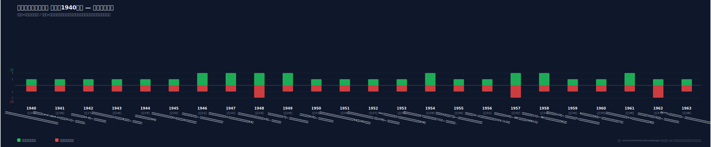
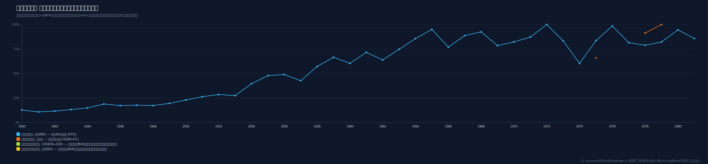

# 経済史 確証済み年表（ECONOMIC_HISTORY）

Service Hub が参照する 1940年〜現在の世界経済・日本経済の年次動向は、
`src/renderer/data/economicHistoryKnowledge.ts` の `ECONOMIC_HISTORY` に1年ごとに採録する。

> ⚠️ 本データは一般的な経済史の要約であり、投資判断等への助言ではありません。数値・順位は出典・推計方法により
> 幅があるため、引用時は一次資料を確認してください。

## 採録の原則

1. **権威ある出典での確証** — 各年について独立した複数の信頼できる出典（百科事典・大学・公的統計・経済史文献等。
   うち1件以上は権威ある出典）で確認できた事実のみ採録。確認できないものは破棄。
2. **ランキングの誠実な取扱い** — 「倒産した業種別ランキング」「売上が伸びた業種別ランキング」は、特に戦前〜
   高度成長期以前について信頼できる定量統計が存在しないことが多い。**存在しないランキングは捏造しない。**
   出典で裏付く範囲で拡大産業（`risingSectors`）・縮小産業（`decliningSectors`）の定性傾向のみを記し、
   限界は `caveats` に明記する。倒産統計（東京商工リサーチ・帝国データバンク等）が整備された戦後の年については、
   出典が得られ次第、業種別の順位情報を追補する。
3. **各年の構造** — `year` / `era`（元号）/ `world` / `japan` / `keyEvents` / `risingSectors` /
   `decliningSectors` / `caveats` / `sources`。

## 収集・検証フロー

1. 百科事典・大学・公的統計（財務省・日銀・国会図書館・国立公文書館・IMF・世界銀行・米政府史料等）・経済史文献から収集。
2. 6並列調査エージェントで年ごとに確証（≥2出典・うち権威ある出典1件以上）。確認できないものは破棄。
3. 確証できた年のみ `ECONOMIC_HISTORY` に採録し、本書の進捗に反映。1940年から1年ずつ現在へ向けて継続。

## 収録済み年（2026-06 時点）

| 年 | 元号 | 主な論点 |
| --- | --- | --- |
| 1940 | 昭和15 | 欧州戦線拡大・国家総動員法下の統制経済・七・七禁令 |
| 1941 | 昭和16 | 武器貸与法・独ソ戦・真珠湾攻撃・対日石油禁輸 |
| 1942 | 昭和17 | ミッドウェー海戦・食糧管理法・企業整備令 |
| 1943 | 昭和18 | スターリングラード／ガダルカナル・軍需省設置・学徒出陣 |
| 1944 | 昭和19 | ブレトンウッズ会議（IMF/世界銀行）・サイパン陥落・本土空襲 |
| 1945 | 昭和20 | 終戦・GHQ占領・産業壊滅・戦後インフレ・IMF/世銀発足・国連設立 |
| 1946 | 昭和21 | 占領改革（財閥解体・農地改革・労組法）・金融緊急措置令・傾斜生産方式決定 |
| 1947 | 昭和22 | トルーマン宣言・マーシャル提唱・GATT調印・復金インフレ・独禁法/労基法 |
| 1948 | 昭和23 | マーシャル・プラン発足・西独通貨改革/ベルリン封鎖・経済安定九原則・昭電事件 |
| 1949 | 昭和24 | ドッジ・ライン・1ドル=360円・ドッジ不況・シャウプ勧告・NATO/中国成立 |
| 1950 | 昭和25 | 朝鮮戦争勃発・朝鮮特需・糸へん金へん景気・レッドパージ |
| 1951 | 昭和26 | サンフランシスコ講和/日米安保調印・特需景気継続・日本開発銀行設立 |
| 1952 | 昭和27 | 講和/安保発効・主権回復・IMF/世界銀行加盟・血のメーデー |
| 1953 | 昭和28 | 朝鮮戦争休戦・スターリン暴落・テレビ本放送開始・米1953不況 |
| 1954 | 昭和29 | 自衛隊発足・造船疑獄・MSA協定・1954デフレ調整・神武景気の入口 |
| 1955 | 昭和30 | 神武景気・GATT加盟・自民党結成（55年体制）・三種の神器 |
| 1956 | 昭和31 | 「もはや戦後ではない」・設備投資ブーム・スエズ動乱・国連加盟 |
| 1957 | 昭和32 | 神武景気終焉・なべ底不況・スプートニク・ローマ条約（EEC） |
| 1958 | 昭和33 | 岩戸景気開始・EEC発足・東京タワー竣工・西欧通貨交換性回復 |
| 1959 | 昭和34 | 岩戸景気・皇太子ご成婚（TV普及）・伊勢湾台風 |
| 1960 | 昭和35 | 60年安保闘争・所得倍増計画・三池争議終結・アフリカの年 |
| 1961 | 昭和36 | 岩戸景気ピーク・農業基本法・ベルリンの壁・国際収支悪化 |
| 1962 | 昭和37 | キューバ危機・ケネディスライド・全総閣議決定・景気踊り場 |
| 1963 | 昭和38 | GATT11条国移行・中小企業基本法・PTBT・ケネディ暗殺 |
| 1964 | 昭和39 | 東海道新幹線・東京五輪・IMF8条国/OECD加盟・証券不況の入口 |
| 1965 | 昭和40 | 昭和40年不況・山一日銀特融・戦後初の赤字国債・いざなぎ景気起点 |
| 1966 | 昭和41 | いざなぎ景気本格化・3C/マイカーブーム・米インフレ/株安 |
| 1967 | 昭和42 | EC統合・ケネディラウンド・第三次中東戦争・第一次資本自由化・公害対策基本法 |
| 1968 | 昭和43 | 金プール崩壊・五月革命・GNP資本主義国2位（西独超え） |
| 1969 | 昭和44 | 東名高速全通・アポロ11号・いざなぎ景気終盤・米景気後退入り |
| 1970 | 昭和45 | 大阪万博・いざなぎ景気終了・公害国会 |
| 1971 | 昭和46 | ニクソンショック・スミソニアン308円・円高不況懸念・日米繊維交渉 |
| 1972 | 昭和47 | 沖縄返還・列島改造論/地価急騰・日中国交正常化・過剰流動性 |
| 1973 | 昭和48 | 変動相場制移行・第一次石油危機・狂乱物価 |
| 1974 | 昭和49 | 戦後初のマイナス成長・狂乱物価20%超・高度成長の終焉 |
| 1975 | 昭和50 | サイゴン陥落・第1回サミット・赤字国債本格発行再開・安定成長期へ |
| 1976 | 昭和51 | ロッキード事件・安定成長・対米輸出主導回復・カーター当選 |
| 1977 | 昭和52 | ロンドンサミット/機関車論・円高進行・福田内閣・PC「1977 Trinity」 |
| 1978 | 昭和53 | 成田開港・日中平和友好条約・ボンサミット・第二次石油危機前夜 |
| 1979 | 昭和54 | 第二次石油危機・東京サミット・ソ連アフガン侵攻・ジャパンアズナンバーワン |
| 1980 | 昭和55 | 第二次石油危機/ボルカー高金利・日本の自動車生産世界一・対米摩擦 |
| 1981 | 昭和56 | レーガノミクス/ERTA・土光臨調・対米自動車輸出自主規制開始 |
| 1982 | 昭和57 | ボルカー高金利の底・中南米債務危機・中曽根内閣・対米黒字摩擦 |
| 1983 | 昭和58 | レーガン景気・東京ディズニーランド開園・ハイテク輸出/貿易摩擦 |
| 1984 | 昭和59 | 日経平均初の1万円突破・日米円ドル委員会（金融自由化）・ドル高 |
| 1985 | 昭和60 | プラザ合意・急激な円高・NTT/JT発足・つくば万博 |
| 1986 | 昭和61 | 逆オイルショック・円高不況・前川レポート・バブル景気起点 |
| 1987 | 昭和62 | ブラックマンデー・国鉄分割民営化(JR)・NTT上場・バブル本格化 |
| 1988 | 昭和63 | バブル本格化・内需主導成長宣言・リクルート事件・ふるさと創生 |
| 1989 | 昭和64/平成元 | 平成改元・消費税3%導入・ベルリンの壁崩壊・日経平均史上最高値38,915円 |
| 1990 | 平成2 | 東西ドイツ統一・湾岸危機・総量規制・公定歩合6%・株バブル崩壊始動 |
| 1991 | 平成3 | 湾岸戦争・ソ連崩壊・バブル景気終焉(2月の山)・証券損失補填・平成不況 |
| 1992 | 平成4 | マーストリヒト調印・ブラックウェンズデー・複合不況・総合経済対策10.7兆円 |
| 1993 | 平成5 | クリントン就任・EU発足・55年体制崩壊(細川連立)・平成の米騒動・円高100円台 |
| 1994 | 平成6 | NAFTA発効・FRB連続利上げ(債券大虐殺)・羽田/村山(自社さ)内閣・テキーラ危機 |
| 1995 | 平成7 | WTO発足・阪神淡路大震災・地下鉄サリン事件・超円高79.75円・住専/大和銀行 |
| 1996 | 平成8 | 橋本内閣・住専処理6850億円・金融ビッグバン構想・グリーンスパン「根拠なき熱狂」 |
| 1997 | 平成9 | 消費税5%・香港返還・アジア通貨危機・金融危機(拓銀/山一/三洋証券) |
| 1998 | 平成10 | ロシア危機・LTCM救済・長銀/日債銀一時国有化・本格デフレ/マイナス成長 |
| 1999 | 平成11 | ユーロ導入・ダウ初の1万ドル突破・日銀ゼロ金利導入・金融再編(みずほ/三井住友)・iモード |
| 2000 | 平成12 | ドットコムバブル崩壊開始(NASDAQ3月ピーク)・介護保険施行・そごう破綻・日銀ゼロ金利解除 |
| 2001 | 平成13 | 米同時多発テロ・ITバブル崩壊本格化・日銀量的緩和導入・小泉内閣発足・BSE国内初確認 |
| 2002 | 平成14 | ユーロ現金流通・WorldCom破綻・いざなみ景気起点(2月)・ペイオフ一部解禁・小泉訪朝 |
| 2003 | 平成15 | イラク戦争・SARS・りそな実質国有化(5月)・日経平均バブル後最安値(4月)・足利銀行国有化 |
| 2004 | 平成16 | FRB利上げ転換・原油高・中越地震・スマトラ沖地震/インド洋大津波・デジタル家電好調 |
| 2005 | 平成17 | 郵政解散総選挙(小泉圧勝)・人民元切り上げ・カトリーナ・日経16,000円台回復・愛知万博 |
| 2006 | 平成18 | 日銀量的緩和/ゼロ金利解除・FRB利上げ打ち止め・ライブドアショック・第1次安倍内閣 |
| 2007 | 平成19 | サブプライム表面化(パリバショック)・DJIA最高値14,164・参院選自民大敗・郵政民営化開始 |
| 2008 | 平成20 | リーマンショック(9/15)・世界金融危機・原油147ドル・いざなみ景気終了・麻生内閣 |
| 2009 | 平成21 | 大不況の底(3月)・GM破綻・政権交代(鳩山内閣)・デフレ宣言・エコポイント |
| 2010 | 平成22 | 欧州ソブリン危機・フラッシュクラッシュ・中国GDP世界2位・日銀包括緩和・JAL/尖閣 |
| 2011 | 平成23 | 東日本大震災/福島原発事故(3/11)・米国債格下げ・超円高75円32銭・タイ大洪水 |
| 2012 | 平成24 | ドラギ「whatever it takes」・QE3・第2次安倍内閣/アベノミクス始動・スカイツリー開業 |
| 2013 | 平成25 | 黒田日銀の異次元緩和(QQE)・日経+57%・2020東京五輪招致・テーパータントラム |
| 2014 | 平成26 | 消費税8%(4/1)で景気後退・日銀サプライズ追加緩和/GPIF見直し・QE3終了・原油急落 |
| 2015 | 平成27 | チャイナショック(人民元切り下げ)・FRB9年半ぶり利上げ・日経2万円回復・爆買い |
| 2016 | 平成28 | 日銀マイナス金利・熊本地震・Brexit可決・YCC導入・トランプ当選 |
| 2017 | 平成29 | トランプ就任・世界同時好況・日経26年ぶり高値・人手不足・仮想通貨バブル |
| 2018 | 平成30 | 米中貿易戦争・FRB年4回利上げ・12月世界同時株安・連続自然災害・働き方改革法 |
| 2019 | 平成31/令和元 | 令和改元・消費税10%/軽減税率・FRB予防的利下げ・米中対立・日経29年ぶり高値 |
| 2020 | 令和2 | コロナショック・FRBゼロ金利・原油初のマイナス・東京五輪延期・菅内閣 |
| 2021 | 令和3 | 東京五輪開催(無観客)・世界的インフレ加速・岸田内閣・半導体不足・BTC史上最高値69k |
| 2022 | 令和4 | ウクライナ侵攻・記録的インフレ/FRB急利上げ・歴史的円安151円・安倍元首相銃撃・FTX破綻 |
| 2023 | 令和5 | 米地銀破綻/CS救済・植田日銀総裁/YCC柔軟化・生成AIブーム・日経バブル後高値更新34年ぶり |
| 2024 | 令和6 | 日経が34年ぶり史上最高値更新(2/22)→4万円突破・日銀マイナス金利解除/YCC撤廃・新NISA・8/5史上最大の暴落と急反発・能登半島地震・トランプ再選 |
| 2025 | 令和7 | トランプ相互関税→日米貿易合意・FRB3会合連続利下げ・日銀0.75%へ追加利上げ・高市早苗が初の女性首相・大阪関西万博・日経が年末終値で史上初の5万円台 |

> **進捗（1940〜現在まで到達）:** **1940–2025 を全年収録完了**（戦時〜高度成長〜石油危機〜安定成長〜プラザ合意〜バブル絶頂・崩壊〜複合不況〜金融危機・デフレ〜ITバブル崩壊〜小泉構造改革・いざなみ景気〜世界金融危機〜東日本大震災・超円高〜アベノミクス・異次元緩和〜コロナ禍〜記録的インフレ・歴史的円安〜日経が史上最高値更新・年末5万円台）。DJIA年末値は1994–2025を毎年確証。日経平均の年末値は確証できた年を収録（直近2017〜2025を毎年確証、2024=39,894.54 年末値で35年ぶり最高、2025=50,339.48 史上初の年末5万円台）。**仮想通貨（ビットコイン年末USD）は2012年から毎年収録**（2012≈$13.5→2017≈$14,156→2021≈$46,306→2022≈$16,547→2024≈$93,429→2025≈$87,502、取引所差のため概数）。なお1993・1994・1995・1998・1999・2002・2003・2009の日経平均は集約サイトが一律403で二重確認できずnull（捏造回避、通称値はcaveatsに注記）。日経平均年末値の一次データ未照合年（戦後の大半）と市街地価格指数は今後の追補対象。

## タイムライン・グラフ

年表は `scripts/gen-econ-history-chart.cjs`（`npm run gen:econ-chart`）で
`docs/economic-history-timeline.svg` に可視化する（年が追加されれば再生成で伸長）。
上向き=拡大傾向の産業数／下向き=縮小傾向の産業数（出典で裏付く定性傾向の件数であり厳密な経済指標ではない）。

## 資産クラス別 年次推移グラフ（株式・不動産・仮想通貨）

`ECONOMIC_HISTORY` と同じ年に連動した資産指標を `ASSET_SERIES`（`economicHistoryKnowledge.ts`）に保持し、
`scripts/gen-econ-asset-chart.cjs`（`npm run gen:econ-asset-chart`）で `docs/economic-history-assets.svg` に
折れ線グラフ化する（各系列を自系列の最大値=100%に正規化して重ね描き）。

- **株式**：ダウ工業株30種平均の年末終値（USD、MeasuringWorth/FRED 等で確証、1994年以降は毎年収録）。日経平均は東証再開（1949年5月）以降が対象で、
  1945–1949年4月の取引所閉鎖期間および各年確定値が独立2源で照合できない年は N/A（捏造しない）。直近 2017–2025 は毎年確証（2025=50,339.48 史上初の年末5万円台）。
- **不動産**：日本不動産研究所「市街地価格指数」（半期＝3月末・9月末、全国/六大都市・用途別の系列あり、全国平均は1991年がピーク）。**年次の確定指数値は専門統計（有料冊子・統計局Excel）にのみ存在し本環境では独立2源照合ができないため全年 N/A（捏造しない）。**
  追補時の注意：戦前基準「1936年9月=100」と現行公表系列「2000年3月末=100」は**別系列**で、混同すると桁が合わない（出典: 日本不動産研究所 reinet.or.jp / 総務省統計局 g4217 / 国立国会図書館リサーチ・ナビ）。
- **仮想通貨**：ビットコインは2009年1月稼働開始・2010年に市場価格成立。**それ以前（1940–1951を含む）は存在せず N/A。** 2012年以降は毎年収録（取引所差で数%の幅があるため代表的な年末スポット値＝概数）。

数値が確証でき次第、各系列を追補する（特に不動産は一次資料の直接取得が必要）。

出典 URL は `economicHistoryKnowledge.ts` の各 `sources` に機械可読で保持。年の追加・更新は本書と当該データを PR で更新する。
